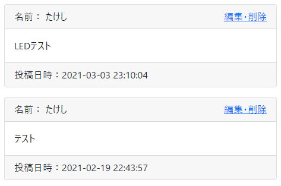
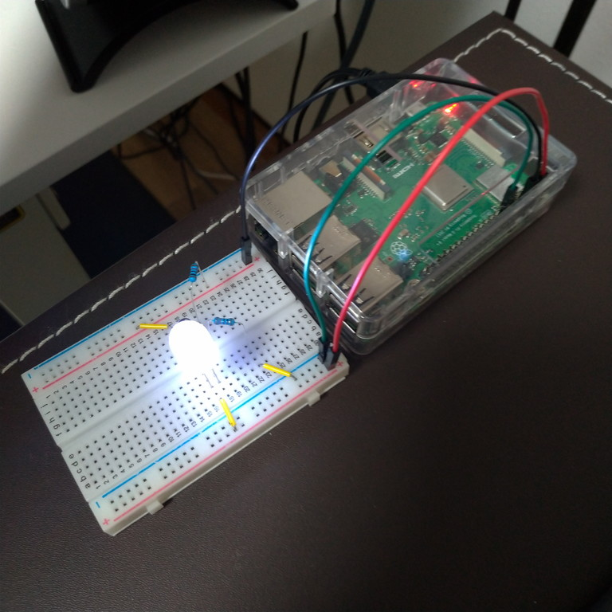
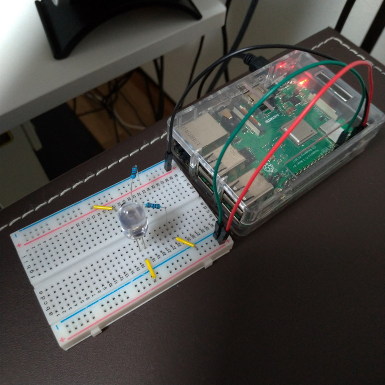

# Python（GPIO）やってみた

実際にやってみた。

## 環境

- リモート（Raspberry Pi）
  - Raspberry Pi 3B+
  - Raspberry Pi OS 10.4
  - Nginx 1.14.2
  - PHP 7.3.19-1~deb10u1
  - MariaDB 10.3
  - Python 3.7.3

## 準備

後で自動実行するために`upload`ユーザー（詳しくは[こちら](../webserver/update2.html)）でRaspberry Piにログインする。

管理しやすい場所にフォルダを作る。

~~~shell
$ mkdir bbs-led
$ cd bbs-led
~~~

MySQL-Connectorをグローバルにインストールする。

~~~shell
$ python3 -m pip install mysql-connector-python
~~~

## メインスクリプト

`bbs-led.py`というファイルを新規作成し以下を記述。

~~~python
import mysql.connector as mydb

connect = mydb.connect(
        host='localhost',
        port='3306',
        user='bbs',
        password=(DBのパスワード),
        database='bbs',
        charset='utf8'
)
cursor = connect.cursor()

cursor.execute('select max(id) from posts')
row = cursor.fetchone()

cursor.close()
connect.close()

with open('dbdata.dat') as f:
        s = f.read()

oldMaxId = int(s)

with open('/sys/class/gpio/gpio17/value', 'w+') as g17:
        if row[0] > oldMaxId:
                g17.write(str(1))
        else:
                g17.write(str(0))
~~~

また、同じディレクトリに`dbdata.dat`というファイルを作成し、中身に`1`とだけ書いて保存。

掲示板にテスト書き込みをする。記事が2個できたのでデータベースに保存されている記事IDは最大値2となる。

この状態で以下のコマンドを実行。

~~~shell
$ python3 bbs-led.py
~~~

ぴかーん。

これを自動で実行するようにする。

一度ログアウトし、`takeshi`ユーザーでログインし直し、以下を実行。

~~~shell
$ sudo crontab -u upload -e
~~~

初めて使う時は「エディタを選べ」的なことを言われるので、適当にNanoエディタを選ぶ。

続けてNanoエディタで以下のようなファイルが開かれるので、最後の1行は自分で書き足して保存終了。

~~~
# Edit this file to introduce tasks to be run by cron.
#
# Each task to run has to be defined through a single line
# indicating with different fields when the task will be run
# and what command to run for the task
#
# To define the time you can provide concrete values for
# minute (m), hour (h), day of month (dom), month (mon),
# and day of week (dow) or use '*' in these fields (for 'any').
#
# Notice that tasks will be started based on the cron's system
# daemon's notion of time and timezones.
#
# Output of the crontab jobs (including errors) is sent through
# email to the user the crontab file belongs to (unless redirected).
#
# For example, you can run a backup of all your user accounts
# at 5 a.m every week with:
# 0 5 * * 1 tar -zcf /var/backups/home.tgz /home/
#
# For more information see the manual pages of crontab(5) and cron(8)
#
# m h  dom mon dow   command
*/1 * * * * cd (bbs-ledがあるディレクトリ); python3 bbs-led.py #←この行を書き足す
~~~

これで1分おきに`upload`ユーザーが自動でスクリプトを実行してくれる。

## サブスクリプト

今度はデスクトップにアイコンを作って、ダブルクリックしたらこのLEDが消えるようにする。

まず`upload`ユーザーでログインし、`bbs-led.py`と同じディレクトリに`update_max_id.py`というファイルを新規作成し以下を記述。

~~~python
import mysql.connector as mydb

connect = mydb.connect(
        host='localhost',
        port='3306',
        user='bbs',
        password=(DBのパスワード),
        database='bbs',
        charset='utf8'
)
cursor = connect.cursor()

cursor.execute('select max(id) from posts')
row = cursor.fetchone()

cursor.close()
connect.close()

with open('dbdata.dat', 'w+') as f:
        f.write(str(row[0]))
with open('/sys/class/gpio/gpio17/value', 'w+') as g17:
        g17.write(str(0))
~~~

Raspberry PiからログアウトしてWindowsに戻ってきて、以下のPowerShellスクリプトを作成。

~~~powershell
$privateKey = "(uploadユーザーの秘密鍵の場所)"
$port = "(22 または 自分で設定したポート)"
$remote = "upload@192.168.1.201"
$command = "cd (bbs-ledがあるディレクトリ); python3 update_max_id.py"

ssh -i $privateKey -p $port $remote $command
$a = Read-Host "Press Enter"
~~~

[以前](../webserver/update2.html)と同じようにデスクトップにこのPowerShellスクリプトへのショートカットを作成。

ダブルクリックするとLEDが消える。

