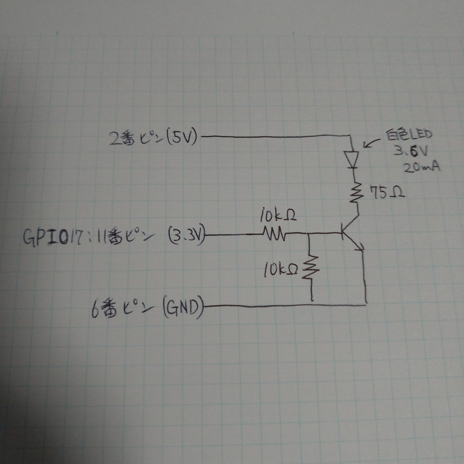
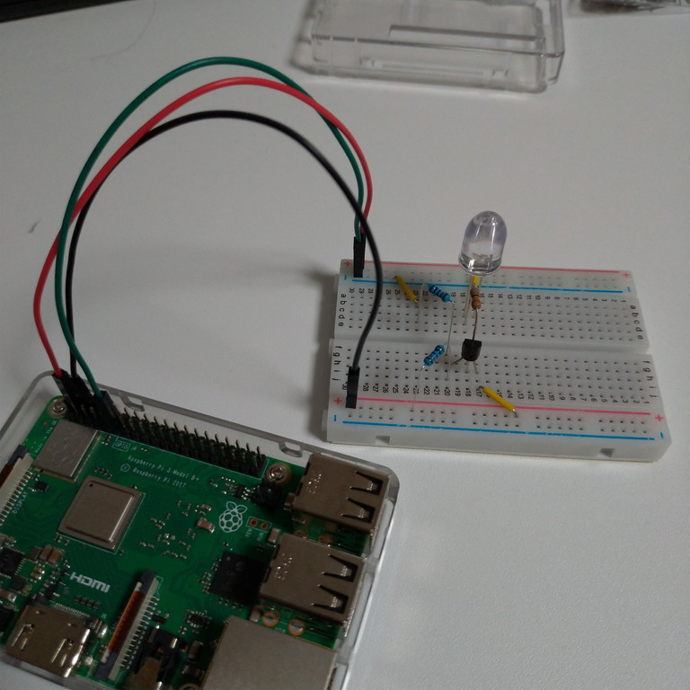

# 事前調査　～GPIOと配線～

## 使用するGPIOポートを有効化

~~~shell
$ echo ポート番号 > /sys/class/gpio/export
~~~

物理ピンとポート番号の対応表は以下。

[Raspberry Pi GPIO Pinout](https://pinout.xyz/)

使えるピンはいっぱいあるけど、SPIやI2CやUART用に使うピンが指定されているっぽいので、特に何とも被っていないGPIO17（物理番号11番）を使う。

といことで、以下を打ちGPIO17を開放。

~~~shell
$ echo 17 > /sys/class/gpio/export
~~~

そうすると`/sys/class/gpio/gpio17/`というディレクトリが生成される。

## 使用するGPIOポートの設定

~~~shell
$ echo out > /sys/class/gpio/gpio17/direction
~~~

Raspberry Pi→LEDという方向で命令を出すので`out`を書き込む。

逆にRaspberry Pi←センサー類という方向なら`in`にする。

## GPIOから出力

~~~shell
$ echo 1 > /sys/class/gpio/gpio17/value
~~~

## 配線

手元にある一番デカい（10Φ）LEDじゃないと、他は暗すぎて使えないことが分かった。

これは順電圧3.6Vで0.02A。GPIOは3.3Vなので直接コントロールすることはできない。なのでトランジスタが必要。

参考：[Lチカonラズパイで、オームの法則・GPIO・トランジスタをちょっと詳しく知る \| Device Plus \- デバプラ](https://deviceplus.jp/hobby/raspberrypi_i01/)

上記サイトの「5. トランジスタでLEDを制御する」に出てくる回路を参考にした。6Vではなく5Vなので、LEDを3.5Vで計算した結果75Ωで良いということになった。
トランジスタは参考サイトと同じ2SC1815を使用。ただしランクはGR。

[2sc1815データシート](http://www.op316.com/tubes/tips/image/2sc1815.pdf)

10kΩの抵抗2つは未だによく分かっていないけど、会社の同僚に聞いたらこれで良いということだったのでこれでいいんだろう。

配線はブレッドボードとジャンパーケーブルで十分。

LEDのアノード・カソードを間違えないように配線。2番ピンも11番ピンもどちらも＋極扱いで、GNDが－極。

写真では光っていないけど、`echo 1 > /sys/class/gpio/gpio17/value`で光ったのでとりあえずOK。