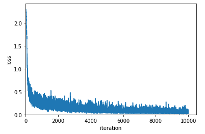
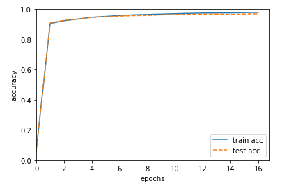

# ニューラルネットワークを使う

参考：[ゼロから作るDeep Learningで素人がつまずいたことメモ: まとめ - Qiita](https://qiita.com/segavvy/items/4e8c36cac9c6f3543ffd)

## 学習

前回作った`TwoLayerNet`を使って実際に学習をしてみる。

~~~python
import numpy as np
from mnist import load_mnist
from twolayernet import TwoLayerNet
import matplotlib.pylab as plt

# データのロード
(x_train, t_train), (x_test, t_test) = load_mnist(normalize=True, one_hot_label=True)

# ハイパーパラメーター
train_loss_list = []
train_acc_list = []
test_acc_list = []

iters_num = 10000
batch_size = 100
learning_rate = 0.1

train_size = x_train.shape[0]
iter_per_epoch = max(int(train_size / batch_size), 1)

# インスタンス作成
network = TwoLayerNet(input_size=784, hidden_size=50, output_size=10, learning_rate=learning_rate)

# 10000万回学習
for i in range(iters_num):
    batch_mask = np.random.choice(train_size, batch_size, replace=False)
    x_batch = x_train[batch_mask]
    t_batch = t_train[batch_mask]
    network.learn(x_batch, t_batch)
    loss = network.loss(x_batch, t_batch)
    train_loss_list.append(loss)
    if i % iter_per_epoch == 0:
        train_acc = network.accuracy(x_train, t_train)
        test_acc = network.accuracy(x_test, t_test)
        train_acc_list.append(train_acc)
        test_acc_list.append(test_acc)
        print(f'[更新数]{i:>4} [損失関数の値]{loss:.4f} '
              f'[訓練データの認識精度]{train_acc:.4f} [テストデータの認識精度]{test_acc:.4f}')
~~~

ここまで実行すると数十分かけて以下を出力する。飯を食うなりテレビ見るなりして待つといい感じの時間で終わる。

~~~
[更新数]   0 [損失関数の値]2.3005 [訓練データの認識精度]0.0678 [テストデータの認識精度]0.0662
[更新数] 600 [損失関数の値]0.3504 [訓練データの認識精度]0.9061 [テストデータの認識精度]0.9098
[更新数]1200 [損失関数の値]0.3603 [訓練データの認識精度]0.9243 [テストデータの認識精度]0.9272
[更新数]1800 [損失関数の値]0.2787 [訓練データの認識精度]0.9355 [テストデータの認識精度]0.9356
[更新数]2400 [損失関数の値]0.1614 [訓練データの認識精度]0.9472 [テストデータの認識精度]0.9472
[更新数]3000 [損失関数の値]0.1606 [訓練データの認識精度]0.9529 [テストデータの認識精度]0.9512
[更新数]3600 [損失関数の値]0.0826 [訓練データの認識精度]0.9589 [テストデータの認識精度]0.9549
[更新数]4200 [損失関数の値]0.0923 [訓練データの認識精度]0.9631 [テストデータの認識精度]0.9579
[更新数]4800 [損失関数の値]0.1019 [訓練データの認識精度]0.9653 [テストデータの認識精度]0.9591
[更新数]5400 [損失関数の値]0.0295 [訓練データの認識精度]0.9683 [テストデータの認識精度]0.9630
[更新数]6000 [損失関数の値]0.0330 [訓練データの認識精度]0.9707 [テストデータの認識精度]0.9661
[更新数]6600 [損失関数の値]0.0829 [訓練データの認識精度]0.9730 [テストデータの認識精度]0.9662
[更新数]7200 [損失関数の値]0.0804 [訓練データの認識精度]0.9750 [テストデータの認識精度]0.9679
[更新数]7800 [損失関数の値]0.0613 [訓練データの認識精度]0.9758 [テストデータの認識精度]0.9682
[更新数]8400 [損失関数の値]0.0405 [訓練データの認識精度]0.9758 [テストデータの認識精度]0.9654
[更新数]9000 [損失関数の値]0.0478 [訓練データの認識精度]0.9783 [テストデータの認識精度]0.9686
[更新数]9600 [損失関数の値]0.0462 [訓練データの認識精度]0.9794 [テストデータの認識精度]0.9705
~~~

損失の様子

~~~python
x = np.arange(len(train_loss_list))
plt.plot(x, train_loss_list, label='loss')
plt.xlabel('iteration')
plt.ylabel('loss')
plt.xlim(left=0)
plt.ylim(bottom=0)
plt.show()
~~~

正答率の様子

~~~python
x2 = np.arange(len(train_acc_list))
plt.plot(x2, train_acc_list, label='train acc')
plt.plot(x2, test_acc_list, label='test acc', linestyle='--')
plt.xlabel('epochs')
plt.ylabel('accuracy')
plt.xlim(left=0)
plt.ylim(0, 1.0)
plt.legend(loc='lower right')
plt.show()
~~~

