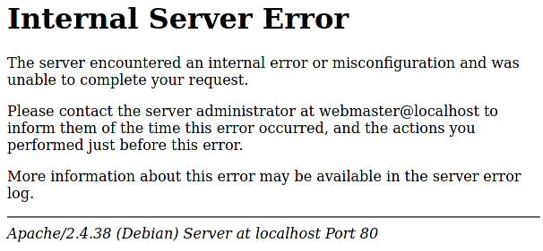

# Internal Server Errorが出た（Apacheのモジュール有効化）

## 症状

「Internal Server Error」が出た。

一番下にApacheと出ているのでApacheのエラーと思われる。

## ログ

以下を打ちログを見る。コンテナ名は`sudo docker ps`で調べる。自分の場合は`docker-php-1`。

~~~shell
$ sudo docker logs -f (php-apacheのコンテナ名)
~~~

よく見ると`.htaccess`のエラーだと書いてある。

~~~
[Sun Dec 26 12:42:13.613281 2021] [core:alert] [pid 18] [client 172.20.0.1:47198] /var/www/html/.htaccess: Invalid command 'Header', perhaps misspelled or defined by a module not included in the server configuration
~~~

なるほど。

ログを抜けるときは`ctrl + C`。（それでも抜けられない場合は`ctrl + alt + C`）

## `Invalid command 'Header'`とは

Apacheの`headers`モジュールが有効化されていないからそうなるらしい。

参考：[dockerで構築したapacheでHeader関係の関数が使えない件の対応 - websandbag ブログ](https://blog.websandbag.com/entry/2017/11/04/212907)

ということで`php/Dockerfile`に以下を追加。

~~~dockerfile
FROM php:7.2.23-apache
RUN apt-get update \
&& apt-get install -y \
libonig-dev \
libzip-dev \
unzip \
libpng-dev \
&& docker-php-ext-install \
pdo_mysql \
mysqli \
mbstring \
zip \
gd
COPY --from=composer:latest /usr/bin/composer /usr/bin/composer
RUN a2enmod headers # ←追加
~~~

コンテナのビルドし直し。`docker-compose.yml`がある場所まで移動し以下を打つ。

~~~shell
$ sudo docker-compose down #←もし稼働してたら終了する
$ sudo docker-compose build
$ sudo docker-compose up -d
~~~

これで解決。

## Apacheのモジュール？

参考
[モジュール一覧 - Apache HTTP サーバ バージョン 2.4](https://httpd.apache.org/docs/2.4/ja/mod/)
[Apache の標準モジュールを（だいたい）全部調べてみた - くじらにっき++](https://kujira16.hateblo.jp/entry/2020/07/25/152508)

サーバーと一緒にモジュールというものがついてくるけど、Debian系のApacheの場合はちゃんと有効化してあげないといけないらしい。

> 通常、`mod_redirect` モジュールはApacheサーバインストール時に一緒にインストールされますが、Debian系Linuxの場合は、明示的にモジュールを有効化する必要があるので注意が必要です。
>
> [Dockerに慣れながら学ぶApacheサーバの基礎 - Qiita](https://qiita.com/amenoyoya/items/cb8bea4315447baf7a81)

全部が全部そうだとは限らないけど、Apacheのエラーで困ったら参考にしよう。
