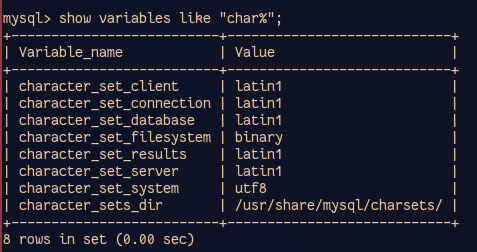
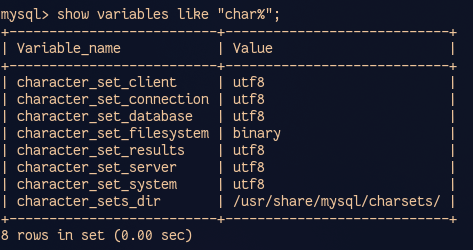

# DBから取得した日本語文字列が文字化けする（DBの文字セットを指定）

## 症状

表示ページのうち、全部じゃないけど一部文字化けして、なんだろうと思って調べてみたらDBから取得した日本語文字列が文字化けしていた。

## 原因

MySQLコンテナは特に設定しなければ`latin1`という文字セットが使われるらしい。

参考：[Dockerで稼働するMySQLの文字コードを設定する話 - あとらすの備忘録](https://kitigai.hatenablog.com/entry/2019/03/03/203310)

確認してみる。一旦MySQLにログイン。

~~~shell
$ sudo docker-compose up -d #コンテナが起動していなければ起動しておく
$ sudo docker exec -it (MySQLコンテナ名) mysql -u (指定ユーザー名) -p
~~~

いつもどおり、コンテナ名は`sudo docker ps`で調べる。

ログインしてから以下を打つ。

~~~mysql
> show variables like "char%";
~~~

これではいけない。

## 解消手順

### `my.cnf`の作成

`mysql`ディレクトリに`my.cnf`というファイルを以下の内容で作成する。

~~~
[mysql]
default-character-set=utf8

[mysqld]
character-set-server=utf8
~~~

### `my.cnf`のマウント

`docker-compose.yml`に1行追加する。

~~~yaml
services:
  mysql:
    image: mysql:(指定のバージョン)
    volumes:
      - ./mysql/data:/var/lib/mysql
      - ./mysql/init.sql:/docker-entrypoint-initdb.d/init.sql
      - ./mysql/init_data:/mysql_init_data
      - ./mysql/my.cnf:/etc/mysql/conf.d/my.cnf # ←追加
    ports:
      - 3306:3306
    environment:
      - MYSQL_ROOT_PASSWORD=(rootのパスワード何でも)
      - MYSQL_DATABASE=(指定のDB名)
      - MYSQL_USER=(指定のユーザー名)
      - MYSQL_PASSWORD=(指定のユーザーのパスワード)
  php:
    build: ./php
    volumes:
      - ./php/php.ini:/usr/local/etc/php/php.ini
      - ./source/test:/var/www/html
    ports:
      - 80:80
      - 443:443
    depends_on:
      - mysql
~~~

### コンテナ再起動

~~~shell
$ sudo docker-compose down
$ sudo docker-compose up -d
~~~

## 確認

~~~shell
$ sudo docker exec -it (MySQLのコンテナ名) mysql -u (指定ユーザー名) -p
~~~

MySQLにログイン後、

~~~mysql
> show variables like "char%";
~~~

よし。

これはDumpファイルの再読込とか特にしなくてもいいらしい。ちゃんと表示された。
