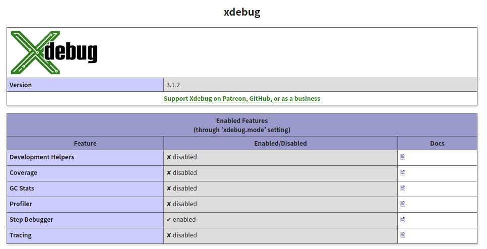
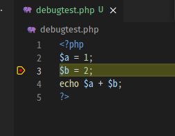

# デバッグ機能を準備する（VSCode + XDebug）

以前[掲示板作成の時](../php/debug.html)に準備したデバッグ環境をDocker上でも構築する。

## 手順

### PHPコンテナの`Dockerfile`の編集

以下のように追記する。

~~~dockerfile
FROM php:(指定のバージョン)-apache
RUN apt-get update \
  && apt-get install -y \
    libonig-dev \
    libzip-dev \
    unzip \
    libpng-dev \
  && docker-php-ext-install \
    pdo_mysql \
    mysqli \
    mbstring \
    zip \
    gd
COPY --from=composer:latest /usr/bin/composer /usr/bin/composer
RUN a2enmod headers
# 以下はHTTPSでアクセスするためのもの（省略可）
RUN mkdir -p /etc/httpd/ssl
RUN a2enmod ssl
COPY ./ssl.conf /etc/apache2/sites-available/ssl.conf
COPY ./ssl/ssl.key /etc/httpd/ssl/ssl.key
COPY ./ssl/ssl.crt /etc/httpd/ssl/ssl.crt
RUN a2ensite ssl
# 以下はMailHogのため
RUN curl -sSL https://github.com/mailhog/mhsendmail/releases/download/v0.2.0/mhsendmail_linux_386 -o mhsendmail \
    && chmod +x mhsendmail \
    && mv mhsendmail /usr/local/bin/mhsendmail
# 以下を追加
RUN pecl install xdebug \
  && docker-php-ext-enable xdebug
~~~

### `php.ini`の編集

以下を追記。Xdebug2系と3系で設定の仕方が違うので注意。以下は3系。

~~~ini
[XDebug]
xdebug.mode = debug
xdebug.start_with_request = yes
xdebug.client_port = 9003
xdebug.client_host = (下記参照)
xdebug.log = /var/log/xdebug.log
xdebug.log_level = 0
~~~

※この`xdebug.client_host`は

* WindowsやMacなら`host.docker.internal`
* LinuxやWSLなら自PC（＝Dockerにとってのホスト）のローカルIP　例：`192.168.0.2`

参考：[xdebug3, nginx, docker環境のリモートデバッグ設定 │ wonwon eater](https://wonwon-eater.com/xdebug3-remote-debug/)

これでハマった。

### `docker-compose.yml`の編集

特に大したことはしないけど、せっかくログファイルの設定するんだからマウントして簡単に取得できるようにしたらええじゃんという話。

~~~yaml
services:
  mysql:
    image: mysql:(指定のバージョン)
    volumes:
      - ./mysql/data:/var/lib/mysql
      - ./mysql/init.sql:/docker-entrypoint-initdb.d/init.sql
      - ./mysql/init_data:/mysql_init_data
      - ./mysql/my.cnf:/etc/mysql/conf.d/my.cnf
    ports:
      - 3306:3306
    environment:
      - MYSQL_ROOT_PASSWORD=(rootのパスワード何でも)
      - MYSQL_DATABASE=(指定のDB名)
      - MYSQL_USER=(指定のユーザー名)
      - MYSQL_PASSWORD=(指定のユーザーのパスワード)
  php:
    build: ./php
    volumes:
      - ./php/php.ini:/usr/local/etc/php/php.ini
      - ./php/log:/var/log # ←この行を追記
      - ./source/test:/var/www/html
    ports:
      - 80:80
      - 443:443
    depends_on:
      - mysql
  mailhog:
    image: mailhog/mailhog
    ports:
      - 1025:1025
      - 8025:8025
~~~

### コンテナのビルド

`docker-compose.yml`がある場所まで戻ってコンテナ終了〜ビルド〜コンテナ再起動。

~~~shell
$ sudo docker-compose down
$ sudo docker-compose build
$ sudo docker-compose up -d
~~~

### VSCodeの設定

まずは拡張機能の「PHP Debug」をインストールする。同じ名前のものが色々あるらしいけどDL数が一番多いものを選ぶ。Linux版VSCodeでは1つしかなかったけど。

VSCodeのデバッグペインを表示して、「launch.jsonファイルを作成します」をクリック。

Windows版VSCodeではこの後、設定ファイルである`launch.json`を作成する場所とどの言語（今回ではPHP）のデバッグ設定を作るか聞かれる。Linux版では聞かれなかった。

聞かれなかった場合、上部に見える歯車マークをクリックすると`launch.json`が開く。

まあとにかくどうにかして`launch.json`が開いたら、`configuration`内の先頭に以下を追記。

~~~json
{
    // Use IntelliSense to learn about possible attributes.
    // Hover to view descriptions of existing attributes.
    // For more information, visit: https://go.microsoft.com/fwlink/?linkid=830387
    "version": "0.2.0",
    "configurations": [
        
        // 以下を追記
        {
            "name": "XDebug on docker",
            "type": "php",
            "request": "launch",
            "port": 9003,
            "pathMappings": {
                "/var/www/html": "${workspaceRoot}"
            }
        },
        // ここまで
        
        // (元々の設定は残してもよし消してもよし)
    ]
}
~~~

## 動作確認

### XDebugが入ったかどうか

ドキュメントルートに`phpinfo.php`という名前で以下の内容のファイルを作成する。

~~~php+HTML
<?php phpinfo(); ?>
~~~

で、`localhost/phpinfo.php`にアクセスして、XDebugが入っているか確認する。

`Step Debugger`が`enabled`になってたらOK。

ターミナル上でも確認できる。以下を打つ。

~~~shell
$ sudo docker exec (PHPのコンテナ名) php -v
~~~

~~~
PHP (指定のバージョン) (cli) (built: Oct 24 2019 03:18:57) ( NTS )
Copyright (c) 1997-2018 The PHP Group
Zend Engine v3.2.0, Copyright (c) 1998-2018 Zend Technologies
    with Xdebug v3.1.2, Copyright (c) 2002-2021, by Derick Rethans
~~~

`with Xdebug ~`と出てきたらOK。

### デバッグできるかどうか

ドキュメントルートに`debugtest.php`という名前で以下の内容のファイルを作成する。

~~~php+HTML
<?php
$a = 1;
$b = 2;
echo $a + $b;
?>
~~~

そしてそれをVSCode上で開き、行番号の左のスペースをクリックしてブレークポイントを設定する。（下の画像の赤丸部分をクリックすればブレークポイントが設定できる）

デバッグ設定を`XDebug on docker`にして、再生ボタンを押すとデバッグ情報のリッスンを開始する。

そのまま`localhost/debugtest.php`にアクセスすると、ブレークポイントで止まる。

デバッグペインには現在定義されている変数の中身が表示される。

もうちょい詳しい使い方は[自分の以前の記事](../php/debug.html)をどうぞ。
