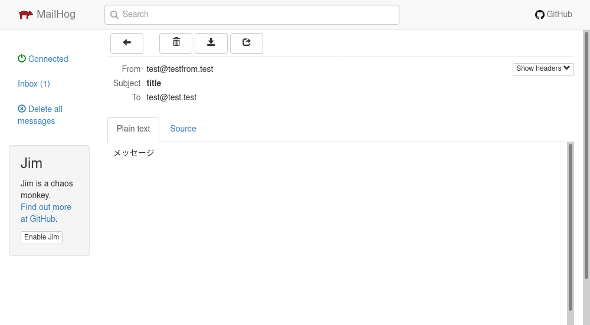

# メールが送信できない（メール送信機能テスト）

PHPからメールを送信する機能というのは、もちろんプロジェクトによるけど結構あるのではないか。

## 問題点

通常PHPからメールを送信する関数としては`mail`（または`mb_send_mail`）があるけど、実際に送信を担うのは`sendmail`というLinuxコマンド。でもPHP-Apacheコンテナにはそんなものインストールされていない。

実際にソースコードのどこかに`mail`関数があったとして、それを発動させても何も起きない。以下でログを確認する。

~~~shell
$ sudo docker logs -f (PHPのコンテナ名)
~~~

どこかの行に以下のような表示が出るはず。

~~~
sh: 1: /usr/sbin/sendmail: not found
~~~

なぜこんなことが起こるかというと、`php.ini`に以下のような記述があるから。

~~~
[mail function]
; For Unix only.  You may supply arguments as well (default: "sendmail -t -i").
; http://php.net/sendmail-path
sendmail_path = /usr/sbin/sendmail -t -i
~~~

だから`sendmail`を入れてしまえ、という人（[How to get sendmail working in docker PHP - Tom Butler](https://r.je/sendmail-php-docker)）もいるけど、もうすこし便利なものがあるらしい。

## MailHog

参考
[dockerコンテナでPHPからのメール送信とhttpsに対応する - Qiita](https://qiita.com/kinoleaf/items/0b0002aa03993e58e2f0)
[MailHogを利用してメール送信テスト環境をdockerコンテナ上に作る - Qiita](https://qiita.com/kobatei/items/1b8b0ca5e8737235dccd)
[Dockerでメールフォーム開発用コンテナを3分クッキング - Qiita](https://qiita.com/mach3/items/33d486420c6821582c87)

これを使うと、PHPから送信されたメールがMailHogコンテナに届いてそこで止まる。つまり実際送信されずにどんなメールを送信しようとしたか確認できるということらしい。これは素晴らしい。やってみよう。

## 手順

### `docker-compose.yml`の編集

以下のようにして`mailhog`コンテナを導入する。

~~~yaml
services:
  mysql:
    image: mysql:(指定のバージョン)
    volumes:
      - ./mysql/data:/var/lib/mysql
      - ./mysql/init.sql:/docker-entrypoint-initdb.d/init.sql
      - ./mysql/init_data:/mysql_init_data
      - ./mysql/my.cnf:/etc/mysql/conf.d/my.cnf
    ports:
      - 3306:3306
    environment:
      - MYSQL_ROOT_PASSWORD=(rootのパスワード何でも)
      - MYSQL_DATABASE=(指定のDB名)
      - MYSQL_USER=(指定のユーザー名)
      - MYSQL_PASSWORD=(指定のユーザーのパスワード)
  php:
    build: ./php
    volumes:
      - ./php/php.ini:/usr/local/etc/php/php.ini
      - ./source/test:/var/www/html
    ports:
      - 80:80
      - 443:443
    depends_on:
      - mysql
  # 以下を追加
  mailhog:
    image: mailhog/mailhog
    ports:
      - 1025:1025
      - 8025:8025
~~~

ここで、

* `1025`：メールを受け付ける用ポート
* `8025`：ブラウザからMailHogのメールボックスにアクセスする用ポート

となる。MailHogのデフォルトの設定らしいので変えなくてOK。

### PHPの`Dockerfile`の編集

`php/Dockerfile`を以下のように編集。

~~~dockerfile
FROM php:7.2.23-apache
RUN apt-get update \
  && apt-get install -y \
    libonig-dev \
    libzip-dev \
    unzip \
    libpng-dev \
  && docker-php-ext-install \
    pdo_mysql \
    mysqli \
    mbstring \
    zip \
    gd
COPY --from=composer:latest /usr/bin/composer /usr/bin/composer
RUN a2enmod headers
# 以下はHTTPSでアクセスするためのもの（省略可）
RUN mkdir -p /etc/httpd/ssl
RUN a2enmod ssl
COPY ./ssl.conf /etc/apache2/sites-available/ssl.conf
COPY ./ssl/ssl.key /etc/httpd/ssl/ssl.key
COPY ./ssl/ssl.crt /etc/httpd/ssl/ssl.crt
RUN a2ensite ssl
# 以下を追加
RUN curl -sSL https://github.com/mailhog/mhsendmail/releases/download/v0.2.0/mhsendmail_linux_386 -o mhsendmail \
    && chmod +x mhsendmail \
    && mv mhsendmail /usr/local/bin/mhsendmail
~~~

`sendmail`の代わりにMailHogと同じ作者が作った`mhsendmail`というものを入れる。

`curl`のダウンロードリンクは、[https://github.com/mailhog/mhsendmail/releases](https://github.com/mailhog/mhsendmail/releases)に行けばリストがあるから自分が使っているCPUに合わせて書き換えること。

### `php.ini`の編集

以下のように書き換える。

~~~
[mail function]
sendmail_path = "/usr/local/bin/mhsendmail --smtp-addr=mailhog:1025"
~~~

### コンテナの再起動

`docker-compose.yml`と同じ場所に移動して以下を打つ。

~~~shell
$ sudo docker-compose down
$ sudo docker-compose build
$ sudo docker-compose up -d
~~~

イメージのビルドとかプルとかがあるけど問題なく立ち上がるはず。

## 動作確認

まず`localhost:8025`にアクセスするとGmailみたいなメールボックス風UIが表示される。

適当にPHPからメールを送ってみる。

ドキュメントルート（`docker-compose.yml`でPHPコンテナの`/var/www/html`にマウントされているディレクトリ）に、`sendmailtest.php`という名前で以下の内容を追加する。

~~~php+HTML
<?php mail('test@test.test', 'title', 'メッセージ', 'From: test@testfrom.test'); ?>
~~~

そして`localhost/sendmailtest.php`にアクセスすると画面は真っ白だけどメールは送られる。

再度MailHogを確認するとメールが届いている。

メールを開いてみるとこんな感じ。

メールのソースも確認できる。

## 余談

RubyのGemで[MailCatcher](https://mailcatcher.me/)というものがあるらしい。[それを使った構築](https://goodlife.tech/posts/mailcatcher)もあるらしい。
