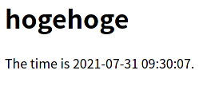
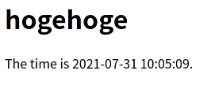
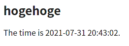

# 複数のコンテナを一発で立ち上げる

## 準備1：Docker-Composeをインストール

Jetson Nanoでは`apt`コマンドでインストールするっぽい。

~~~shell
$ sudo apt install docker-compose
~~~

インストール確認。

~~~shell
$ sudo docker-compose version
~~~

~~~
docker-compose version 1.17.1, build unknown
docker-py version: 2.5.1
CPython version: 2.7.17
OpenSSL version: OpenSSL 1.1.1  11 Sep 2018
~~~

1.17が古いのでソースからインストールしようとしたけど何故か上手くいかない。まあJetPackのベースのUbuntuが18.04だからもうええか。

## 準備2：必要なファイル類を整理

`my-docker`ディレクトリ以下をこのように整理。

~~~
my-docker/
└── sample-app
	├── docker-compose.yml
	├── settings
	│   └── default.conf
	└── src
		└── index.php
~~~

`default.conf`には前回のものから以下の変更を加える。

~~~
    location / {
        root   /usr/share/nginx/html;
        index  index.php index.html index.htm;  # ←index.phpを追加
    }
~~~

これで`(Jetson NanoのIP)/index.php`としなくてもIPだけで`index.php`が読み込まれる。

`index.php`の中身は前回と同様。

## 準備3：整理されたディレクトリ構造に応じてコマンドも書き直し

### PHPコンテナ

~~~shell
$ sudo docker run --name phpfpm -d -v ~/my-docker/sample-app/src:/scripts --network my-network --network-alias phpfpm php:7.4-fpm
~~~

変更点

* `-v`オプションの引数を変更
* 使用イメージを`jitesoft/php-fpm`から公式イメージである`php:7.4-fpm`に変更

### Nginxコンテナ

~~~shell
$ sudo docker run --name nginx -d -p 80:80 -v ~/my-docker/sample-app/src:/usr/share/nginx/html --network my-network -v ~/my-docker/sample-app/settings/default.conf:/etc/nginx/conf.d/default.conf nginx
~~~

変更点

* `-v`オプションの引数を変更

### コマンドのテスト

すでにコンテナが立ち上がっていたら一旦全部削除して、上2つのコマンドを打つ。

それからメインPCのブラウザにJetson NanoのIPを入力してアクセスすると以下が出る。

相変わらず時間がずれているけど、これは後で直す。

## `docker-compose.yml`の編集

上記2つのコマンドを`docker-compose.yml`に書く。

~~~yaml
version: "3"

services:
    nginx:
        image: nginx
        ports:
          - 80:80
        volumes:
          - ./src:/usr/share/nginx/html
          - ./settings/default.conf:/etc/nginx/conf.d/default.conf
    phpfpm:
        image: php:7.4-fpm
        volumes:
          - ./src:/scripts
~~~

### 解説

* `version:`

  これは`docker-compose.yml`の書式のバージョニングということになるらしい。とりあえず`"3"`って書いとけばOK。

  `docker-compose`のバージョンがもっと高ければもっと高いバージョンを書いてもいいらしいけど、よく分からん。詳しくは[公式ドキュメント](https://matsuand.github.io/docs.docker.jp.onthefly/compose/compose-file/)へ。

* `services:`

  実際のコンテナに関するオプション等を書くところ。ちなみにインデントにタブ文字を使うのはNG。

  * `nginx:`

    先頭のコンテナ名は`--name`と`--network-alias`の両方の役割がある

    * `image: nginx`

      コンテナの元になるイメージ

    * `ports:`

      `-p`に当たる設定。

      中身を書くときは改行して、スペースでインデントを下げて、`-`を入れて、さらにスペースを入れて、そして引数である`80:80`を書く。

      こういう風に複数書いても良い。

      ~~~
      ports:
        - 80:80
        - 8080:80
      ~~~

    * `volumes:`

      `-v`に当たる設定。

      `docker-compose.yml`が置かれている場所からの相対パスでもいいらしい。ただし、先頭に`./`を入れないと、以下のように書くと`src`という名前付きボリュームとして認識されてしまうらしい。

      ~~~
      volumes:
        - src:/usr/share/nginx/html #←先頭に./が必要
      ~~~

  * `phpfpm:`

    同じ

`--network`にあたるオプションは、今回は特に書かなくてもいいみたい。実際立ち上げると新たなネットワークが生成されていた。（後述）

## コンテナ立ち上げ

Jetson Nano上で以下を打つ。

~~~shell
$ cd ~/my-docker/sample-app
$ sudo docker-compose up -d
~~~

これでちょっと待ったら2つのコンテナが立ち上がる。

確認。

~~~shell
$ sudo docker ps
~~~

~~~
550c696e69e3   php:7.4-fpm   "docker-php-entrypoi…"   14 seconds ago       Up 12 seconds   9000/tcp             sampleapp_phpfpm_1
1f806e21347e   nginx         "/docker-entrypoint.…"   About a minute ago   Up 12 seconds   0.0.0.0:80->80/tcp   sampleapp_nginx_1
~~~

メインPCのブラウザからアクセス。

これ見んの何回目や。とりあえず動いてよかった。

ネットワークを確認してみる。

~~~shell
$ sudo docker network ls
~~~

~~~
NETWORK ID     NAME                DRIVER    SCOPE
3ab9e891841f   bridge              bridge    local
290dfd60aa80   host                host      local
a260687ee955   my-network          bridge    local
73f5330be4d1   none                null      local
f03d6da84553   sampleapp_default   bridge    local
~~~

`sampleapp_default`というネットワークが追加されている。

コンテナを終了させるのは以下。

~~~shell
$ sudo docker-compose down
~~~

~~~
Stopping sampleapp_phpfpm_1 ... done
Stopping sampleapp_nginx_1  ... done
Removing sampleapp_phpfpm_1 ... done
Removing sampleapp_nginx_1  ... done
Removing network sampleapp_default
~~~

ほほう、コンテナとネットワークの削除もやってくれるのか。これは楽。

## コンテナの依存関係を記述する

PHP使用の設定を追加したせいで（具体的には`default.conf`内の`fastcgi_pass   phpfpm:9000;`という行に対してNginxが`phpfpm`という名前でTCP通信ができるかどうかを確認し、ダメだったらエラーを吐いて止まる）、Nginxコンテナの前にPHP-FPMコンテナが立ち上がっていないといけない。

なので、`docker-compose up`を打った後のログのNginxコンテナに`done`がつかない。

~~~shell
$ sudo docker-compose up -d
~~~

~~~
Creating network "sampleapp_default" with the default driver
Creating sampleapp_nginx_1 ...
Creating sampleapp_phpfpm_1 ...
Creating sampleapp_phpfpm_1
Creating sampleapp_phpfpm_1 ... done
~~~

一応どこかのタイミングで立ち上がるみたいだけど、あまりキレイではない。

なので、依存関係を`docker-compose.yml`に`depends_on:`の項目を書き加える。

~~~yaml
version: "3"

services:
    nginx:
        image: nginx
        ports:
          - 80:80
        volumes:
          - ./src:/usr/share/nginx/html
          - ./settings/default.conf:/etc/nginx/conf.d/default.conf
        depends_on:	 # ←追加
          - phpfpm   # ←追加
    phpfpm:
        image: php:7.4-fpm
        volumes:
          - ./src:/scripts
~~~

そしてコンテナを立ち上げると、立ち上げの順番を変えてくれる。

~~~shell
$ sudo docker-compose up -d
~~~

~~~
Creating network "sampleapp_default" with the default driver
Creating sampleapp_phpfpm_1 ...
Creating sampleapp_phpfpm_1 ... done
Creating sampleapp_nginx_1 ...
Creating sampleapp_nginx_1 ... done
~~~

ただし[公式](https://docs.docker.com/compose/startup-order/)によると、コンテナが準備OKとなるまでは待たないらしいから、本当の意味では問題は解決したことにはならない。接続に依存するようなアプリは作るな、ということらしい。

## PHPのタイムゾーン設定を変える

コンテナを立ち上げたまま、PHPの`ini`ファイルをどうにかして取り出す。

`phpinfo();`を実行したときに表示されていた`ini`ファイルの場所を参考に、まずはファイルの存在をチェック。

~~~shell
$ sudo docker exec sampleapp_phpfpm_1 ls /usr/local/etc/php -al
~~~

~~~
total 156
drwxr-xr-x 1 root root  4096 Jul 29 23:27 .
drwxr-xr-x 1 root root  4096 Jul 29 23:27 ..
drwxr-xr-x 1 root root  4096 Jul 29 23:27 conf.d
-rw-r--r-- 1 root root 72554 Jul 29 23:27 php.ini-development
-rw-r--r-- 1 root root 72584 Jul 29 23:27 php.ini-production
~~~

そして[Docker HubのPHPイメージのページ](https://hub.docker.com/_/php)の記述から、この`php.ini-production`を`php.ini`にリネームして取り出して編集し、`conf.d`の中に突っ込めば良いらしい。

よって、まずは`php.ini-production`の取り出しから。

~~~shell
$ sudo docker cp sampleapp_phpfpm_1:/usr/local/etc/php/php.ini-production ./settings/php.ini
~~~

そして取り出した`php.ini`を編集する。

~~~shell
$ sudo nano settings/php.ini
~~~

`ctrl + w`でnanoの検索BOXを出し、`date.timezone`を検索してジャンプ。

そして以下のように変更。先頭のセミコロンは取るように。

~~~
[Date]
; Defines the default timezone used by the date functions
; http://php.net/date.timezone
date.timezone = "Asia/Tokyo" ;←ここを変更
~~~

そして`docker-compose.yml`を編集。

~~~yaml
version: "3"

services:
    nginx:
        image: nginx
        ports:
          - 80:80
        volumes:
          - ./src:/usr/share/nginx/html
          - ./settings/default.conf:/etc/nginx/conf.d/default.conf
        depends_on:
          - phpfpm
    phpfpm:
        image: php:7.4-fpm
        volumes:
          - ./src:/scripts
          - ./settings/php.ini:/usr/local/etc/php/conf.d/php.ini	 # ←追加
~~~

コンテナを終了させ、再度立ち上げる。

~~~shell
$ sudo docker-compose down
$ sudo docker-compose up -d
~~~

メインPCのブラウザからアクセス。

おお、時間がちゃんと合っとる。

でも、Nginxのときもそうだけど、こういう設定ファイルのために`volumes:`でマウントするってのは何だかよくない感じ。こういうときは、設定ファイルを中にコピーしたイメージを作り直せばいいのか。

