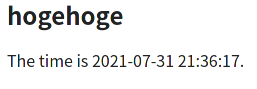

# イメージファイルを作りながら複数コンテナを一発で立ち上げる

前回ではイメージファイルは公式そのままで、コンテナを作るときに設定ファイルをマウントして動かしていたけど、マウントしているとJetson Nano上で設定ファイルを変更したらコンテナ内にも即反映されてしまう。結局はリロードしないと設定は反映されないので問題はそこまで大きくないと思われるが、ベストプラクティスっぽくはない。

ということで、公式イメージに独自の設定ファイルを足して独自イメージを作り、その上で`docker-compose`で一発立ち上げを狙う。

## 準備1：ディレクトリ階層の再整理

Jetson Nano上で以下のように再整理する。

~~~
my-docker/
    └── sample-app
        ├── docker-compose.yml
        ├── settings
        │   ├── nginx
        │   │   ├── default.conf
        │   │   └── Dockerfile
        │   └── phpfpm
        │       ├── Dockerfile
        │       └── php.ini
        └── src
            └── index.php
~~~

ポイントは`settings`の中身。それぞれの`Dockerfile`はまだ空の状態。

## 準備2：NginxコンテナのDockerfile

~~~shell
$ sudo nano ~/my-docker/sample-app/settings/nginx/Dockerfile
~~~

以下のように編集。

~~~dockerfile
FROM nginx
COPY ./default.conf /etc/nginx/conf.d/default.conf
~~~

## 準備3：PHP-FPMコンテナのDockerfile

~~~shell
$ sudo nano ~/my-docker/sample-app/settings/phpfpm/Dockerfile
~~~

以下のように編集。

~~~dockerfile
FROM php:7.4-fpm
COPY ./php.ini /usr/local/etc/php/conf.d/php.ini
~~~

## 準備4：`docker-compose.yml`の編集

~~~shell
$ sudo nano ~/my-docker/sample-app/docker-compose.yml
~~~

以下のように編集。

~~~yaml
version: "3"

services:
    nginx:
        build: ./settings/nginx
        ports:
          - 80:80
        volumes:
          - ./src:/usr/share/nginx/html
        depends_on:
          - phpfpm
    phpfpm:
        build: ./settings/phpfpm
        volumes:
          - ./src:/scripts
~~~

ポイントは`build:`の項目で、それぞれの`Dockerfile`が置いてあるディレクトリへのパスを書けばいいらしい。それに伴って`volumes:`の項目から設定ファイルに関する行を削除した。

## コンテナ立ち上げ

~~~shell
$ cd ~/my-docker/sample-app
$ sudo docker-compose up -d --build
~~~

イメージを作ってるっぽいログと共にコンテナが立ち上がる。

~~~
Building phpfpm
Step 1/2 : FROM php:7.4-fpm
  ---> 183b108f66fa
Step 2/2 : COPY ./php.ini /usr/local/etc/php/conf.d/php.ini
  ---> 178e8df553b1
Successfully built 178e8df553b1
Successfully tagged sampleapp_phpfpm:latest
Building nginx
Step 1/2 : FROM nginx
  ---> 04bd8b4e0d30
Step 2/2 : COPY ./default.conf /etc/nginx/conf.d/default.conf
  ---> 643b11fc4465
Successfully built 643b11fc4465
Successfully tagged sampleapp_nginx:latest
Recreating sampleapp_phpfpm_1 ...
Recreating sampleapp_phpfpm_1 ... done
Recreating sampleapp_nginx_1 ...
Recreating sampleapp_nginx_1 ... done
~~~

そしてメインPCからブラウザでアクセス。

よしよし、`docker-compose.yml`から設定ファイルの記述を抜いたけどタイムゾーンの設定がちゃんとできている。

## 実験

### `--build`オプション無しで立ち上げてみたらどうなるのか

まずコンテナを終了させる。

~~~shell
$ sudo docker-compose down
~~~

そしてイメージを確認。

~~~shell
$ sudo docker images
~~~

~~~
REPOSITORY                       TAG              IMAGE ID       CREATED          SIZE
sampleapp_phpfpm                 latest           178e8df553b1   25 minutes ago   364MB
sampleapp_nginx                  latest           643b11fc4465   25 minutes ago   126MB
(略)
~~~

削除する。

~~~shell
$ sudo docker rmi 178e8df553b1 643b11fc4465
~~~

そしてコンテナ立ち上げ。

~~~shell
$ sudo docker-compose up -d
~~~

~~~
Creating network "sampleapp_default" with the default driver
Building phpfpm
Step 1/2 : FROM php:7.4-fpm
---> 183b108f66fa
Step 2/2 : COPY ./php.ini /usr/local/etc/php/conf.d/php.ini
---> efe6f8c681e8
Successfully built efe6f8c681e8
Successfully tagged sampleapp_phpfpm:latest
WARNING: Image for service phpfpm was built because it did not already exist. To rebuild this image you must use `docker-compose build` or `docker-compose up --build`.
Building nginx
Step 1/2 : FROM nginx
---> 04bd8b4e0d30
Step 2/2 : COPY ./default.conf /etc/nginx/conf.d/default.conf
---> bc0b7f45b5ab
Successfully built bc0b7f45b5ab
Successfully tagged sampleapp_nginx:latest
WARNING: Image for service nginx was built because it did not already exist. To rebuild this image you must use `docker-compose build` or `docker-compose up --build`.
Creating sampleapp_phpfpm_1 ...
Creating sampleapp_phpfpm_1 ... done
Creating sampleapp_nginx_1 ...
Creating sampleapp_nginx_1 ... done
~~~

`WARNING`が出るようになった。でも「イメージが無かったから作っといたけど、もし作り直すなら`docker-compose build`もしくは`docker-compose up --build`で立ち上げてね。」という内容だから特に致命的なものではなさそう。

### イメージは毎回作られるの？

このまま引き続いて以下を実行。

~~~shell
$ sudo docker-compose down
~~~

~~~
Stopping sampleapp_nginx_1  ... done
Stopping sampleapp_phpfpm_1 ... done
Removing sampleapp_nginx_1  ... done
Removing sampleapp_phpfpm_1 ... done
Removing network sampleapp_default
~~~

~~~shell
$ sudo docker-compose up -d
~~~

~~~
Creating network "sampleapp_default" with the default driver
Creating sampleapp_phpfpm_1 ...
Creating sampleapp_phpfpm_1 ... done
Creating sampleapp_nginx_1 ...
Creating sampleapp_nginx_1 ... done
~~~

一度作られたイメージは再利用されるっぽい。

### `--build`オプションはイメージ再作成を強制するの？

~~~shell
$ sudo docker-compose down
~~~

~~~
Stopping sampleapp_nginx_1  ... done
Stopping sampleapp_phpfpm_1 ... done
Removing sampleapp_nginx_1  ... done
Removing sampleapp_phpfpm_1 ... done
Removing network sampleapp_default
~~~

~~~shell
$ sudo docker-compose up -d --build
~~~

~~~
Creating network "sampleapp_default" with the default driver
Building phpfpm
Step 1/2 : FROM php:7.4-fpm
---> 183b108f66fa
Step 2/2 : COPY ./php.ini /usr/local/etc/php/conf.d/php.ini
---> Using cache
---> efe6f8c681e8
Successfully built efe6f8c681e8
Successfully tagged sampleapp_phpfpm:latest
Building nginx
Step 1/2 : FROM nginx
---> 04bd8b4e0d30
Step 2/2 : COPY ./default.conf /etc/nginx/conf.d/default.conf
---> Using cache
---> bc0b7f45b5ab
Successfully built bc0b7f45b5ab
Successfully tagged sampleapp_nginx:latest
Creating sampleapp_phpfpm_1 ...
Creating sampleapp_phpfpm_1 ... done
Creating sampleapp_nginx_1 ...
Creating sampleapp_nginx_1 ... done
~~~

そうっぽい。

でも再作成したからと言って、どんどん増殖していく訳でもなさそう。

~~~shell
$ sudo docker images
~~~

~~~
REPOSITORY                       TAG              IMAGE ID       CREATED          SIZE
sampleapp_nginx                  latest           bc0b7f45b5ab   11 minutes ago   126MB
sampleapp_phpfpm                 latest           efe6f8c681e8   11 minutes ago   364MB
(略)
~~~

