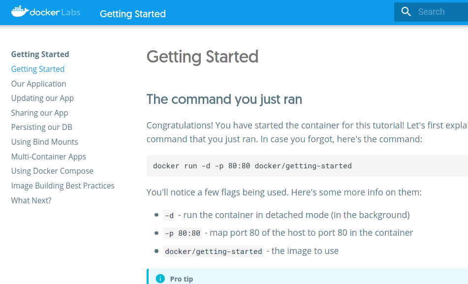
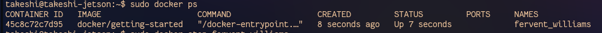

# とにかくコンテナを動かす

Jetson Nano上で以下を打つ。

~~~shell
$ sudo docker run -d -p 80:80 --network host docker/getting-started
~~~

イメージファイルのダウンロードが始まり、イメージファイルからコンテナが生成される。`-d`があるのでバックグラウンドで動く。

したらば、ブラウザからJetson NanoのIPにアクセス（Jetson Nano上からだったらアドレス欄に`localhost`と打ってアクセス）するとGetting Startedページが表示される。

コンテナを止めるにはコンテナ名を知る必要があるので以下を打つ。

~~~shell
$ sudo docker ps
~~~

すると以下のように表示される。`NAMES`に表示されている`fervent_williams`が自動付与されたコンテナ名。

なのでこの場合、以下のように打てばコンテナが止まる。

~~~shell
$ sudo docker stop fervent_williams
~~~

それを確認するときは以下。

~~~shell
$ sudo docker ps
~~~

何も表示されないときはコンテナが止まっている。ただし、止まっているコンテナは削除されたわけではない。以下を打つと止まっているコンテナを表示させることができる。

~~~shell
$ sudo docker ps -a
~~~

コンテナは不要だったら削除すればいい。削除は以下。

~~~shell
$ sudo docker rm fervent_williams
~~~

また、コンテナを削除したとしても、その元となるイメージファイルは残ったままになる。イメージファイルを確認するのは以下。

~~~shell
$ sudo docker images
~~~

今回は`docker/getting-started`というイメージをダウンロードしたことになるので、それを削除する。

~~~shell
$ sudo rmi docker/getting-started
~~~

これで最初の状態に戻った。

