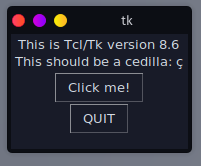

# コンテナ上でGUIアプリ開発　環境構築

## 前提

1. コンテナ内で立ち上げたGUIアプリはローカル側に表示される。（設定の仕方は[ここ](l4t_base1.html)）
2. PyTorchコンテナ内に入っている。（要は[前回](pytorch_container.html)の続き）

## Pythonのライブラリの確認

### Tkinter

Python標準のGUIライブラリのはずだけど入っていない。なのでインストールから。

~~~shell
# apt update
# apt install python3-tk
# python3 -m tkinter
~~~

REPLからも確認ができる。

~~~shell
# python3
~~~

~~~python
>>> import tkinter as tk
>>> tk._test()
~~~

同じものが表示される。

### PyQt5

色々試してみたけど上手く入らん。

### Kivy

[Kivy: Cross-platform Python Framework for NUI Development](https://kivy.org/#home)

~~~shell
# python3 -m pip install -U pip setuptools
# python3 -m pip install kivy[base] kivy_examples
~~~

こっちは入ったけど、ウィンドウが表示されない。

### まとめ

特にGUIはこだわるところではないし、Tkinterでいこ。

## JetCam

[NVIDIA-AI-IOT/jetcam: Easy to use Python camera interface for NVIDIA Jetson](https://github.com/NVIDIA-AI-IOT/jetcam)

Jetson Nano用に作られた、USBカメラ（またはCSIカメラ）を扱うためのモジュール。これがあるとカメラ周りのコーディングが楽になる。

動作確認をするためにはまずコンテナを終了してオプションを追加しないといけない。コンテナから抜けて、コンテナを削除しておく。

### Python用スクリプトのディレクトリを準備

~~~shell
$ mkdir ~/my-docker/pytorch/src
~~~

今はこんな状態。

~~~
pytorchディレクトリ
├── docker-compose.yml
└── srcディレクトリ
~~~

ほぼ空。

### `docker-compose.yml`の再編集

`volumes`にいくつか追加したのと、`devices`にUSBカメラを追加。

~~~yaml
services:
    test:
        image: nvcr.io/nvidia/l4t-pytorch:r32.5.0-pth1.7-py3
        runtime: nvidia
        environment:
          - DISPLAY=$DISPLAY
        volumes:
          - /tmp/.X11-unix:/tmp/.X11-unix
          - ~/.Xauthority:/root/.Xauthority
          - ~/my-docker/pytorch/src:/pytorch/src
          - /tmp/argus_socket:/tmp/argus_socket
        network_mode: "host"
        tty: true
        stdin_open: true
        devices:
          - /dev/video0
~~~

### コンテナ再立ち上げ

~~~shell
$ cd ~/my-docker/pytorch
$ sudo docker-compose up -d
$ sudo docker attach pytorch_test_1
~~~

中で必要なことをしておく。将来的にはDockerfileに書いておこう。

~~~shell
# apt update
# apt install python3-tk nano
# python3 -m pip install -U pip setuptools
# cd /pytorch
~~~

### JetCamをインストール

まず依存パッケージをインストール。

~~~shell
# python3 -m pip install traitlets opencv-python
~~~

JetCamをインストール。

~~~shell
# git clone https://github.com/NVIDIA-AI-IOT/jetcam
# cd jetcam
# python3 setup.py install
~~~

確認。

~~~shell
# python3
~~~

~~~python
>>> from jetcam.usb_camera import USBCamera
>>>
~~~

エラーが無いならヨシ。JetCamのGitHubページに依存パッケージ情報が書いてなかったから最初の立ち上げでエラー出まくった。

・・・が、次でエラーが出まくっている。

https://github.com/NVIDIA-AI-IOT/jetcam/blob/master/jetcam/usb_camera.py

https://github.com/NVIDIA-AI-IOT/jetcam/issues/12

https://note.nkmk.me/python-opencv-videocapture-file-camera/

https://note.nkmk.me/python-opencv-getbuildinformation/
