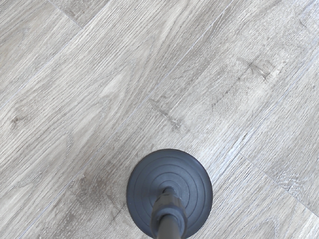

# コンテナ上でGUIアプリ開発　環境構築1

※失敗＆調査で非常に長い、かつ最終的にどうすれば良かったのかは別ページにまとめるので、結果だけ知りたい人はそちらへどうぞ。

## 前提

1. コンテナ内で立ち上げたGUIアプリはローカル側に表示される。（設定の仕方は[ここ](l4t_base1.html)）
2. PyTorchコンテナ内に入っている。（要は[前回](pytorch_container.html)の続き）

## Pythonのライブラリの確認

### Tkinter

Python標準のGUIライブラリのはずだけど入っていない。なのでインストールから。

~~~shell
# apt update
# apt install python3-tk
# python3 -m tkinter
~~~

REPLからも確認ができる。

~~~shell
# python3
~~~

~~~python
>>> import tkinter as tk
>>> tk._test()
~~~

同じものが表示される。

### PyQt5

色々試してみたけど上手く入らん。

### Kivy

[Kivy: Cross-platform Python Framework for NUI Development](https://kivy.org/#home)

~~~shell
# python3 -m pip install -U pip setuptools
# python3 -m pip install kivy[base] kivy_examples
~~~

こっちは入ったけど、ウィンドウが表示されない。

### まとめ

特にGUIはこだわるところではないし、Tkinterでいこ。

## JetCam

[NVIDIA-AI-IOT/jetcam: Easy to use Python camera interface for NVIDIA Jetson](https://github.com/NVIDIA-AI-IOT/jetcam)

Jetson Nano用に作られた、USBカメラ（またはCSIカメラ）を扱うためのモジュール。これがあるとカメラ周りのコーディングが楽になる。

動作確認をするためにはまずコンテナを終了してオプションを追加しないといけない。コンテナから抜けて、コンテナを削除しておく。

### Python用スクリプトのディレクトリを準備

~~~shell
$ mkdir ~/my-docker/pytorch/src
~~~

今はこんな状態。

~~~
pytorchディレクトリ
├── docker-compose.yml
└── srcディレクトリ
~~~

ほぼ空。

### `docker-compose.yml`の再編集

`volumes`にいくつか追加したのと、`devices`にUSBカメラを追加。

~~~yaml
services:
    test:
        image: nvcr.io/nvidia/l4t-pytorch:r32.5.0-pth1.7-py3
        runtime: nvidia
        environment:
          - DISPLAY=$DISPLAY
        volumes:
          - /tmp/.X11-unix:/tmp/.X11-unix
          - ~/.Xauthority:/root/.Xauthority
          - ~/my-docker/pytorch/src:/pytorch/src
          - /tmp/argus_socket:/tmp/argus_socket
        network_mode: "host"
        tty: true
        stdin_open: true
        devices:
          - /dev/video0
~~~

### コンテナ再立ち上げ

~~~shell
$ cd ~/my-docker/pytorch
$ sudo docker-compose up -d
$ sudo docker attach pytorch_test_1
~~~

中で必要なことをしておく。将来的にはDockerfileに書いておこう。

~~~shell
# apt update
# apt install python3-tk nano
# python3 -m pip install -U pip setuptools
# cd /pytorch
~~~

### JetCamをインストール

まず依存パッケージをインストール。

~~~shell
# python3 -m pip install traitlets opencv-python
~~~

JetCamをインストール。

~~~shell
# git clone https://github.com/NVIDIA-AI-IOT/jetcam
# cd jetcam
# python3 setup.py install
~~~

確認。

~~~shell
# python3
~~~

~~~python
>>> from jetcam.usb_camera import USBCamera
>>>
~~~

エラーが無いならヨシ。JetCamのGitHubページに依存パッケージ情報が書いてなかったから最初の立ち上げでエラー出まくった。

実際にインスタンス化してみる。

~~~python
>>> camera = USBCamera(capture_device=0)
Traceback (most recent call last):
  File "/pytorch/jetcam/jetcam/usb_camera.py", line 24, in __init__
    raise RuntimeError('Could not read image from camera.')
RuntimeError: Could not read image from camera.

During handling of the above exception, another exception occurred:

Traceback (most recent call last):
  File "<stdin>", line 1, in <module>
  File "/pytorch/jetcam/jetcam/usb_camera.py", line 28, in __init__
    'Could not initialize camera.  Please see error trace.')
RuntimeError: Could not initialize camera.  Please see error trace.
>>>
~~~

なんやなんや。

### 調査1

まずJetcamの`usb_camera.py`でエラーが起こっているとのことなので、ソースを見てみる。

https://github.com/NVIDIA-AI-IOT/jetcam/blob/master/jetcam/usb_camera.py

~~~python
    def __init__(self, *args, **kwargs):
        super(USBCamera, self).__init__(*args, **kwargs)
        try:
            self.cap = cv2.VideoCapture(self._gst_str(), cv2.CAP_GSTREAMER)

            re , image = self.cap.read()
            
            if not re:
                raise RuntimeError('Could not read image from camera.')
            
        except:
            raise RuntimeError(
                'Could not initialize camera.  Please see error trace.')

        atexit.register(self.cap.release)
~~~

ほほう、OpenCVがエラーを吐いているのか。

これについてJetCamのIssueを見てみると、`cv2.VideoCapture`の引数に`0`を渡してやればとりあえず良いと書いてある。

参考：https://github.com/NVIDIA-AI-IOT/jetcam/issues/12

ということでJetCamを使わずに直接OpenCVでカメラキャプチャーにトライしてみる。

~~~python
>>> import cv2
>>> camera = cv2.VideoCapture(0)
>>> re, image = camera.read()
>>> print(re)
True
~~~

お、いった。ちゃんとカメラの画像はキャプチャーできるのか。

~~~python
>>> cv2.imwrite("test.png", image)
True
~~~

保存された`test.png`をコンテナの中からJetson上に出して、さらにローカルPCへ`scp`で転送すると見れた。ちゃんと写している。床だけど。

ということはコンテナ内からJetsonに繋がっているカメラにアクセスはできているということか。

なら、原因は`cv2.VideoCapture`の引数ということになる。JetCamのソースコードでは`self._gst_str()`と` cv2.CAP_GSTREAMER`が渡されていて、そのうち`_gst_str()`は以下。

~~~
'v4l2src device=/dev/video{} ! video/x-raw, width=(int){}, height=(int){}, framerate=(fraction){}/1 ! videoconvert !  video/x-raw, format=(string)BGR ! appsink'.format(self.capture_device, self.capture_width, self.capture_height, self.capture_fps)
~~~

特に、`capture_device`以外はデフォルト値を使っているので、それを踏まえると実際に渡されている文字列は以下。

~~~
'v4l2src device=/dev/video0 ! video/x-raw, width=640, height=480, framerate=30/1 ! videoconvert !  video/x-raw, format=(string)BGR ! appsink'
~~~

とにかく、どうもこれはOpenCVとGStreamerの連携がポイントっぽい。

### 調査2

OpenCVの`VideoCapture`周りで検索をかけていたら以下を発見。

> OpenCVで動画を扱うにはビルド時に`Video I/O`が有効化されている必要がある。エラーが発生して動画が読み込めない場合は、まず`Video I/O`が有効化されているかを確認したほうがいい。
>
> [Python, OpenCVで動画を読み込み（ファイル・カメラ映像） | note.nkmk.me](https://note.nkmk.me/python-opencv-videocapture-file-camera/)

動画というよりカメラだけど、まあとりあえず`Video I/O`を見てみる。再度コンテナ内に戻りPythonのREPLを立ち上げ、以下を打つ。

~~~python
>>> print(cv2.getBuildInformation())
(略)

Video I/O:
  DC1394:                      NO
  FFMPEG:                      YES
    avcodec:                   YES (58.112.103)
    avformat:                  YES (58.64.100)
    avutil:                    YES (56.60.100)
    swscale:                   YES (5.8.100)
    avresample:                NO
  GStreamer:                   NO
  v4l/v4l2:                    YES (linux/videodev2.h)

(略)
~~~

参考：[OpenCVのビルド情報を確認するgetBuildInformation() | note.nkmk.me](https://note.nkmk.me/python-opencv-getbuildinformation/)

おお、GStreamerが`NO`になっている。まあ多分これじゃあダメなんだろうな。

じゃあどうやって`YES`にするのかというと、どうもOpenCVをソースからコンパイルしないといけないっぽい。まあ、`getBuildInformation()`という名前のメソッドで取れる情報を変更しようというんだから、まあそうなるか。

### OpenCVをソースからビルド

参考：[[Kinesis Video Streams] OpenCVのビデオソースにGStreamerを使用してみました。 | DevelopersIO](https://dev.classmethod.jp/articles/gstreamer-opencv/)

まずはDL。

~~~shell
# cd /pytorch
# mkdir opencv
# cd opencv
# wget https://github.com/opencv/opencv/archive/4.5.3.zip
# apt install unzip
# unzip 4.5.3.zip
# cd opencv-4.5.3
~~~

`cmake`でビルドするので、ビルド用のディレクトリを作成する。

~~~shell
# mkdir build
# cd build
# apt install cmake
~~~

`cmake -D WITH_GSTREAMER=ON`とすれば良いらしい。なんか他にもオプションをつけた方がいいっぽい記述をよく見かけたけど、核になるのはこのオプションらしい。とりあえず試しにやってみる。最後の`..`は`CMakeList.txt`の場所を表す。

~~~shell
# cmake -D WITH_GSTREAMER=ON ..
~~~

~~~
-- General configuration for OpenCV 4.5.3 =====================================
--   Version control:               unknown
-- 
--   Platform:
--     Timestamp:                   2021-08-08T07:22:28Z
--     Host:                        Linux 4.9.201-tegra aarch64
--     CMake:                       3.10.2
--     CMake generator:             Unix Makefiles
--     CMake build tool:            /usr/bin/make
--     Configuration:               Release
-- 
--   CPU/HW features:
--     Baseline:                    NEON FP16
-- 
--   C/C++:
--     Built as dynamic libs?:      YES
--     C++ standard:                11
--     C++ Compiler:                /usr/bin/c++  (ver 7.5.0)
--     C++ flags (Release):         -fsigned-char -W -Wall -Werror=return-type -Werror=non-virtual-dtor -Werror=address -Werror=sequence-point -Wformat -Werror=format-security -Wmissing-declarations -Wundef -Winit-self -Wpointer-arith -Wshadow -Wsign-promo -Wuninitialized -Wsuggest-override -Wno-delete-non-virtual-dtor -Wno-comment -Wimplicit-fallthrough=3 -Wno-strict-overflow -fdiagnostics-show-option -pthread -fomit-frame-pointer -ffunction-sections -fdata-sections    -fvisibility=hidden -fvisibility-inlines-hidden -O3 -DNDEBUG  -DNDEBUG
--     C++ flags (Debug):           -fsigned-char -W -Wall -Werror=return-type -Werror=non-virtual-dtor -Werror=address -Werror=sequence-point -Wformat -Werror=format-security -Wmissing-declarations -Wundef -Winit-self -Wpointer-arith -Wshadow -Wsign-promo -Wuninitialized -Wsuggest-override -Wno-delete-non-virtual-dtor -Wno-comment -Wimplicit-fallthrough=3 -Wno-strict-overflow -fdiagnostics-show-option -pthread -fomit-frame-pointer -ffunction-sections -fdata-sections    -fvisibility=hidden -fvisibility-inlines-hidden -g  -O0 -DDEBUG -D_DEBUG
--     C Compiler:                  /usr/bin/cc
--     C flags (Release):           -fsigned-char -W -Wall -Werror=return-type -Werror=address -Werror=sequence-point -Wformat -Werror=format-security -Wmissing-declarations -Wmissing-prototypes -Wstrict-prototypes -Wundef -Winit-self -Wpointer-arith -Wshadow -Wuninitialized -Wno-comment -Wimplicit-fallthrough=3 -Wno-strict-overflow -fdiagnostics-show-option -pthread -fomit-frame-pointer -ffunction-sections -fdata-sections    -fvisibility=hidden -O3 -DNDEBUG  -DNDEBUG
--     C flags (Debug):             -fsigned-char -W -Wall -Werror=return-type -Werror=address -Werror=sequence-point -Wformat -Werror=format-security -Wmissing-declarations -Wmissing-prototypes -Wstrict-prototypes -Wundef -Winit-self -Wpointer-arith -Wshadow -Wuninitialized -Wno-comment -Wimplicit-fallthrough=3 -Wno-strict-overflow -fdiagnostics-show-option -pthread -fomit-frame-pointer -ffunction-sections -fdata-sections    -fvisibility=hidden -g  -O0 -DDEBUG -D_DEBUG
--     Linker flags (Release):      -Wl,--gc-sections -Wl,--as-needed  
--     Linker flags (Debug):        -Wl,--gc-sections -Wl,--as-needed  
--     ccache:                      NO
--     Precompiled headers:         NO
--     Extra dependencies:          dl m pthread rt
--     3rdparty dependencies:
-- 
--   OpenCV modules:
--     To be built:                 calib3d core dnn features2d flann gapi highgui imgcodecs imgproc ml objdetect photo python3 stitching ts video videoio
--     Disabled:                    world
--     Disabled by dependency:      -
--     Unavailable:                 java python2
--     Applications:                tests perf_tests apps
--     Documentation:               NO
--     Non-free algorithms:         NO
-- 
--   GUI: 
--     GTK+:                        NO
--     VTK support:                 NO
-- 
--   Media I/O: 
--     ZLib:                        /usr/lib/aarch64-linux-gnu/libz.so (ver 1.2.11)
--     JPEG:                        /usr/lib/aarch64-linux-gnu/libjpeg.so (ver 80)
--     WEBP:                        build (ver encoder: 0x020f)
--     PNG:                         build (ver 1.6.37)
--     TIFF:                        build (ver 42 - 4.2.0)
--     JPEG 2000:                   build (ver 2.4.0)
--     OpenEXR:                     build (ver 2.3.0)
--     HDR:                         YES
--     SUNRASTER:                   YES
--     PXM:                         YES
--     PFM:                         YES
-- 
--   Video I/O:
--     DC1394:                      NO
--     FFMPEG:                      NO
--       avcodec:                   NO
--       avformat:                  NO
--       avutil:                    NO
--       swscale:                   NO
--       avresample:                NO
--     GStreamer:                   NO
--     v4l/v4l2:                    YES (linux/videodev2.h)
-- 
--   Parallel framework:            pthreads
-- 
--   Trace:                         YES (with Intel ITT)
-- 
--   Other third-party libraries:
--     Lapack:                      NO
--     Eigen:                       NO
--     Custom HAL:                  YES (carotene (ver 0.0.1))
--     Protobuf:                    build (3.5.1)
-- 
--   OpenCL:                        YES (no extra features)
--     Include path:                /pytorch/opencv/opencv-4.5.3/3rdparty/include/opencl/1.2
--     Link libraries:              Dynamic load
--
--   Python 3:
--     Interpreter:                 /usr/bin/python3 (ver 3.6.9)
--     Libraries:                   /usr/lib/aarch64-linux-gnu/libpython3.6m.so (ver 3.6.9)
--     numpy:                       /usr/local/lib/python3.6/dist-packages/numpy/core/include (ver 1.19.4)
--     install path:                lib/python3.6/dist-packages/cv2/python-3.6
--
--   Python (for build):            /usr/bin/python2.7
--
--   Java:
--     ant:                         NO
--     JNI:                         NO
--     Java wrappers:               NO
--     Java tests:                  NO
--
--   Install to:                    /usr/local
-- -----------------------------------------------------------------
~~~

あれ、`GStreamer`が`NO`になってる。なんでや。

とりあえずビルドファイルを生成しただけでビルドは行われていない。一旦`build`ディレクトリから抜けてディレクトリごと消し、再度作成して中に入り`cmake`すればもう一度ビルドファイル生成が行える。

~~~shell
# cd ../
# rm -r build
# mkdir build
# cd build
~~~

色々調べてみると、どうもGStreamerのライブラリが足らないらしい。

~~~shell
# apt install libgstreamer1.0-dev libgstreamer-plugins-base1.0-dev
~~~

逆にこれを入れると勝手に探して`ON`にしてくれるので、`-D WITH_GSTREAMER=ON`のオプションがいらないらしい。

再度`cmake`する。

~~~shell
# cmake ..
~~~

~~~
-- General configuration for OpenCV 4.5.3 =====================================
--   Version control:               unknown
-- 
--   Platform:
--     Timestamp:                   2021-08-08T07:49:28Z
--     Host:                        Linux 4.9.201-tegra aarch64
--     CMake:                       3.10.2
--     CMake generator:             Unix Makefiles
--     CMake build tool:            /usr/bin/make
--     Configuration:               Release
-- 
--   CPU/HW features:
--     Baseline:                    NEON FP16
-- 
--   C/C++:
--     Built as dynamic libs?:      YES
--     C++ standard:                11
--     C++ Compiler:                /usr/bin/c++  (ver 7.5.0)
--     C++ flags (Release):         -fsigned-char -W -Wall -Werror=return-type -Werror=non-virtual-dtor -Werror=address -Werror=sequence-point -Wformat -Werror=format-security -Wmissing-declarations -Wundef -Winit-self -Wpointer-arith -Wshadow -Wsign-promo -Wuninitialized -Wsuggest-override -Wno-delete-non-virtual-dtor -Wno-comment -Wimplicit-fallthrough=3 -Wno-strict-overflow -fdiagnostics-show-option -pthread -fomit-frame-pointer -ffunction-sections -fdata-sections    -fvisibility=hidden -fvisibility-inlines-hidden -O3 -DNDEBUG  -DNDEBUG
--     C++ flags (Debug):           -fsigned-char -W -Wall -Werror=return-type -Werror=non-virtual-dtor -Werror=address -Werror=sequence-point -Wformat -Werror=format-security -Wmissing-declarations -Wundef -Winit-self -Wpointer-arith -Wshadow -Wsign-promo -Wuninitialized -Wsuggest-override -Wno-delete-non-virtual-dtor -Wno-comment -Wimplicit-fallthrough=3 -Wno-strict-overflow -fdiagnostics-show-option -pthread -fomit-frame-pointer -ffunction-sections -fdata-sections    -fvisibility=hidden -fvisibility-inlines-hidden -g  -O0 -DDEBUG -D_DEBUG
--     C Compiler:                  /usr/bin/cc
--     C flags (Release):           -fsigned-char -W -Wall -Werror=return-type -Werror=address -Werror=sequence-point -Wformat -Werror=format-security -Wmissing-declarations -Wmissing-prototypes -Wstrict-prototypes -Wundef -Winit-self -Wpointer-arith -Wshadow -Wuninitialized -Wno-comment -Wimplicit-fallthrough=3 -Wno-strict-overflow -fdiagnostics-show-option -pthread -fomit-frame-pointer -ffunction-sections -fdata-sections    -fvisibility=hidden -O3 -DNDEBUG  -DNDEBUG
--     C flags (Debug):             -fsigned-char -W -Wall -Werror=return-type -Werror=address -Werror=sequence-point -Wformat -Werror=format-security -Wmissing-declarations -Wmissing-prototypes -Wstrict-prototypes -Wundef -Winit-self -Wpointer-arith -Wshadow -Wuninitialized -Wno-comment -Wimplicit-fallthrough=3 -Wno-strict-overflow -fdiagnostics-show-option -pthread -fomit-frame-pointer -ffunction-sections -fdata-sections    -fvisibility=hidden -g  -O0 -DDEBUG -D_DEBUG
--     Linker flags (Release):      -Wl,--gc-sections -Wl,--as-needed  
--     Linker flags (Debug):        -Wl,--gc-sections -Wl,--as-needed  
--     ccache:                      NO
--     Precompiled headers:         NO
--     Extra dependencies:          dl m pthread rt
--     3rdparty dependencies:
-- 
--   OpenCV modules:
--     To be built:                 calib3d core dnn features2d flann gapi highgui imgcodecs imgproc ml objdetect photo python3 stitching ts video videoio
--     Disabled:                    world
--     Disabled by dependency:      -
--     Unavailable:                 java python2
--     Applications:                tests perf_tests apps
--     Documentation:               NO
--     Non-free algorithms:         NO
-- 
--   GUI: 
--     GTK+:                        NO
--     VTK support:                 NO
-- 
--   Media I/O: 
--     ZLib:                        /usr/lib/aarch64-linux-gnu/libz.so (ver 1.2.11)
--     JPEG:                        /usr/lib/aarch64-linux-gnu/libjpeg.so (ver 80)
--     WEBP:                        build (ver encoder: 0x020f)
--     PNG:                         build (ver 1.6.37)
--     TIFF:                        build (ver 42 - 4.2.0)
--     JPEG 2000:                   build (ver 2.4.0)
--     OpenEXR:                     build (ver 2.3.0)
--     HDR:                         YES
--     SUNRASTER:                   YES
--     PXM:                         YES
--     PFM:                         YES
-- 
--   Video I/O:
--     DC1394:                      NO
--     FFMPEG:                      NO
--       avcodec:                   NO
--       avformat:                  NO
--       avutil:                    NO
--       swscale:                   NO
--       avresample:                NO
--     GStreamer:                   YES (1.14.5)
--     v4l/v4l2:                    YES (linux/videodev2.h)
-- 
--   Parallel framework:            pthreads
-- 
--   Trace:                         YES (with Intel ITT)
-- 
--   Other third-party libraries:
--     Lapack:                      NO
--     Eigen:                       NO
--     Custom HAL:                  YES (carotene (ver 0.0.1))
--     Protobuf:                    build (3.5.1)
-- 
--   OpenCL:                        YES (no extra features)
--     Include path:                /pytorch/opencv/opencv-4.5.3/3rdparty/include/opencl/1.2
--     Link libraries:              Dynamic load
--
--   Python 3:
--     Interpreter:                 /usr/bin/python3 (ver 3.6.9)
--     Libraries:                   /usr/lib/aarch64-linux-gnu/libpython3.6m.so (ver 3.6.9)
--     numpy:                       /usr/local/lib/python3.6/dist-packages/numpy/core/include (ver 1.19.4)
--     install path:                lib/python3.6/dist-packages/cv2/python-3.6
--
--   Python (for build):            /usr/bin/python2.7
--
--   Java:
--     ant:                         NO
--     JNI:                         NO
--     Java wrappers:               NO
--     Java tests:                  NO
--
--   Install to:                    /usr/local
-- -----------------------------------------------------------------
~~~

今度は`GStreamer:  YES (1.14.5)`と出ている。OK。

ちなみに、[DLI Getting Started with AI on Jetson Nano | NVIDIA NGC](https://ngc.nvidia.com/catalog/containers/nvidia:dli:dli-nano-ai)のコンテナ内でのOpenCVの`cv2.getBuildInformation()`の出力結果は以下。

~~~
General configuration for OpenCV 4.1.1 =====================================
  Version control:               4.1.1-2-gd5a58aa75

  Platform:
    Timestamp:                   2019-12-13T17:25:11Z
    Host:                        Linux 4.9.140-tegra aarch64
    CMake:                       3.10.2
    CMake generator:             Unix Makefiles
    CMake build tool:            /usr/bin/make
    Configuration:               Release

  CPU/HW features:
    Baseline:                    NEON FP16
      required:                  NEON
      disabled:                  VFPV3

  C/C++:
    Built as dynamic libs?:      YES
    C++ Compiler:                /usr/bin/c++  (ver 7.4.0)
    C++ flags (Release):         -fsigned-char -W -Wall -Werror=return-type -Werror=non-virtual-dtor -Werror=address -Werror=sequence-point -Wformat -Werror=format-security -Wmissing-declarations -Wundef -Winit-self -Wpointer-arith -Wshadow -Wsign-promo -Wuninitialized -Winit-self -Wsuggest-override -Wno-delete-non-virtual-dtor -Wno-comment -Wimplicit-fallthrough=3 -Wno-strict-overflow -fdiagnostics-show-option -pthread -fomit-frame-pointer -ffunction-sections -fdata-sections    -fvisibility=hidden -fvisibility-inlines-hidden -O3 -DNDEBUG  -DNDEBUG
    C++ flags (Debug):           -fsigned-char -W -Wall -Werror=return-type -Werror=non-virtual-dtor -Werror=address -Werror=sequence-point -Wformat -Werror=format-security -Wmissing-declarations -Wundef -Winit-self -Wpointer-arith -Wshadow -Wsign-promo -Wuninitialized -Winit-self -Wsuggest-override -Wno-delete-non-virtual-dtor -Wno-comment -Wimplicit-fallthrough=3 -Wno-strict-overflow -fdiagnostics-show-option -pthread -fomit-frame-pointer -ffunction-sections -fdata-sections    -fvisibility=hidden -fvisibility-inlines-hidden -g  -O0 -DDEBUG -D_DEBUG
    C Compiler:                  /usr/bin/cc
    C flags (Release):           -fsigned-char -W -Wall -Werror=return-type -Werror=non-virtual-dtor -Werror=address -Werror=sequence-point -Wformat -Werror=format-security -Wmissing-declarations -Wmissing-prototypes -Wstrict-prototypes -Wundef -Winit-self -Wpointer-arith -Wshadow -Wuninitialized -Winit-self -Wno-comment -Wimplicit-fallthrough=3 -Wno-strict-overflow -fdiagnostics-show-option -pthread -fomit-frame-pointer -ffunction-sections -fdata-sections    -fvisibility=hidden -O3 -DNDEBUG  -DNDEBUG
    C flags (Debug):             -fsigned-char -W -Wall -Werror=return-type -Werror=non-virtual-dtor -Werror=address -Werror=sequence-point -Wformat -Werror=format-security -Wmissing-declarations -Wmissing-prototypes -Wstrict-prototypes -Wundef -Winit-self -Wpointer-arith -Wshadow -Wuninitialized -Winit-self -Wno-comment -Wimplicit-fallthrough=3 -Wno-strict-overflow -fdiagnostics-show-option -pthread -fomit-frame-pointer -ffunction-sections -fdata-sections    -fvisibility=hidden -g  -O0 -DDEBUG -D_DEBUG
    Linker flags (Release):      -Wl,--gc-sections
    Linker flags (Debug):        -Wl,--gc-sections
    ccache:                      NO
    Precompiled headers:         NO
    Extra dependencies:          dl m pthread rt
    3rdparty dependencies:

  OpenCV modules:
    To be built:                 calib3d core dnn features2d flann gapi highgui imgcodecs imgproc ml objdetect photo python2 python3 stitching ts video videoio
    Disabled:                    world
    Disabled by dependency:      -
    Unavailable:                 java js
    Applications:                tests perf_tests examples apps
    Documentation:               NO
    Non-free algorithms:         NO

  GUI:
    GTK+:                        YES (ver 2.24.32)
      GThread :                  YES (ver 2.56.4)
      GtkGlExt:                  NO

  Media I/O:
    ZLib:                        /usr/lib/aarch64-linux-gnu/libz.so (ver 1.2.11)
    JPEG:                        /usr/lib/aarch64-linux-gnu/libjpeg.so (ver 80)
    WEBP:                        build (ver encoder: 0x020e)
    PNG:                         /usr/lib/aarch64-linux-gnu/libpng.so (ver 1.6.34)
    TIFF:                        /usr/lib/aarch64-linux-gnu/libtiff.so (ver 42 / 4.0.9)
    JPEG 2000:                   build (ver 1.900.1)
    HDR:                         YES
    SUNRASTER:                   YES
    PXM:                         YES
    PFM:                         YES

  Video I/O:
    FFMPEG:                      YES
      avcodec:                   YES (57.107.100)
      avformat:                  YES (57.83.100)
      avutil:                    YES (55.78.100)
      swscale:                   YES (4.8.100)
      avresample:                NO
    GStreamer:                   YES (1.14.5)
    v4l/v4l2:                    YES (linux/videodev2.h)

  Parallel framework:            TBB (ver 2017.0 interface 9107)

  Trace:                         YES (with Intel ITT)

  Other third-party libraries:
    Lapack:                      NO
    Eigen:                       YES (ver 3.3.4)
    Custom HAL:                  YES (carotene (ver 0.0.1))
    Protobuf:                    build (3.5.1)

  Python 2:
    Interpreter:                 /usr/bin/python2.7 (ver 2.7.15)
    Libraries:                   /usr/lib/aarch64-linux-gnu/libpython2.7.so (ver 2.7.15+)
    numpy:                       /usr/lib/python2.7/dist-packages/numpy/core/include (ver 1.13.3)
    install path:                lib/python2.7/dist-packages/cv2/python-2.7

  Python 3:
    Interpreter:                 /usr/bin/python3 (ver 3.6.9)
    Libraries:                   /usr/lib/aarch64-linux-gnu/libpython3.6m.so (ver 3.6.9)
    numpy:                       /usr/lib/python3/dist-packages/numpy/core/include (ver 1.13.3)
    install path:                lib/python3.6/dist-packages/cv2/python-3.6

  Python (for build):            /usr/bin/python2.7

  Java:
    ant:                         NO
    JNI:                         NO
    Java wrappers:               NO
    Java tests:                  NO

  Install to:                    /usr
-----------------------------------------------------------------
~~~

大きく違うなと思うところは`GTK+`の項目と、`FFMPEG`の項目。あと、調べてみると`Parallel framework`の`TBB`を`ON`にしている人が多い。

`GTK+`に関しては以下のライブラリを入れると`ON`になる。

~~~shell
# apt install libgtk2.0-dev
~~~

`FFMPEG`に関しては以下。FFMPEG本体入れてないけど大丈夫か？

~~~shell
# apt install libavcodec-dev libavformat-dev libavutil-dev libswscale-dev libavresample-dev
~~~

`TBB`は`cmake`時のオプションで`-D WITH_TBB=ON -D BUILD_TBB=ON`を付与すれば自動でDLしてビルドしてくれるらしい。でも両方とも無いとダメっぽい。これを見つけるのに何回`cmake`したか・・・

最終的なOpenCVのビルドオプションは以下。

~~~
-- General configuration for OpenCV 4.5.3 =====================================
--   Version control:               unknown
-- 
--   Platform:
--     Timestamp:                   2021-08-08T09:23:01Z
--     Host:                        Linux 4.9.201-tegra aarch64
--     CMake:                       3.10.2
--     CMake generator:             Unix Makefiles
--     CMake build tool:            /usr/bin/make
--     Configuration:               Release
-- 
--   CPU/HW features:
--     Baseline:                    NEON FP16
-- 
--   C/C++:
--     Built as dynamic libs?:      YES
--     C++ standard:                11
--     C++ Compiler:                /usr/bin/c++  (ver 7.5.0)
--     C++ flags (Release):         -fsigned-char -W -Wall -Werror=return-type -Werror=non-virtual-dtor -Werror=address -Werror=sequence-point -Wformat -Werror=format-security -Wmissing-declarations -Wundef -Winit-self -Wpointer-arith -Wshadow -Wsign-promo -Wuninitialized -Wsuggest-override -Wno-delete-non-virtual-dtor -Wno-comment -Wimplicit-fallthrough=3 -Wno-strict-overflow -fdiagnostics-show-option -pthread -fomit-frame-pointer -ffunction-sections -fdata-sections    -fvisibility=hidden -fvisibility-inlines-hidden -O3 -DNDEBUG  -DNDEBUG
--     C++ flags (Debug):           -fsigned-char -W -Wall -Werror=return-type -Werror=non-virtual-dtor -Werror=address -Werror=sequence-point -Wformat -Werror=format-security -Wmissing-declarations -Wundef -Winit-self -Wpointer-arith -Wshadow -Wsign-promo -Wuninitialized -Wsuggest-override -Wno-delete-non-virtual-dtor -Wno-comment -Wimplicit-fallthrough=3 -Wno-strict-overflow -fdiagnostics-show-option -pthread -fomit-frame-pointer -ffunction-sections -fdata-sections    -fvisibility=hidden -fvisibility-inlines-hidden -g  -O0 -DDEBUG -D_DEBUG
--     C Compiler:                  /usr/bin/cc
--     C flags (Release):           -fsigned-char -W -Wall -Werror=return-type -Werror=address -Werror=sequence-point -Wformat -Werror=format-security -Wmissing-declarations -Wmissing-prototypes -Wstrict-prototypes -Wundef -Winit-self -Wpointer-arith -Wshadow -Wuninitialized -Wno-comment -Wimplicit-fallthrough=3 -Wno-strict-overflow -fdiagnostics-show-option -pthread -fomit-frame-pointer -ffunction-sections -fdata-sections    -fvisibility=hidden -O3 -DNDEBUG  -DNDEBUG
--     C flags (Debug):             -fsigned-char -W -Wall -Werror=return-type -Werror=address -Werror=sequence-point -Wformat -Werror=format-security -Wmissing-declarations -Wmissing-prototypes -Wstrict-prototypes -Wundef -Winit-self -Wpointer-arith -Wshadow -Wuninitialized -Wno-comment -Wimplicit-fallthrough=3 -Wno-strict-overflow -fdiagnostics-show-option -pthread -fomit-frame-pointer -ffunction-sections -fdata-sections    -fvisibility=hidden -g  -O0 -DDEBUG -D_DEBUG
--     Linker flags (Release):      -Wl,--gc-sections -Wl,--as-needed  
--     Linker flags (Debug):        -Wl,--gc-sections -Wl,--as-needed  
--     ccache:                      NO
--     Precompiled headers:         NO
--     Extra dependencies:          dl m pthread rt
--     3rdparty dependencies:
-- 
--   OpenCV modules:
--     To be built:                 calib3d core dnn features2d flann gapi highgui imgcodecs imgproc ml objdetect photo python3 stitching ts video videoio
--     Disabled:                    world
--     Disabled by dependency:      -
--     Unavailable:                 java python2
--     Applications:                tests perf_tests apps
--     Documentation:               NO
--     Non-free algorithms:         NO
-- 
--   GUI: 
--     GTK+:                        YES (ver 2.24.32)
--       GThread :                  YES (ver 2.56.4)
--       GtkGlExt:                  NO
--     VTK support:                 NO
-- 
--   Media I/O: 
--     ZLib:                        /usr/lib/aarch64-linux-gnu/libz.so (ver 1.2.11)
--     JPEG:                        /usr/lib/aarch64-linux-gnu/libjpeg.so (ver 80)
--     WEBP:                        build (ver encoder: 0x020f)
--     PNG:                         /usr/lib/aarch64-linux-gnu/libpng.so (ver 1.6.34)
--     TIFF:                        build (ver 42 - 4.2.0)
--     JPEG 2000:                   build (ver 2.4.0)
--     OpenEXR:                     build (ver 2.3.0)
--     HDR:                         YES
--     SUNRASTER:                   YES
--     PXM:                         YES
--     PFM:                         YES
-- 
--   Video I/O:
--     DC1394:                      NO
--     FFMPEG:                      YES
--       avcodec:                   YES (57.107.100)
--       avformat:                  YES (57.83.100)
--       avutil:                    YES (55.78.100)
--       swscale:                   YES (4.8.100)
--       avresample:                YES (3.7.0)
--     GStreamer:                   YES (1.14.5)
--     v4l/v4l2:                    YES (linux/videodev2.h)
-- 
--   Parallel framework:            TBB (ver 2020.2 interface 11102)
-- 
--   Trace:                         YES (with Intel ITT)
-- 
--   Other third-party libraries:
--     Lapack:                      NO
--     Eigen:                       NO
--     Custom HAL:                  YES (carotene (ver 0.0.1))
--     Protobuf:                    build (3.5.1)
--
--   OpenCL:                        YES (no extra features)
--     Include path:                /pytorch/opencv/opencv-4.5.3/3rdparty/include/opencl/1.2
--     Link libraries:              Dynamic load
--
--   Python 3:
--     Interpreter:                 /usr/bin/python3 (ver 3.6.9)
--     Libraries:                   /usr/lib/aarch64-linux-gnu/libpython3.6m.so (ver 3.6.9)
--     numpy:                       /usr/local/lib/python3.6/dist-packages/numpy/core/include (ver 1.19.4)
--     install path:                lib/python3.6/dist-packages/cv2/python-3.6
--
--   Python (for build):            /usr/bin/python2.7
--
--   Java:
--     ant:                         NO
--     JNI:                         NO
--     Java wrappers:               NO
--     Java tests:                  NO
--
--   Install to:                    /usr/local
-- -----------------------------------------------------------------
~~~

### コンパイル

`build`ディレクトリの中に居ることを確認してから以下を打つ。

~~~shell
# make -j4
~~~

全自動だけど、めちゃめちゃ時間かかる。具体的には1時間37分かかった。

これを配置する。これは早い。

~~~shell
# make install
~~~

動作確認をしてみる。

~~~shell
# python3
~~~

~~~python
>>> from jetcam.usb_camera import USBCamera
>>> camera = USBCamera(capture_device=0)
[ WARN:0] global /pytorch/opencv/opencv-4.5.3/modules/videoio/src/cap_gstreamer.cpp (1081) open OpenCV | GStreamer warning: Cannot query video position: status=0, value=-1, duration=-1
>>>
~~~

うそやん。まだ？

