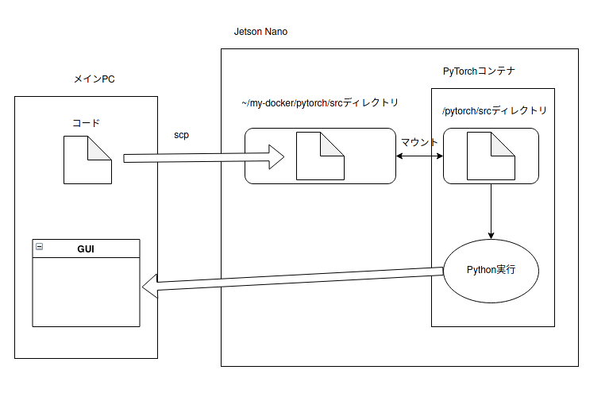

# コンテナ上でGUIアプリ開発　環境構築2

どこでコードを書くか。

## Linuxから（メインPC）

シンプルにこんな感じ。

`scp`コマンドで飛ばして、`ssh`でコマンド実行。なんか泥臭いけど、困るまではこれで行く。

前提として

* Jetson Nanoへのログインをパスフレーズ無しの公開鍵で行う
* Jetson Nanoユーザーが`docker`コマンドを打つときに`sudo`をつけなくてもいいようにしておく
* すでにJetson Nanoへのログインをしていて、すでにコンテナが動いている

ことが必要。GUIをローカルに飛ばしてくるのは、ここに来るまでにすでにやっているので割愛。

### コマンド作成

`scp`と`docker exec`を1コマンドで行えるようなコマンドを作ってしまえば良い。

適当にテキストファイルに以下を記入。

~~~
scp ~/python/pytorch_test/test2.py takeshi@192.168.1.205:~/my-docker/pytorch/src
ssh takeshi@192.168.1.205 docker exec pytorch_test_1 python3 /pytorch/src/test2.py
~~~

実行権限を与えて、パスが通っているディレクトリに放り込めば完了。

ファイルが増えてきたりしたら、また対策を考えよう。

## Windowsから（ノートPC）

基本的な構造は同じ。ただ、`scp`コマンドの代わりにWindowsからはVSCodeのRemote Developmentが使える。でも、GUIを手元に飛ばしてくる方法を準備してあげないといけない。

（準備中）
