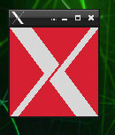
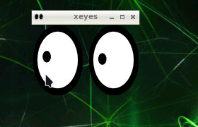
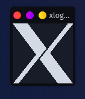

# NVIDIA L4T Baseイメージ1

## 立ち上げ

GUIアプリをコンテナ内で起動する場合、Jetson Nanoのデスクトップ上から直接コンテナを立ち上げる場合と、SSH接続でJetson Nanoと繋がっている場合とで設定が異なる。簡単なのはJetson Nanoのデスクトップ上での立ち上げ。

### Jetson Nano上で立ち上げる

~~~shell
$ xhost +
$ sudo docker run --name base -it --rm --net=host --runtime nvidia -e DISPLAY=$DISPLAY -v /tmp/.X11-unix/:/tmp/.X11-unix nvcr.io/nvidia/l4t-base:r32.5.0
~~~

最初の`xhost +`は、簡単に言うと、リモートで起動したGUIアプリをJetson Nano上で表示することを許可するコマンド。`+`という引数はどのIPからでも受け付けるという意味なのでセキュリティとしては危険。でも実験的に許可するだけだし、`xhost -`で元に戻せる。

その上でBaseコンテナを起動している。

* `-e`：環境変数を設定。`DISPLAY=$DISPLAY`は、「現在の環境変数に設定されているディスプレイ情報をコンテナ内の環境変数としてセットする」という意味。まあ簡単に言えば「コンテナ内部で起動したGUIアプリはJetson Nano上に表示する」ということ。
* `-v`：ここでマウントしているディレクトリはGUIアプリをデスクトップに表示するときに必要なもの。らしい。

このコマンドで立ち上げると以下のようなプロンプトが表示される。中に入れたらしい。

~~~shell
root@takeshi-jetson:/#
~~~

以下のコマンドを打ってGUIアプリが本当にデスクトップ上に表示されるかやってみる。

~~~shell
# apt update
# apt install x11-apps
# xlogo
~~~

~~~shell
# xeyes
~~~

※録画の関係で画面がちらついている

### SSH接続からの起動

| メインPC（Linux） | →    | Jetson Nano（Ubuntu）    | →    | Baseコンテナ  |
| ----------------- | ---- | ------------------------ | ---- | ------------- |
|                   |      |                          |      | ↓             |
| 受信して表示      | ←    | （画面情報をスルーパス） | ←    | GUIアプリ起動 |

こんな感じ。

なんでこんなことをするのかと言うと、普段Jetson NanoにSSH経由でアクセスしてたらモニターなんて繋いでなくて、でもそれだとGUIアプリ開発がやりにくい。ただ、そのGUIアプリはコンテナ内で動くから、開発はコンテナ内で行いたい、というわけ。

自分のメインPCがLinuxなのでLinux上でどうやるかを解説する。WindowsやMacの人は`windows ssh ubuntu gui docker`とか`mac (以下同文)`とかで検索してどうにかする。

でもおそらくどの解説でもX Window SystemサーバーというものをローカルPCに入れて、Ubuntu上で動くGUIアプリの画面をローカルで受信して表示させるような趣旨の解説になっているはず。以下の2以降の解説が大いに参考になるはず。

1. ローカルPC（Linux）上でターミナルを開き、以下を打つ。

   ~~~shell
   $ xhost (Jetson NanoのIP)
   ~~~

   これでGUI情報の受信を許可する。このコマンドはターミナルを開くたびに毎回打たないといけない。永続化させるには`~/.bashrc`（またはシェルとしてFishを使っている場合は`~/.config/fish/fish.config`）に以下を追記。

   ~~~
   xhost (Jetson NanoのIP) > /dev/null
   ~~~

2. Jetson NanoにSSHで接続してから、`vi`でも`nano`でも何でもいいからエディタで`/etc/ssh/sshd_config`を開いて以下の行を`yes`にする。

   ~~~
   X11Forwarding yes
   ~~~

3. 一度SSH接続を切り、`-Y`オプションをつけて再度SSH接続をする。

   ~~~shell
   $ ssh -Y (Jetson NanoのユーザーID)@(Jetson NanoのIP)
   ~~~

4. 以下のコマンドでBaseコンテナを立ち上げる。

   ~~~shell
   $ sudo docker run --name base -it --rm --net=host --runtime nvidia -e DISPLAY=$DISPLAY -v /tmp/.X11-unix/:/tmp/.X11-unix -v ~/.Xauthority:/root/.Xauthority nvcr.io/nvidia/l4t-base:r32.5.0
   ~~~

   Jetson Nano上でやるときとの違いは、2個目の`-v`オプションだけ。

   後は一緒。

5. お試しアプリをインストール&実行。

   ~~~shell
   # apt update
   # apt install x11-apps
   # xlogo
   ~~~

   

   ~~~shell
   # xeyes
   ~~~

   

   目が死にかけてるけど大丈夫か？

### `docker-compose.yml`にコンテナ立ち上げコマンドを書く

これ以降はDocker-Compose v1.27.0以降が必要。（`runtime`オプションを認識してくれないため）

どこか適当な場所（自分の場合は`~/my-docker/base`）に`docker-compose.yml`を作成し以下を記入。

Jetson Nano上で立ち上げる場合

~~~yaml
services:
    base:
        image: nvcr.io/nvidia/l4t-base:r32.5.0
        runtime: nvidia
        environment:
          - DISPLAY=$DISPLAY
        volumes:
          - /tmp/.X11-unix:/tmp/.X11-unix
        network_mode: "host"
        tty: true
        stdin_open: true
~~~

SSH接続経由で立ち上げる場合

~~~yaml
services:
    base:
        image: nvcr.io/nvidia/l4t-base:r32.5.0
        runtime: nvidia
        environment:
          - DISPLAY=$DISPLAY
        volumes:
          - /tmp/.X11-unix:/tmp/.X11-unix
          - ~/.Xauthority:/root/.Xauthority
        network_mode: "host"
        tty: true
        stdin_open: true
~~~

そして以下でコンテナ立ち上げ＆中に入る。

~~~shell
$ sudo docker-compose up -d
$ sudo docker attach base_base_1 #名前は変わる可能性あり　sudo docker psで調べられる
~~~

確認でX11のアプリを入れるのは同じ。

~~~shell
# apt update
# apt install x11-apps
# xlogo
# xeyes
~~~

