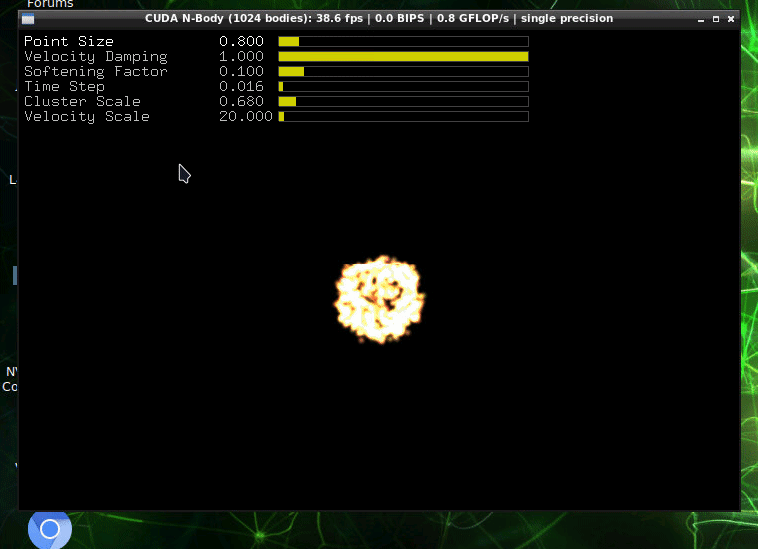
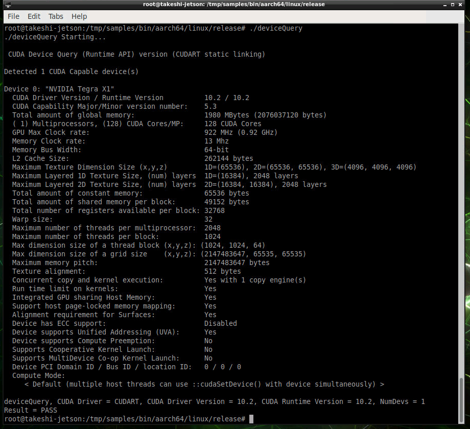
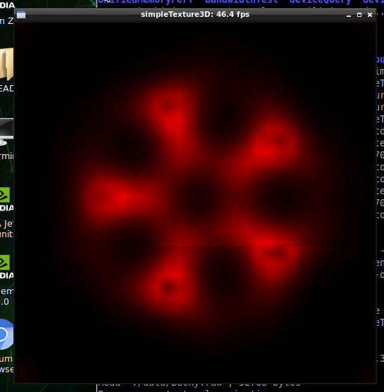

# NVIDIA L4T Baseイメージ2

ここではそもそもBaseイメージとは何なのかを紐解く。

参考にしているのは[ここ](https://gitlab.com/nvidia/container-images/l4t-base)。

## Dockerfileから分かること

全部は分からん。けど、断片的に分かること。

* ベースはUbuntu 18.04

* CUDAのライブラリが入っている

  ~~~
  $CUDAPKGは何かバージョン番号っぽいもの（おそらく10.2）
  
  cuda-libraries-$CUDAPKG
  cuda-nvtx-$CUDAPKG
  cuda-libraries-dev-$CUDAPKG
  cuda-minimal-build-$CUDAPKG
  cuda-license-$CUDAPKG
  cuda-command-line-tools-$CUDAPKG
  ~~~

* `gstreamer`も入っている

* Pythonは2.7と3.6

これだけじゃさっぱり。でもやっぱりCUDAは入っているらしい。でも雑に言うとCUDAしか入っていないらしい。

## CUDAサンプルの何かを動かしてみる

参考：[Jetson NanoでDocker Containerを動かす - やってみた！](https://akifukka.hatenablog.com/entry/2019/10/12/140000)

N-bodyというサンプルアプリがビルドできる。CUDAを使うのでJetson Nano上からコンテナに入る。

~~~shell
$ xhost +
$ sudo docker run --name base -it --rm --net=host --runtime nvidia -e DISPLAY=$DISPLAY -v /tmp/.X11-unix/:/tmp/.X11-unix nvcr.io/nvidia/l4t-base:r32.5.0
~~~

中に入って以下を打つ。

~~~shell
# apt update
# apt install -y --no-install-recommends make g++
# cp -r /usr/local/cuda/samples /tmp
# cd /tmp/samples/5_Simulations/nbody
# make
# ./nbody
~~~

こんな感じでサンプルアプリをコンパイルしたらCUDAが試せるらしい。

今度は`deviceQuery`を試してみる。

~~~shell
# cd /tmp/samples/1_Utilities/deviceQuery
# make
# ./deviceQuery
~~~

CUDAのバージョンは10.2。

simpleTexture3Dというのもあるらしい。

~~~shell
# cd /tmp/samples/2_Graphics/simpleTexture3D
# make
# ./simpleTexture3D
~~~

昔のビーマニ5鍵を思い出す。

## 公式見解

> l4t-base docker image enables l4t applications to be run in a container using the Nvidia Container Runtime on Jetson.
> It has a subset of packages from the l4t rootfs included within. Note that package contents of the l4t-base container have changed from the  r32.4.2 release (see below for details). The platform specific libraries and select device nodes for a particular device are mounted by the  NVIDIA container runtime into the l4t-base container from the underlying host, thereby providing necessary dependencies for l4t applications to  execute within the container. This approach enables the l4t-base container to be shared between  various Jetson devices.  
>
> Similarly, CUDA, TensorRT and VisionWorks are ready to use within the l4t-base container as they are made available from the host by the  NVIDIA container runtime.
>
> https://ngc.nvidia.com/catalog/containers/nvidia:l4t-base

l4t applicationsを動かすためのもの。CUDA、TensorRT、VisionWorksが使えるよ。ほんまかいな。

### TensorRT

参考：[TensorRTをubuntuにインストールするぞ - Qiita](https://qiita.com/chin_self_driving_car/items/c3bbf88d9a0ee203a7f7)

もう入っているはずなので、以下を打ちPython3のREPLを起動。

~~~shell
# python3
~~~

以下を打ちエラーが出なければTensorRTの存在を確認できる。脱出は`quit()`

~~~python
>>> import tensorrt
>>> quit()
~~~

### VisionWorks

調べた限りのやり方では入っていることが確認できなかった。ライブラリが足りてない？

## 参考

[NVIDIA Container Runtime on Jetson · NVIDIA/nvidia-docker Wiki](https://github.com/NVIDIA/nvidia-docker/wiki/NVIDIA-Container-Runtime-on-Jetson)
[Building Your First Jetson Container – Welcome to Collabnix](https://collabnix.com/building-your-first-jetson-container/)

