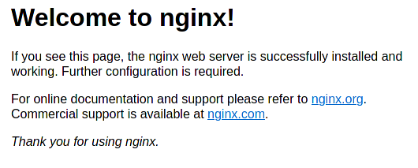
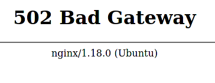
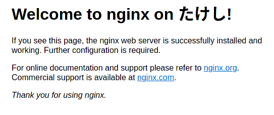

# Ubuntuコンテナでマウント

## Ubuntuコンテナ

~~~shell
$ sudo docker run ubuntu
~~~

これでUbuntuコンテナが立ち上がるが、ターミナルすら立ち上がらずすぐ止まる。何も指示していないので当然。

※止まったコンテナは溜まっていくので、`docker ps -a`でコンテナ名を確認して`docker rm (コンテナ名)`で削除しておく。

ターミナルを立ち上げてUbuntuっぽくするのは以下。

~~~shell
$ sudo docker run -it ubuntu
~~~

こうすると以下のようにターミナルが立ち上がる。

~~~shell
root@9271422f2061:/#
~~~

これを見るに、ユーザーは`root`で、現在地はトップディレクトリ。

抜けるのは普通に`exit`と打てば良い。抜けた後は手動でコンテナを削除する。

毎回削除するのが面倒なので、「コンテナが停止したら自動で削除する」というオプションを付与してコンテナを立ち上げる。

~~~shell
$ sudo docker run -it --rm ubuntu
~~~

これで楽になった。

## Nginxをインストールしてみる

Ubuntuコンテナ内でNginxをインストールして稼働させてみる。メインPCからブラウザでアクセスするときに、メインPC→Jetson Nano→コンテナという経路をたどるので、コンテナとJetson NanoのNICを共有させておく。

~~~shell
$ sudo docker run -it --rm --network host ubuntu
~~~

中に入ったら以下を打つ。

~~~shell
# apt update
# apt install nginx
# /etc/init.d/nginx start
~~~

そしてローカルPCからブラウザにJetson NanoのIPを打ち込んでアクセスしてみると

おおおおお、[約1年ほど前にRaspberry Piを触り始めてNginxをおっかなびっくり立ち上げて喜んでいたころを思い出す。](../webserver/nginx.html)

せっかくなので自分のページの説明に従ってPHPを試してみる。

あれー？`php-fpm`入れてNginxの設定ファイル書き換えて、と自分の指示どおりにやったけど動かない。

調べてみるとPHPはPHP用に別のコンテナを用意するっぽい。今回のテーマはそこではないので、一旦保留。PHPを動かさない状態で次に移る。

## マウント

Jetson Nano上のディレクトリとコンテナ内のディレクトリを接続して、コンテナを削除した後でも編集したファイルが残るようにする。違う見方をすれば、Jetson Nano上で編集したファイルをコンテナに持ち込むとも言える。

一度コンテナから抜けて削除。

再度コンテナを以下のコマンドで作成。

~~~shell
$ sudo docker run -it --network host --rm --volume ~/my-docker/ubuntu:/etc/www/html ubuntu
~~~

`~/my-docker/ubuntu`の部分は各自好きなところに変える。ただしフルパスじゃないとダメ。

で、再度Nginxをインストール&開始する。

~~~shell
# apt update
# apt install nginx
# /etc/init.d/nginx start
~~~

ローカルPCからブラウザ経由で再度アクセスできることを確認してから、コンテナ内から抜ける。抜け方は`Ctrl + P`を押した後に`Ctrl + Q`で、コンテナを動かしながらその中から出ることができる。

Jetson Nano上で`~/my-docker/ubuntu/index.nginx-debian.html`を編集・保存しブラウザをリロードしてみる。

よしよし。ということで、以下の対応でコンテナ内外のディレクトリが同期していることがわかる。

| Jetson Nano上         | コンテナ内      |
| --------------------- | --------------- |
| `~/my-docker/ubuntu/` | `/var/www/html` |

ちなみに名前付きボリュームというやり方もあるけど、正直いらない。

