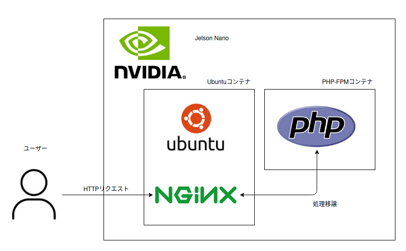

# 複数コンテナ

PHP処理を担当するコンテナというものを作成して、Webサーバー担当と分けてみる。

## 準備

Jetson Nano上にPHPファイル用のディレクトリを作成し、`index.php`を作成。

~~~shell
$ mkdir ~/my-docker/php
$ cd ~/my-docker/php
$ nano index.php
~~~

以下を記述。

~~~php+HTML
<?php phpinfo(); ?>
~~~

## コンテナ用のネットワークを作成

コンテナ同士が通信する方法はいくつかあるらしいけど、一般的なのはTCPでのやり取り。馴染みもあるし。以下を打ち、Docker用のネットワークを新たに作る。

~~~shell
$ sudo docker network create my-network
~~~

できたかどうかは以下で確認できる。`bridge`、`host`、`none`は最初から用意されている。まあだから言ってしまえば`my-network`を作る必要は無いんだけど、練習として。

~~~shell
$ sudo docker network ls
NETWORK ID     NAME         DRIVER    SCOPE
7431c1285d99   bridge       bridge    local
290dfd60aa80   host         host      local
a260687ee955   my-network   bridge    local
73f5330be4d1   none         null      local
~~~

## PHP-FPMコンテナ

PHPの処理を担当するコンテナを作成。

~~~shell
$ sudo docker run -d --volume ~/my-docker/php:/var/www/html --network my-network --network-alias phpfpm jitesoft/php-fpm
~~~

注意点としては

* `-d`でバックグラウンドで動かしておく。

* PHPのコンテナの中に実際のPHPスクリプトが書かれたファイルを置かないといけない。なので`~/my-docker/php`ディレクトリを`/var/www/html`にマウントする。なぜ`/var/www/html`かと言うと、Webサーバーのドキュメントルートに合わせるため。この`/var/www/html`を別のディレクトリに変えたら、Webサーバー側でもドキュメントルートを変える必要がある。

* `--network-alias`は名前解決に必要。
* 普通に`php-fpm`イメージからコンテナを作成するとJetson NanoのCPUアーキテクチャであるARM64で動かないので、どこかの誰かが作ったARM64で動く`jitesoft/php-fpm`を使用。

## Ubuntuコンテナ

前回と同様にUbuntuコンテナを立ち上げる。違うところは、ネットワークは`my-network`に参加させて、ポートだけ80番をJetson Nanoと共有する。これで自分のメインPCからブラウザにJetson NanoのIPを打つだけでNginxにアクセスできる。

~~~shell
$ sudo docker run -it -p 80:80 --network my-network ubuntu
~~~

コンテナ内でNginxをインストールし、立ち上げ。

~~~shell
# apt update
# apt install nginx
# /etc/init.d/nginx start
~~~

Nginxのコンフィグをいじる。

~~~shell
# apt install nano
# nano /etc/nginx/sites-enabled/default
~~~

`location`ディレクティブの`\.php$`となっているところをコメントアウトし以下のようにする。

~~~shell
location ~ \.php$ {
	include snippets/fastcgi-php.conf;
	fastcgi_pass phpfpm:9000;
}
~~~

ここでの注意点としては`fastcgi_pass`を`phpfpm:9000`とするところ。この`phpfpm`は先程`--network-alias`で設定した名前。もし`--network-alias`を設定しなければ、PHP-FPMコンテナに割り振られたIPを探して`phpfpm`の変わりに記述することになる。9000番のポートがすでに空いているのはPHP-FPMコンテナの作者の優しみ。

以下で、Nginxに「要求ファイルが存在する」と見せかけるためのファイルを準備。`touch`コマンドで作っているように、中身は何も無し。これが無いと、Nginxが処理をPHPに投げる前に「ファイルがねーぞ！」と404を返してしまう。

~~~shell
# touch /var/www/html/index.php
~~~

Nginxの設定ファイルを反映させる。

~~~shell
# /etc/init.d/nginx reload
~~~

## 動作テスト

メインPCからブラウザに`(Jetson NanoのIP)/index.php`と打ち込んで以下が出ればOK。

動いた。

## よくある図

なんかみんなこんな図描きがちだよね。

