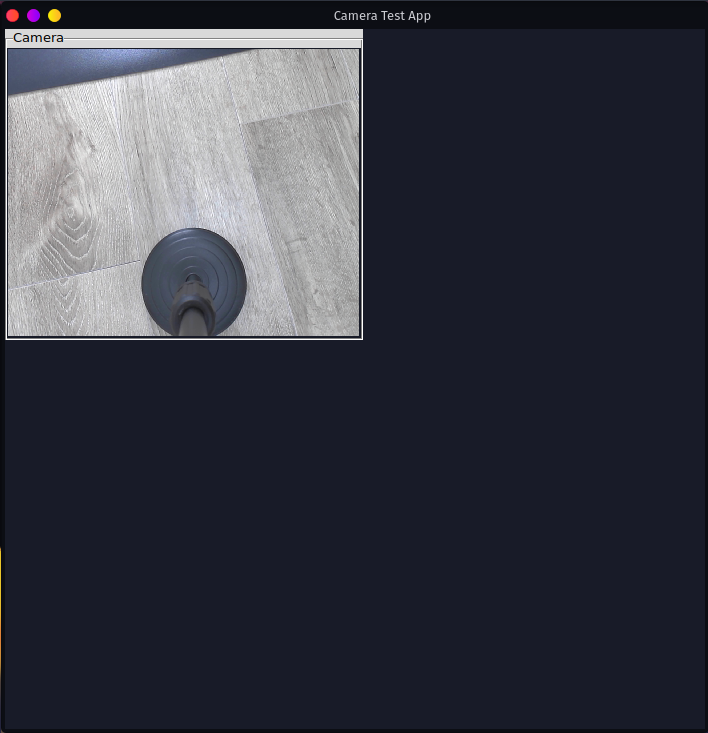

# コンテナ上でGUIアプリ作成　アプリ試作

## 環境

前回からの続き。

* PyTorchコンテナ
* OpenCV（GStreamerの使用をONにしたもの）
* JetCam

## ポイント

### OpenCVでキャプチャーしたカメラ画像をTkinterのフォーム上に表示

1. カメラ

   ↓（`cv2.VideoCapture`の`read`）

2. `ndarray`

   ↓（`cv2.cvtColor`でBGR形式をRGB形式に変換）

3. `ndarray`

   ↓（`PIL.Image.fromarray`）

4. `PIL.Image`

   ↓（`PIL.ImageTk.PhotoImage`）

5. Tkinterの`PhotoImage`オブジェクト

   ↓（`Tkinter.Canvas`の`create_image`）

6. Tkinterの`Canvas`オブジェクト

あとはTkinterのやり方で適当に表示

### 動画として連続アップデートする

1. 上の画像表示ロジックを`update`という名前のメソッドにまとめる。

2. `update`内で`after`を呼び、数ms後に再度`update`を実行するように登録。

   →延々と画像が更新され続ける

## コード

参考：
[パソコンに接続したカメラの映像をGUIに表示する。 - Qiita](https://qiita.com/kotai2003/items/3d31528d56059c848458)
[【Python/tkinter】OpenCVのカメラ動画をCanvasに表示する | イメージングソリューション](https://imagingsolution.net/program/python/tkinter/display_opencv_video_canvas/)
[Tkinter による GUI プログラミング - Python 入門](https://python.keicode.com/advanced/tkinter.php)

~~~python
from tkinter import *
from tkinter import ttk
import cv2
import PIL.Image, PIL.ImageTk
from jetcam.usb_camera import USBCamera

class Application(ttk.Frame):
    def __init__(self, master=None):
        super().__init__(master)
        self.pack(anchor=NW)

        self.master.geometry("700x700")
        self.master.title("Camera Test App")

        self.cap_device = 0
        self.cap_width = 352
        self.cap_height = 288
        self.delay = 15

        self.width = self.cap_width + 50
        self.height = self.cap_height + 50

        self.create_widgets()

        self.camera = USBCamera(capture_device=self.cap_device, capture_width=self.cap_width, capture_height=self.cap_height, width=self.cap_width, height=self.cap_height)
        self.camera.running = True

        self.update()

    def create_widgets(self):

        #Camera Frame
        self.frame_cam = ttk.LabelFrame(self, text = 'Camera')
        self.frame_cam.place(x = 10, y = 10)
        self.frame_cam.configure(width = self.cap_width + 30, height = self.cap_height + 30)
        self.frame_cam.grid_propagate(0)
        self.frame_cam.pack()

        #Canvas
        self.canvas1 = Canvas(self.frame_cam)
        self.canvas1.configure(width = self.cap_width, height = self.cap_height)
        self.canvas1.grid(column = 0, row = 0, padx = 10, pady = 10)
        self.canvas1.pack()

    def update(self):
        frame = self.camera.value
        frame = cv2.cvtColor(frame, cv2.COLOR_BGR2RGB)
        self.photo = PIL.ImageTk.PhotoImage(image = PIL.Image.fromarray(frame))
        self.canvas1.create_image(0, 0, image = self.photo, anchor = 'nw')
        self.master.after(self.delay, self.update)

if __name__ == "__main__":
    root = Tk()
    app = Application(master=root)
    app.mainloop()
    app.camera.running = False
~~~

これをコンテナ内の適当なところに`test2.py`とかいう名前で保存し、Pythonで実行する。

OpenCVで取得したカメラ映像をフォームに乗せて、他のウィジェットと同時に表示させられるのが良い。まだ他のウィジェット何も無いけど。

## 問題点

見て分かるとおりフォームの大きさが合っていないのと、ボタン等も追加していきたい。これからやることは山積み。でも、それだとどうしても「少し変えては動かし、また変えては動かして確認」の繰り返しとなってしまう。

現状では「コンテナ内に入ってスクリプトをいじってそのままPythonで起動」が一番ラクだけど、それだとエディターがNanoとかそんなんになってしまう。

ということで、

* ソース編集はローカルで、動作はコンテナ内で

を実現してみたい。

また、家のメインPCはLinuxだけど、ノートはWindowsだったりするので

* Windows上でもGUIのデバッグができるようにする

もやってみる。
