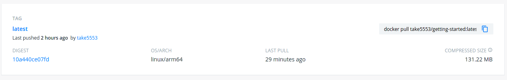

# イメージファイルの共有とアーキテクチャーの罠

Docker Hubを通じて作成したイメージファイルを配布できるようにする。

## Docker Hubでリモートリポジトリを作成

1. [Docker Hubにサインアップ](https://www.docker.com/pricing?utm_source=docker&utm_medium=webreferral&utm_campaign=docs_driven_upgrade)
2. [Docker Hubにログイン](https://hub.docker.com/)
3. `Create Repository`をクリック
4. 名前を`getting-started`にし、公開レベルを`Public`にする
5. `Create`をクリック

## Docker Hubに作成したイメージファイルをPush

Jetson Nano上で

~~~shell
$ sudo docker login -u (Docker Hubのユーザー名)
~~~

パスワードを要求されるので、入力するとログイン完了。

さらに以下でローカルにあるDockerイメージに、Docker Hub上にあるリモートリポジトリをタグ付け。

~~~shell
$ sudo docker tag getting-started (Docker Hubのユーザー名)/getting-started
~~~

以下でPush。

~~~shell
$ sudo docker push (Docker Hubのユーザー名)/getting-started
~~~

## 試してみる

[Play with Docker](https://labs.play-with-docker.com/)というところに行き、`Login`をクリック、ドロップダウンリストから`docker`を選択すると何やらセッションが始まる。

画面左の`ADD NEW INSTANCE`をクリックするとコンソールが開くので以下を打ち込む。

~~~shell
$ docker run -d -p 3000:3000 (Docker Hubのユーザー名)/getting-started
~~~

これでPullが始まり、IPの右に表示される「3000」というリンクを開けば動く・・・はず。

## アーキテクチャーの罠

実際に自分が試したところ、エラーが表示されてコンテナが動かなかった。

~~~
WARNING: The requested image's platform (linux/arm64) does not match the detected host platform (linux/amd64) and no specific platform was requested
~~~

どうやら、Jetson NanoのCPUのアーキテクチャーがARM64なので、Jetson Nano上でビルドしたイメージはARM64アーキテクチャー向けイメージになるらしい。

参考：[ARMとx86/x64 (Intel, AMD) のCPU、アーキテクチャの違い、シェア、性能比較、アーキテクチャ、エンディアン | urashita.com 浦下.com (ウラシタドットコム)](https://urashita.com/archives/12325)

Play with Dockerでは使っているCPUはAMD64ということになるのかな？つまり「CPUの種類が違うから動かせへんで」ということか。

Docker Hub上の自分がアップしたイメージを見てみると以下の様に表示されている。

「OS/ARCH」が`linux/arm64`となっている。

### 実験

試しにDocker Hub上で「getting-started」で検索し、適当に見つかったイメージから`linux/arm64`になってないものをJetson NanoにPullして動かそうとしてみる。

するとやっぱり以下のエラーが表示された。

~~~
WARNING: The requested image's platform (linux/amd64) does not match the detected host platform (linux/arm64/v8) and no specific platform was requested
~~~

今度は警告が逆になっている。

じゃあDocker Hubから`linux/arm64`になっているイメージを適当にPullして動かしてみると、普通に動いた。

そういうことか。

### 結論

* Jetson Nano上でビルドしたイメージは、Jetson Nano専用（もしくはARM64ならいけるはずなのでRaspberry Pi 4と64bit OSの組み合わせでもOK）とする。
  * [Raspberry Pi 3でもいけるらしい。](https://blog.knjcode.com/arm64-docker-on-raspberry-pi-3/)
* マルチCPUアーキテクチャー対応イメージをビルドする（各自チェック）

