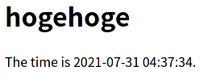
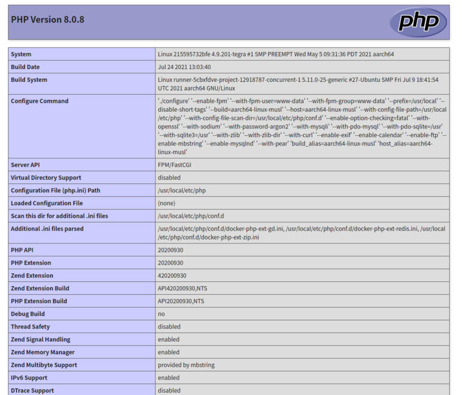

# Nginxコンテナを使ってもう一度

前回やった複数コンテナの連携で、PHP-FPMコンテナがワンコマンドで立ち上がったのに比べてUbuntuコンテナは立ち上げからの手順が多かった。正直なところUbuntuよりNginxに仕事してもらえたらそれでいいので、最初からNginxがインストールされているコンテナを使えば楽。

ということでNginxコンテナを使ってもう一度動くかどうか確かめる。

## 実験用ファイルを準備

適当にファイルを作成。

~~~shell
$ mkdir ~/my-docker/nginx/html
$ cd ~/my-docker/nginx/html
$ nano index.html
~~~

中身は以下。

~~~html
<h1>hogehoge</h1>
~~~

## まずは単体で

~~~shell
$ sudo docker run --name nginx -d -p 80:80 -v ~/my-docker/nginx/html:/usr/share/nginx/html nginx
~~~

今回からコンテナ名を`--name`で指定することにする。毎回`docker ps`でコンテナ名を確認して、訳の分からんランダムな名前を打ち込むのは面倒。

`-v`でのマウント先`/usr/share/nginx/html`は[Docker HubのNginxのページ](https://hub.docker.com/_/nginx)で説明されていた。デフォルトではここ使えということなのね。

これでメインPCからブラウザを立ち上げJetson NanoのIPにアクセスすると以下のように大きなhogehogeが表示される。

ちなみにデフォルトのWelcome to nginx!ページは準備されていないみたい。

### 設定ファイルを覗く

コンテナの中からNginxの設定ファイルをJetson Nano上に出して中を覗いてみる。まずは出してくる場所の作成。Jetson Nano上で以下を打つ。

~~~shell
$ mkdir ~/my-docker/nginx/conf
~~~

Docker Hub上の説明から`/etc/nginx`内に設定ファイルがありそうなので、そこを調べてみる。Jetson Nano上で以下を打つ。（Nginxコンテナ内ではシェルが動いているわけではなさそうなので外部からコマンドを実行する）

~~~shell
$ sudo docker exec nginx ls -al /etc/nginx
~~~

~~~
total 36
drwxr-xr-x 1 root root 4096 Jul 22 04:46 .
drwxr-xr-x 1 root root 4096 Jul 31 03:50 ..
drwxr-xr-x 1 root root 4096 Jul 31 03:50 conf.d
-rw-r--r-- 1 root root 1007 Jul  6 14:59 fastcgi_params
-rw-r--r-- 1 root root 5290 Jul  6 14:59 mime.types
lrwxrwxrwx 1 root root   22 Jul  6 15:11 modules -> /usr/lib/nginx/modules
-rw-r--r-- 1 root root  648 Jul  6 15:11 nginx.conf
-rw-r--r-- 1 root root  636 Jul  6 14:59 scgi_params
-rw-r--r-- 1 root root  664 Jul  6 14:59 uwsgi_params
~~~

これによりコンテナ内の`/etc/nginx`に

* 大本の設定ファイルとして`nginx.conf`
* その他の設定ファイルの置き場所として`conf.d`ディレクトリがある

ということが分かったので、今度は`conf.d`ディレクトリの中を覗いてみる。

~~~shell
$ sudo docker exec nginx ls -al /etc/nginx/conf.d
~~~

~~~
total 12
drwxr-xr-x 1 root root 4096 Jul 31 03:50 .
drwxr-xr-x 1 root root 4096 Jul 22 04:46 ..
-rw-r--r-- 1 root root 1093 Jul 31 03:50 default.conf
~~~

`default.conf`しか置いていない。よし、こいつをいじればいいんだな。

コンテナ外に引っ張り出してくる。

~~~shell
$ sudo docker cp nginx:/etc/nginx/conf.d/default.conf ~/my-docker/nginx/conf
~~~

中身を見てみる。

~~~
server {
    listen       80;
    listen  [::]:80;
    server_name  localhost;

    #access_log  /var/log/nginx/host.access.log  main;

    location / {
    root   /usr/share/nginx/html;
    index  index.html index.htm;
    }

    #error_page  404              /404.html;

    # redirect server error pages to the static page /50x.html
    #
    error_page   500 502 503 504  /50x.html;
    location = /50x.html {
    root   /usr/share/nginx/html;
    }

    # proxy the PHP scripts to Apache listening on 127.0.0.1:80
    #
    #location ~ \.php$ {
    #    proxy_pass   http://127.0.0.1;
    #}

    # pass the PHP scripts to FastCGI server listening on 127.0.0.1:9000
    #
    #location ~ \.php$ {
    #    root           html;
    #    fastcgi_pass   127.0.0.1:9000;
    #    fastcgi_index  index.php;
    #    fastcgi_param  SCRIPT_FILENAME  /scripts$fastcgi_script_name;
    #    include        fastcgi_params;
    #}

    # deny access to .htaccess files, if Apache's document root
    # concurs with nginx's one
    #
    #location ~ /\.ht {
    #    deny  all;
    #}
}
~~~

ほほう、これは見慣れたやつだ。

## NginxコンテナとPHP-FPMコンテナの連携

### Nginxの設定ファイルの編集

先程の`default.conf`の中の`location ~ \.php$`ブロックのコメントアウトを外して以下のようにする。

~~~
    location ~ \.php$ {
         fastcgi_pass   phpfpm:9000;
         fastcgi_index  index.php;
         fastcgi_param  SCRIPT_FILENAME  /scripts$fastcgi_script_name;
         include        fastcgi_params;
    }
~~~

`root`ディレクティブはこの中にいらない。

### PHP-FPMコンテナを立ち上げる

~~~shell
$ sudo docker run --name phpfpm -d -v ~/my-docker/nginx/html:/scripts --network my-network --network-alias phpfpm jitesoft/php-fpm
~~~

ほぼ前回と同じだけど、

* `--name`オプションを追加
* `-v`のパラメーター変更

に注意。

特に`-v`は

* マウント元：Nginxコンテナにもマウント予定のディレクトリ

* マウント先：上記`default.conf`に

  ~~~
           fastcgi_param  SCRIPT_FILENAME  /scripts$fastcgi_script_name;
  ~~~

  とあるので、NginxからPHP-FPMに「`/scripts/(ファイル名)`を処理して」とメッセージを投げ、それを受けてPHP-FPMが仕事をすると思われる。

  つまりこの設定だとPHP-FPMのコンテナ内ではNginxのドキュメントルートに合わせたディレクトリ階層ではなく、`/scripts`というディレクトリの中にPHPが書かれたファイルが存在しないといけないということになる。

### Nginxコンテナを立ち上げる

~~~shell
$ sudo docker run --name nginx -d -p 80:80 -v ~/my-docker/nginx/html:/usr/share/nginx/html --network my-network -v ~/my-docker/nginx/conf/default.conf:/etc/nginx/conf.d/default.conf nginx
~~~

設定をミスっていたら立ち上がらないので、ちゃんと立ち上がっているか確認。

~~~shell
$ sudo docker ps
~~~

~~~
CONTAINER ID   IMAGE              COMMAND                  CREATED         STATUS         PORTS                NAMES
8759dca18f7d   nginx              "/docker-entrypoint.…"   5 seconds ago   Up 3 seconds   0.0.0.0:80->80/tcp   nginx
7f46b8ca3a72   jitesoft/php-fpm   "entrypoint php-fpm"     5 minutes ago   Up 5 minutes   9000/tcp             phpfpm
~~~

ちゃんと立ち上がっている。

### もしNginxコンテナが立ち上がらなかったら

立ち上がらない場合は単純に`default.conf`の編集ミスまたはコンテナ立ち上げ時のコマンドミスだと思う。以下で調べることができる。

~~~shell
$ sudo docker logs nginx
~~~

### テスト

まずは`~/my-docker/nginx/html`の中にある`index.html`を`index.php`にリネームして以下のように編集。

~~~php+HTML
<h1>hogehoge</h1>

The time is <?php echo date('Y-m-d H:i:s'); ?>.

~~~

メインPCからブラウザに`(Jetson NanoのIP)/index.php`と打ち込んでアクセス。

よしよし。タイムゾーンの設定がおかしいけど、まあ設定でどないでもなるでしょ。

`index.php`の中身を以下に書き換えて再度アクセス。

~~~php+HTML
<?php phpinfo(); ?>
~~~

良し。

