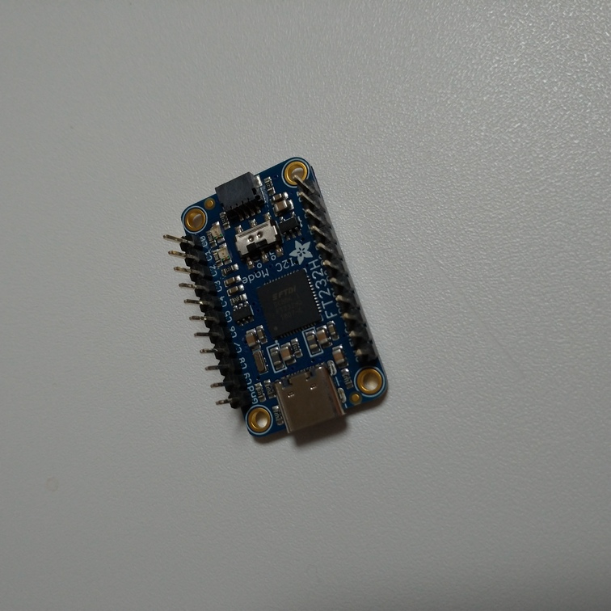
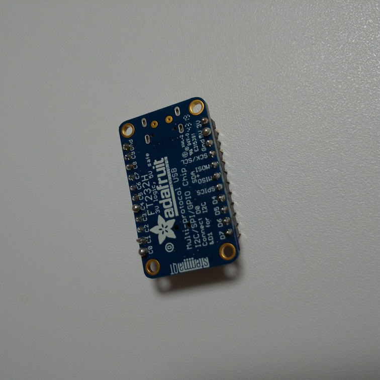
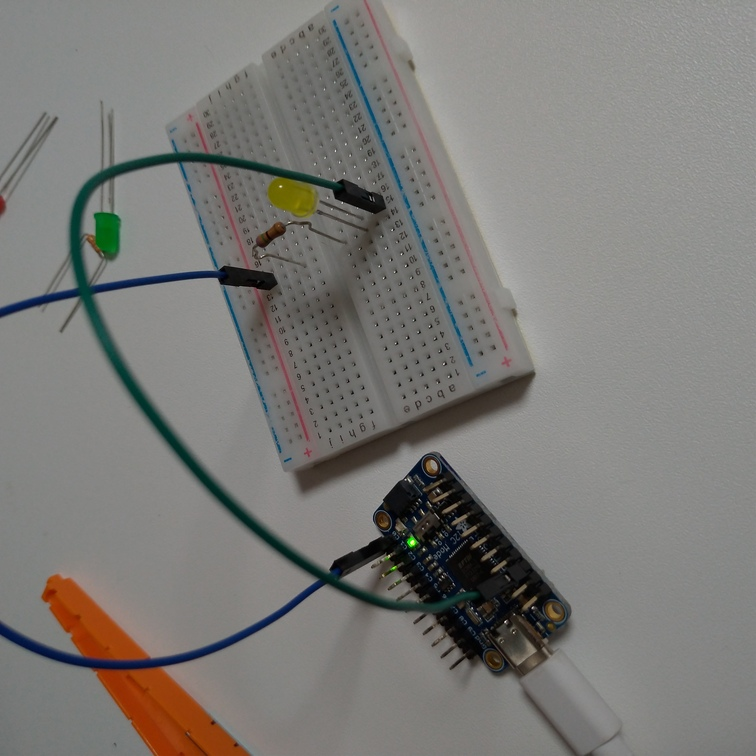
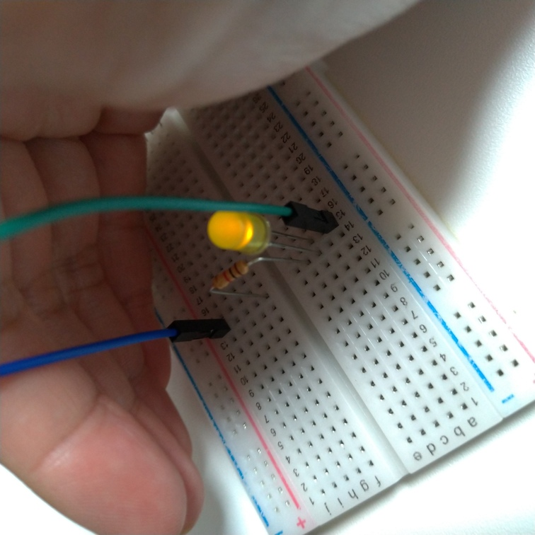
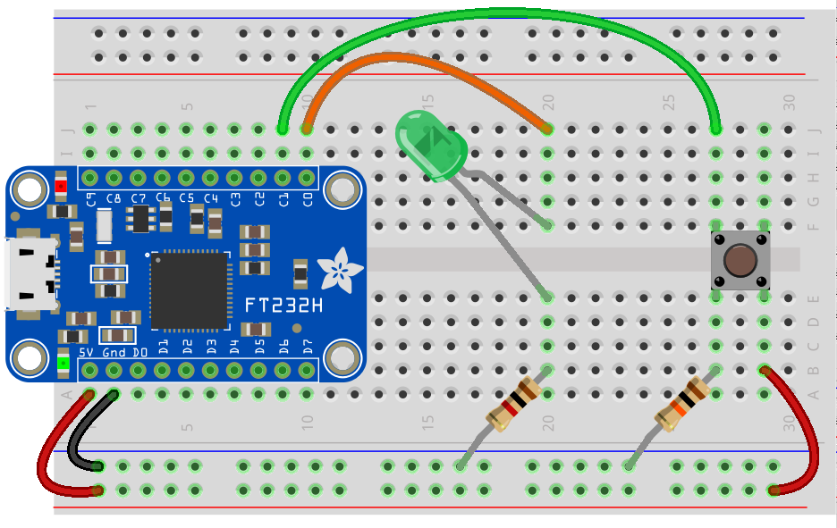
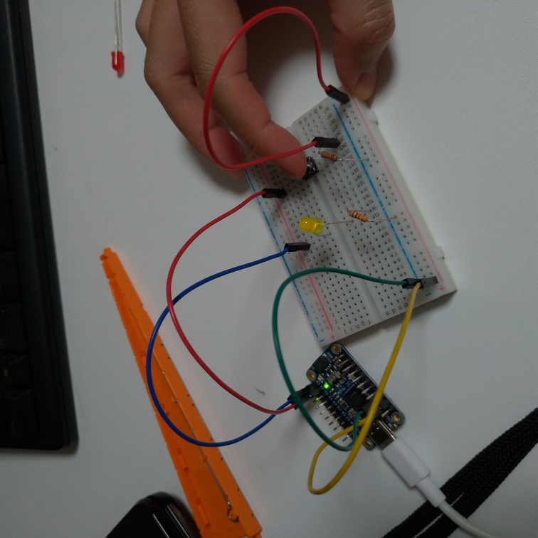

# PCにGPIOを編

Raspberry Piですっかりおなじみの例のピンをPCにも持たせる。 これによりRaspberry PiでなくてもLEDを光らせて通知をするみたいなことができる。

## 参考

[Overview | CircuitPython Libraries on any Computer with FT232H | Adafruit Learning System](https://learn.adafruit.com/circuitpython-on-any-computer-with-ft232h)
[パソコンにGPIOボードを追加する。(1) - Qiita](https://qiita.com/kotai2003/items/0c96143b7d6e84629d99)

Windowsについては上記のQiitaの記事を参考にしてもらうとして、ここではLinuxにインストールすることを目標とする。

例によってGaruda Linux（Arch Linux）なので他のディストロは適宜読み替えてほしい。

## 準備物

[ＦＴ２３２Ｈ使用ＵＳＢ⇔ＧＰＩＯ＋ＳＰＩ＋Ｉ２Ｃ変換モジュール: 半導体 秋月電子通商-電子部品・ネット通販](https://akizukidenshi.com/catalog/g/gM-08942/)

アスクルでも売ってた
[【アスクル】Adafruit FT232H Breakout ー General Purpose USB to GPIO+SPI+I2C 63-3079-73（直送品） 通販 - ASKUL（公式）](https://www.askul.co.jp/p/X368977/)

こいつにピンが付属するので頑張って自分ではんだ付けをする。

## 手順

### インストール

1. (確認)`libusb`がインストールされているかどうか

   ~~~shell
   $ yay -Ss libusb
   ~~~

   とりあえずインストール済みみたいなことが出ればOK

2. udevルールを作成

   ~~~shell
   $ sudo micro /etc/udev/rules.d/11-ftdi.rules
   ~~~

   以下を書き保存。

   ~~~
   # /etc/udev/rules.d/11-ftdi.rules
   SUBSYSTEM=="usb", ATTR{idVendor}=="0403", ATTR{idProduct}=="6001", GROUP="plugdev", MODE="0666"
   SUBSYSTEM=="usb", ATTR{idVendor}=="0403", ATTR{idProduct}=="6011", GROUP="plugdev", MODE="0666"
   SUBSYSTEM=="usb", ATTR{idVendor}=="0403", ATTR{idProduct}=="6010", GROUP="plugdev", MODE="0666"
   SUBSYSTEM=="usb", ATTR{idVendor}=="0403", ATTR{idProduct}=="6014", GROUP="plugdev", MODE="0666"
   SUBSYSTEM=="usb", ATTR{idVendor}=="0403", ATTR{idProduct}=="6015", GROUP="plugdev", MODE="0666"
   ~~~

3. Pythonのライブラリを追加

   Garuda Linuxの場合`python`コマンドはPython3を指すので、他のディストロでは適宜読み替えること。

   また、仮想環境を準備する必要がある人はそのようにすること。

   ~~~shell
   $ python --version
   Python 3.9.5
   $ python -m pip install pyftdi
   $ python -m pip install adafruit-blinka
   ~~~

4. 環境変数を設定

   ~~~shell
   export BLINKA_FT232H=1
   ~~~

   `~/.profile`に書き込んで永続化させても良い。その場合は`source`コマンドで`~/.profile`を読み込み直すこと。

   セットできたかどうか確認は以下。

   ~~~shell
   $ printenv
   ~~~

   いっぱい出てくるので頑張って探す。

### インストール確認

FT232HをPCに接続した後、PythonのREPLを起動。

~~~shell
$ python
~~~

以下を打つ。

~~~python
>>> from pyftdi.ftdi import Ftdi
>>> Ftdi().open_from_url('ftdi:///?')
Available interfaces:
ftdi://ftdi:232h:1/1   (￿￿￿￿￿￿)

Please specify the USB device
~~~

カッコの中が文字化けしたけど、参考サイトによるとここは`USB <-> Serial Converter`と出るらしい。

このコマンドを実行した後は強制的にREPLが終了する。

次に環境変数がちゃんと読み込まれているかどうかの確認のため、再度Pythonを起動。

~~~shell
$ python
~~~

以下を打つ。

~~~python
>>> import os
>>> os.environ["BLINKA_FT232H"]
'1'
~~~

もし何か変な表示が出るなら環境変数のセットがうまくいっていない可能性があるので、頑張って何とかセットする。

ちなみにこのコマンドではREPLは終了しないので、続けて以下を打ちGPIOを操作するためのモジュールが読み込めることを確認する。

~~~python
>>> import board
>>>
~~~

特に何も出ないということはエラー無く読み込めたということ。

ちなみにREPLを終了させたい場合は`quit()`と打てば良い。

### Lチカ

C0→1kΩ抵抗→LED→GNDとつなぐ。

PythonのREPL上で以下を打つ。

~~~python
>>> import board #先程のインストール確認から引き続きの場合はこの行はいらない
>>> import digitalio
>>> led = digitalio.DigitalInOut(board.C0)
>>> led.direction = digitalio.Direction.OUTPUT
>>> led.value = True
~~~

ぺか。

続いてINPUTを試す。

ボタンを取り付けただけの回路だと分かりにくいので、ボタン＋LEDをいきなり試す。

以下のように配線（画像は[公式ガイド](https://learn.adafruit.com/circuitpython-on-any-computer-with-ft232h/gpio)より）。FT232Hの新しいバージョンであるUSB-Cを使うタイプでは5Vだけじゃなく3Vピンもあるので注意。（以下の画像は古いmicroUSBバージョンのピン配置で5Vしかない）。

抵抗は左側（茶・黒・赤）が1kΩ、右側（茶・黒・橙）が10kΩ。

コードは以下。

~~~python
import board
import digitalio

led = digitalio.DigitalInOut(board.C0)
led.direction = digitalio.Direction.OUTPUT

button = digitalio.DigitalInOut(board.C1)
button.direction = digitalio.Direction.INPUT

while True:
    led.value = button.value
~~~

REPL上で試す場合は最後の`while`で無限ループするので、脱出は`ctrl + C`。

分かりにくいけど、ボタンを押すとちゃんと光る。

