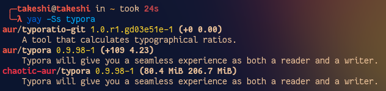
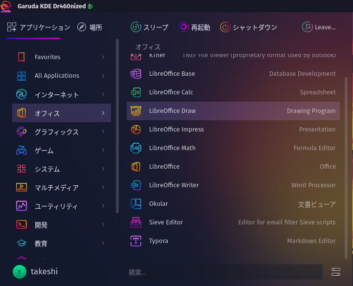
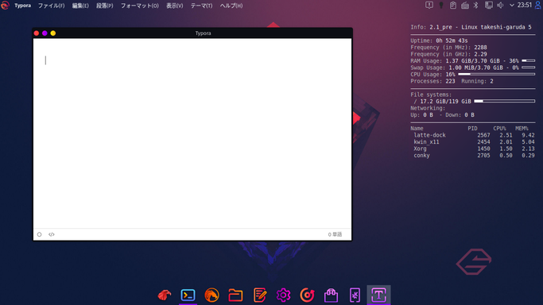

# 2日目　Typoraを入れてマークダウンを書く

このサイトを書くのに使っているTyporaを入れる。

せっかくなので先日入れた`yay`を使って入れてみる。

## `yay`を使ってインストール

まずは検索。

ちゃんとAURからも検索している。

~~~
aur/typora 0.9.98-1 (+109 4.23)
~~~

この`+109`というのは投票数で、4.23はPopularity（レーティングではないけど、最近の投票が多ければ多いほど上がる数値）らしい。これを見ればちゃんと動くか動かないかが大体分かる。

インストール。

~~~shell
$ yay -S typora
~~~

できたはできたけど、ログを見ると別に変なことしていない。多分`chaotic-aur`から普通にDLした？

## 起動

スタートメニューの「オフィス」の一番下に入ってた。デスクトップ上で何も選択せずに`typora`と打っても起動する。

OSが違うけど、ソフトはいつものやつ。そうそう、これこれ。

ちなみにデスクトップの右側に見えてるやつは`conky`というシステムモニター。また今度紹介する。