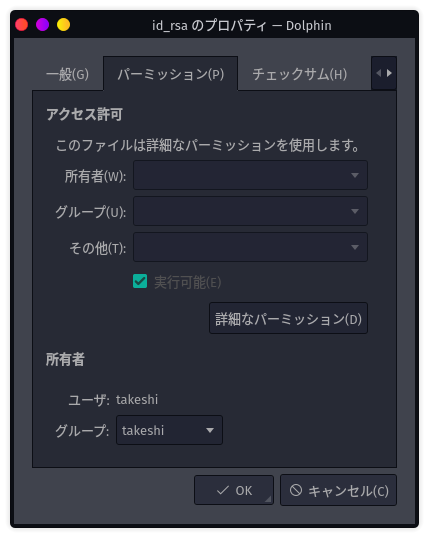

# 3日目　SSH接続でRaspberry Piにログイン

Garuda LinuxからSSHでRaspberry Piに接続する。できれば[今まで](../startup/powershellalias.html)のようにコマンド一発でログインできるようにしたい。

## 秘密鍵を移動

現状Raspberry Piには`takeshi`ユーザーと`upload`ユーザーがいるので、それぞれの秘密鍵（普通は`id_rsa`という名前）をGaruda Linux側に移しておく。

[Samba経由](samba.html)で移せば楽。でも使うにはパーミッションの設定が必要。

`id_rsa`を右クリックしてプロパティを開いて、「詳細なパーミッション」をクリック。

パーミッションを「600」にすればいいので、以下のように設定。

そしてKonsoleで以下を打つと入れる。

~~~shell
$ ssh takeshi@192.168.1.201
~~~

## 一発でログインできるようにコマンドを登録

### PATHを通す

~~~shell
$ fish_add_path /home/takeshi/command/
~~~

ちなみに消すときは、一度、今追加したPATHが何番目に追加されているかを確認。

~~~shell
$ echo $PATH
/home/takeshi/command/ (他いろいろ...)
~~~

1番目に来ているので、以下を打つと消える。

~~~shell
$ set -e -U fish_user_paths[1]
~~~

### コマンドを作成

~~~shell
$ mkdir ~/command
$ micro mytest
~~~

以下を記述して保存。

~~~
#!/usr/bin/fish

echo 'hello garuda linux'
~~~

実行権限を付与。

~~~shell
$ chmod +x mytest
~~~

以下を実行

~~~shell
$ mytest
hello garuda linux
~~~

OK

### SSHで接続するコマンドを作成

~~~shell
$ rm mytest
$ micro ssh-takeshi
~~~

以下を記述

~~~
#!/usr/bin/fish

ssh takeshi@192.168.1.201
~~~

権限付与。

~~~shell
$ chmod +x ssh-takeshi
~~~

これでどこのディレクトリにいても、以下を打つことでRaspberry Piにログインできる。

~~~shell
$ ssh-takeshi
~~~

### `upload`ユーザーの鍵を移動

`upload`ユーザーの鍵をGaruda Linuxに移し、`id_rsa_upload`にリネームして`.ssh`ディレクトリに突っ込む。権限も`takeshi`ユーザーの時と同じように設定。

で、同様にコマンドを作成。

~~~shell
$ cd ~/command
$ micro ssh-upload
~~~

以下を打つ。

~~~
#!/usr/bin/fish

ssh upload@192.168.1.201 -i /home/takeshi/.ssh/id_rsa_upload
~~~

作ったコマンドに権限を付与し実行。

~~~shell
$ chmod +x ssh-upload
$ ssh-upload
~~~

これで`upload`ユーザーもRaspberry Piにログインできるようになった。