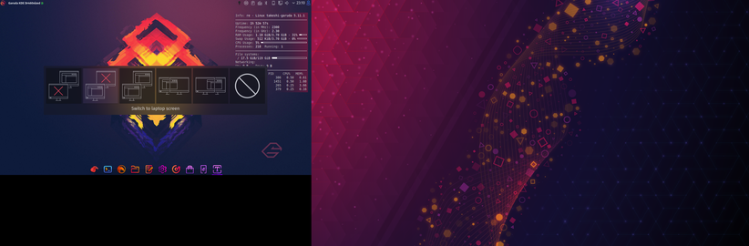
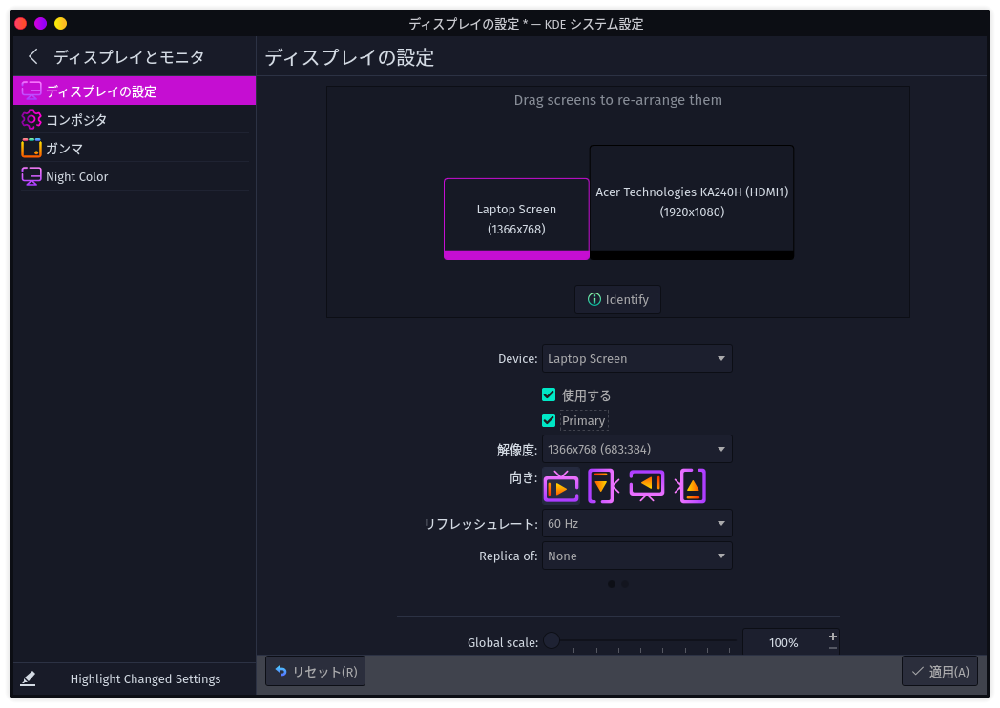
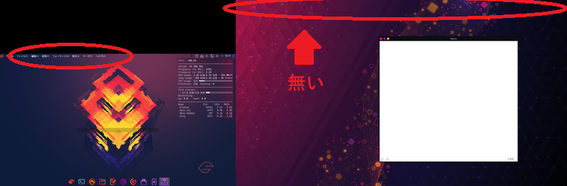
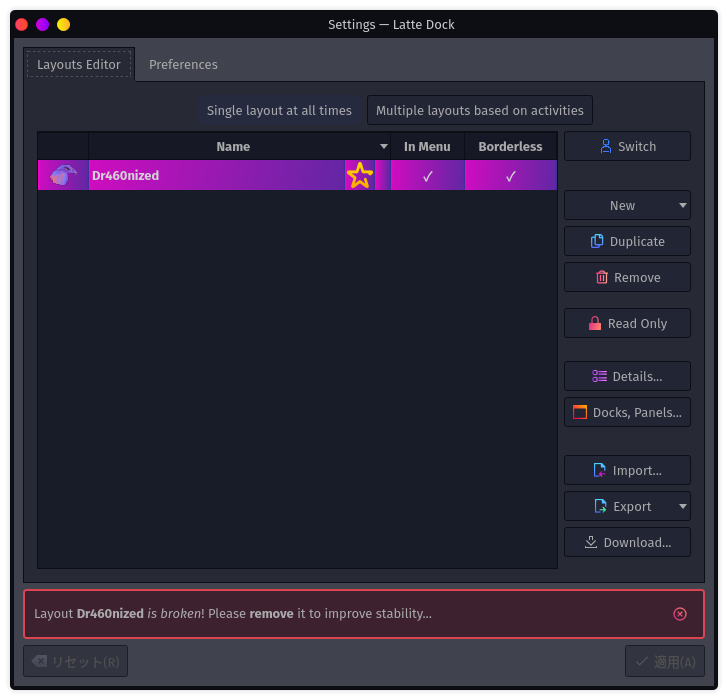
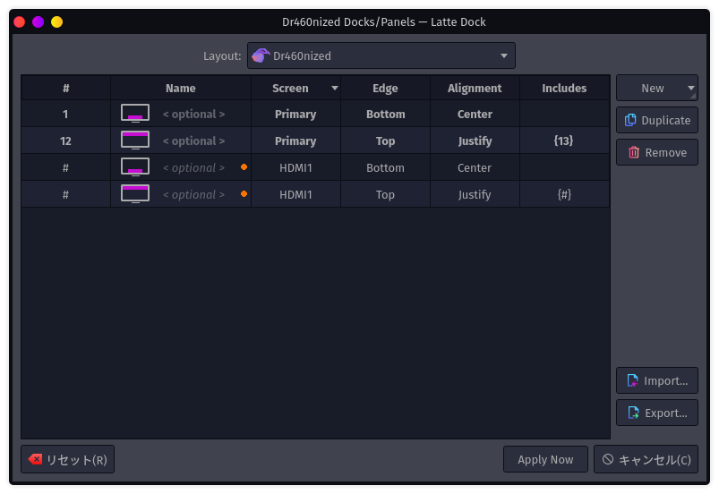
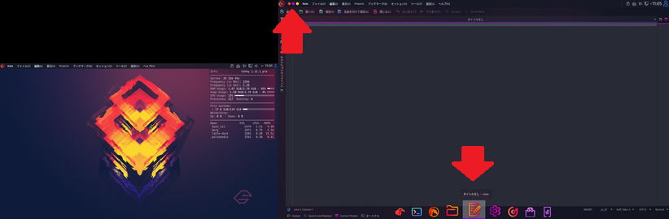

# 5日目　サブディスプレイを接続

普通にパソコンにHDMIポートが付いているので、適当にモニターをつないでみた。

メインモニターの右にとりあえず追加されて、メインモニターには「追加されたモニターをどう扱うか」が表示された。

どちらか片方を非表示にするか、コピーするか、拡張するか。

でも気になったのは、拡張が右か左かの2択しか無いところ。Windowsなら結構柔軟に位置を設定できるけど、Garuda Linuxではできないっぽい。

まあ、別にええけど。

と思ったらKDEの設定で柔軟に設定できた。

なるほど。

## 2枚目のモニターにメニューバーが無い

いつもは画面上部に表示されるやつ。

何とかする。

1. メインディスプレイのメニューバー上で右クリック

2. Layouts→Edit Layouts

3. ウィンドウ右側の「Docks, Panels...」をクリック

   

4. 初期状態だと設定が2行あるので、画面右の「Duplicate」をクリックしてその2行を複製する。その後にScreenのセルをダブルクリックして2枚目のスクリーンの名前にする。自分の場合は「HDMI1」だった。

   

5. 「Apply Now」をクリック

そうすると、メニューバーと、画面下部のドックが2枚目のスクリーンにも適用される。

画像が小さいけど、見えるかな？

## Latte Dock

このパネルとドックはLatte Dockというソフトウェアで実現しているらしい。

詳しいドキュメントは見つからなかったけど、紹介動画はいろいろあるらしい。公式は[こちら](https://www.youtube.com/watch?v=3pL2WsBTU1c&t=108s)。

