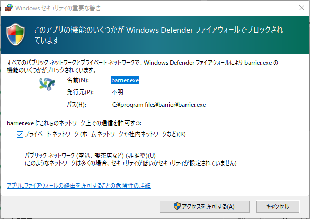

# 6日目　キーボードとマウスをWindowsと共有＆切り替え

Garuda LinuxとWindowsを一つのキーボードとマウスで操作する。[物理的なデバイス](https://www.amazon.co.jp/UGREEN-PC2%E5%8F%B0%E7%94%A8-%E3%83%8F%E3%83%96%E3%81%AA%E3%81%A9%E3%82%92%E5%88%87%E6%9B%BF-USB%E3%82%B1%E3%83%BC%E3%83%96%E3%83%AB%C3%97%EF%BC%92-%E3%83%91%E3%82%BD%E3%82%B3%E3%83%B32%EF%BC%9AUSB%E6%A9%9F%E5%99%A84/dp/B071NM5GRW/ref=asc_df_B071NM5GRW/?tag=jpgo-22&linkCode=df0&hvadid=342420302561&hvpos=&hvnetw=g&hvrand=8457177396989913670&hvpone=&hvptwo=&hvqmt=&hvdev=c&hvdvcmdl=&hvlocint=&hvlocphy=1009540&hvtargid=pla-909251618549&psc=1)もあるけどソフトウェア上で実現してみる。

## Barrier

参考：[Barrierを用いて複数のPC間でマウス・キーボード共有を行う（2019年秋Ver） \- 粗大メモ置き場](https://ossyaritoori.hatenablog.com/entry/2019/09/26/Barrier%E3%82%92%E7%94%A8%E3%81%84%E3%81%A6%E8%A4%87%E6%95%B0%E3%81%AEPC%E9%96%93%E3%81%A7%E3%83%9E%E3%82%A6%E3%82%B9%E3%83%BB%E3%82%AD%E3%83%BC%E3%83%9C%E3%83%BC%E3%83%89%E5%85%B1%E6%9C%89)

Barrierというソフトを使えば、同じLAN上にいるPC同士でキーボード・マウス共有できるらしい。

AURでの投票数が低いけど、Communityリポジトリには入っている。（Communityリポジトリとは、AURのパッケージの中でTrusted Userにより十分な投票が得られたものが登録されるところらしい。公式と非公式の中間。）

動くのかな？

## インストール＆セットアップ

### Garuda Linux側

システムをアップデートしてからインストール。

~~~shell
$ yay
$ sudo pacman -S barrier
~~~

ようこそ。言語は日本語もあるので安心。

む、サーバー側（キーボードとマウスが実際に繋がれている側のPC）から先にセットアップしないといけないのか。

一旦Windows側をセットアップする。

### Windows側

[Releases · debauchee/barrier · GitHub](https://github.com/debauchee/barrier/releases)

上記サイトからSetUp用実行ファイルをDL。

適当に実行すると適当にインストールが始まる。

インストールが終わって起動すると、Linux版と同様にようこそ画面が表示される。

サーバーとしてセットアップするとWindowsが何か聞いてくるので、アクセスを許可するをクリック。

とりあえず「開始」をクリック。

開始するとこの画面を閉じてもバックグラウンドで動いているらしい。

### 再びGaruda Linux側

クライアントとして設定を完了すると勝手に接続を開始した。

よく分からんけどこのまま突っ走ってみよう。

### 再びWindows側

先ほどの設定画面の中の「サーバーを設定」をクリックし、サーバー構成の配置を以下のように設定する。

OKをクリックし、メインの設定画面で適用をクリック。

そうするとGaruda Linux側でも「閉じてもバックで動いてるよ」的なメッセージが出る。これで接続完了。

Windows側でマウスを画面の上に持っていくと、Garuda Linux側で画面の下からマウスが出てくる。やったね。

上記設定で、サーバー画面の上下左右に隣接させないところにクライアント画面を置くとマウス移動で画面を移らなくなる。その代わりホットキーを設定（キーバインドしてから、そのホットキーが押されたときの動作を設定）すると画面を切り替えられるようになる。

Garuda Linuxでは画面の上下にパネルとドックがあるので、マウスを画面端によく持っていく。誤遷移を防ぐためにもホットキーでの切り替えにしておく。

## 色々試してみる

WindowsとLinux間ではクリップボード共有やファイル転送ができないということらしいけど、本当か？

### クリップボード共有

Garuda Linuxでコピー→Windowsでペースト

* 文字：できた

* 画像：できた

* ファイル：できない

  ファイルをコピーしたときにクリップボードに貼りつくのは文字列（ファイルのパス）であって、実体が貼りつくものではない。

Windowsでコピー→Garuda Linuxでペースト

* 文字：できた

* 画像：一応できた

  Linux版TyporaやLibreOffice Writer（Wordみたいなもの）に直接貼り付けることはできなかったけど、Dolphin（Windowsでいうところのエクスプローラー）でどこかのディレクトリに貼り付けようとするとファイル名を聞かれて、入力するとそのファイル名で画像ファイルが保存される。

* ファイル：できない

### D＆Dでファイル移動

できない。まあSambaで共有してるしファイル移動は特にこだわりは無い。

