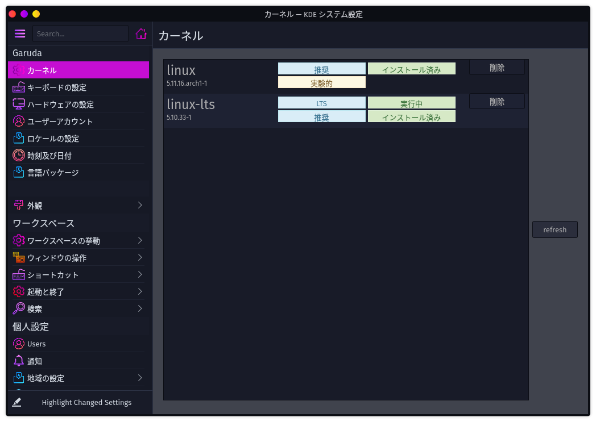

# 8日目　ノートPC用設定を適用する（※失敗）

※上手くいかなかったので戻しました。以下記録として。

Garuda LinuxはデスクトップPC用に最適化されているものらしい。自分はノートPCにGaruda Linuxを入れているので、ノートPC用に設定を変更する。こうすることで変にCPUを使って温度が上がりすぎたりするのを防いでくれるらしい。

参考：[[GUIDE] Configuring Garuda Linux for Laptop - Garuda Community - Garuda Linux Forum](https://forum.garudalinux.org/t/guide-configuring-garuda-linux-for-laptop/7685)

※パフォーマンスが低下する（全体が重くなる）可能性があるので自己判断で。自分はCPU速度が6分の1になるときが出てきた。

## 手順

### システムをアップデートしておく

いつもの「パックマン、シュー」

~~~shell
$ sudo pacman -Syu
(または)
$ yay -Syu
~~~

「念の為にアップデートしておく」だけではなく、`pacman -Syu`をするとシステムのスナップショットが撮られて、後でシステムが不安定になったとしたらアップデートする前に戻れる。だから記録を取る意味でもアップデートしておいた方が良い。

### `performance-tweaks`および`gamemode`の削除

~~~shell
$ pacman -R performance-tweaks gamemode
~~~

これはCPUをフル稼働させて、特にノートでは危険らしい。ちなみに`gamemode`は入っていないと怒られる場合は`performance-tweaks`のみで良い。

### Linuxカーネルの削除

マジで？

子曰く「Garuda LinuxにはLinux Zenが組み込まれておるはずじゃが、それはデスクトップ用じゃ。ノートには普通のLinux、または安定版のLinux LTSを入れるのじゃ。」

ほんまかいな？とりあえずやってみる。

先にLinuxとLinux LTSを入れる。

~~~shell
$ sudo pacman -S linux linux-lts
...
エラー: ファイル 'linux-lts-5.10.32-1-x86_64.pkg.tar.zst' を ftp.jaist.ac.jp から取得するのに失敗しました : The requested URL returned error: 404
警告: 複数のファイルの取得に失敗しました
エラー: 処理を完了できませんでした (ファイルの取得に失敗しました)
エラーが発生したため、パッケージは更新されませんでした。
~~~

あれー？

これは日本のリポジトリがあかんのかな。追加しよか。

公式の[Arch Linux - Pacman Mirrorlist Generator](https://archlinux.org/mirrorlist/)で日本の別のリポジトリを調べることができる。

探してみると`Server = https://mirrors.cat.net/archlinux/$repo/os/$arch`が良さげなので、これを追加してみる。

~~~shell
$ sudo micro /etc/pacman.d/mirrorlist
~~~

サーバーを追記して保存終了。その後にパッケージリストをアップデート。ついでにシステムもアップデート。

~~~shell
$ sudo pacman -Syyu
~~~

`y`は2つ必要。

そして再度LinuxとLinux-LTSのインストールをインストールすると、今度は少し時間がかかったけど入った。

~~~shell
$ sudo pacman -S linux linux-lts
~~~

その後、Linux-Zenを削除する。

~~~shell
$ sudo pacman -R linux-zen
~~~

### `auto-cpufreq`および`thermald`のインストール

CPUをオーバーヒートから防ぐパッケージをインストールする。

~~~shell
$ sudo pacman -S auto-cpufreq thermald
~~~

インストールできたら有効化する。

~~~shell
$ sudo systemctl enable auto-cpufreq
$ sudo systemctl start auto-cpufreq
$ sudo systemctl enable thermald
$ sudo systemctl start thermald
~~~

`auto-cpufreq`は、CPUがある一定温度に達するとCPUの周波数（またはスピード）を勝手に制限してくれるらしい。`thermald`はCPUがある一定温度に達すると勝手に頑張ってファンとか回して温度を下げようとしてくれるらしい。

ある一定温度って何度？

## 再起動

これで動かんかったらどーしよ、とドキドキしながら再起動したけど普通に動いた。

カーネルもさっきまでLinux-ZenだったのがLinux-LTSが動いているらしい。カーネルの入れ替えって結構簡単なのね。

## 適用してみて

温度がそんなに上がってなかったのに、1度CPU速度が400MHzに落ちるときがあった（通常は2.4GHz）。はっきり言ってそこまで下がったら使うどころではない。一応動くけど、突然そうなったら「とりあえず動いてる間に必要なものを保存してシャットダウンしよ」としか思わない。

ハード的に危険な状態になる前の警告として捉えればいいんだけど、温度が上がっていない状態でそんなことになるのはちょっとなぁ。

## その後

400MHzに張り付いて動かない状態が続いて、再起動してもダメだったので直前のSnapShotに戻した。