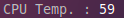
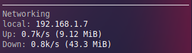

# 9日目　Conkyを設定してみる

Conkyとはデスクトップ上に表示するシステムモニターのこと。

## インストール＆初期設定

~~~shell
$ sudo pacman -Syu conky
$ mkdir -p ~/.config/conky
$ conky -C > ~/.config/conky/conky.conf
~~~

最後の行で初期設定を一気に書き出してくれるらしい。

以下、中身。`conky.config`の中身はちょっと書き換えたから変わっているかもしれない。

~~~
--[[
Conky, a system monitor, based on torsmo

Any original torsmo code is licensed under the BSD license

All code written since the fork of torsmo is licensed under the GPL

Please see COPYING for details

Copyright (c) 2004, Hannu Saransaari and Lauri Hakkarainen
Copyright (c) 2005-2021 Brenden Matthews, Philip Kovacs, et. al. (see AUTHORS)
All rights reserved.

This program is free software: you can redistribute it and/or modify
it under the terms of the GNU General Public License as published by
the Free Software Foundation, either version 3 of the License, or
(at your option) any later version.

This program is distributed in the hope that it will be useful,
but WITHOUT ANY WARRANTY; without even the implied warranty of
MERCHANTABILITY or FITNESS FOR A PARTICULAR PURPOSE.  See the
GNU General Public License for more details.
You should have received a copy of the GNU General Public License
along with this program.  If not, see <http://www.gnu.org/licenses/>.
]]

conky.config = {
    alignment = 'top_right',
    background = true,
    border_width = 1,
    cpu_avg_samples = 2,
    default_color = 'white',
    default_outline_color = 'white',
    default_shade_color = 'white',
    double_buffer = true,
    draw_borders = false,
    draw_graph_borders = true,
    draw_outline = false,
    draw_shades = false,
    extra_newline = false,
    font = 'DejaVu Sans Mono:size=10',
    gap_x = 20,
    gap_y = 60,
    minimum_height = 5,
    minimum_width = 5,
    net_avg_samples = 2,
    no_buffers = true,
    out_to_console = false,
    out_to_ncurses = false,
    out_to_stderr = false,
    out_to_x = true,
    own_window = true,
    own_window_class = 'Conky',
    own_window_type = 'normal',
    own_window_transparent = true,
    own_window_argb_visual = true,
    own_window_hints = 'undecorated,below,sticky,skip_taskbar,skip_pager',
    show_graph_range = false,
    show_graph_scale = false,
    stippled_borders = 0,
    update_interval = 1.0,
    uppercase = false,
    use_spacer = 'none',
    use_xft = true,
}

conky.text = [[
${color grey}Info:$color ${scroll 32 Conky $conky_version - $sysname $nodename $kernel $machine}
$hr
${color grey}Uptime:$color $uptime
${color grey}Frequency (in MHz):$color $freq
${color grey}Frequency (in GHz):$color $freq_g
${color grey}RAM Usage:$color $mem/$memmax - $memperc% ${membar 4}
${color grey}Swap Usage:$color $swap/$swapmax - $swapperc% ${swapbar 4}
${color grey}CPU Usage:$color $cpu% ${cpubar 4}
${color grey}Processes:$color $processes  ${color grey}Running:$color $running_processes
$hr
${color grey}File systems:
 / $color${fs_used /}/${fs_size /} ${fs_bar 6 /}
${color grey}Networking:
Up:$color ${upspeed} ${color grey} - Down:$color ${downspeed}
$hr
${color grey}Name              PID     CPU%   MEM%
${color lightgrey} ${top name 1} ${top pid 1} ${top cpu 1} ${top mem 1}
${color lightgrey} ${top name 2} ${top pid 2} ${top cpu 2} ${top mem 2}
${color lightgrey} ${top name 3} ${top pid 3} ${top cpu 3} ${top mem 3}
${color lightgrey} ${top name 4} ${top pid 4} ${top cpu 4} ${top mem 4}
]]

~~~

## 表示をカスタマイズする

`conky.text`の中身をいじればよい。

基本的には[Configs · brndnmtthws/conky Wiki · GitHub](https://github.com/brndnmtthws/conky/wiki/Configs)に例が載ってるからこの中から「あ、表示したい」というものを探してパクればよい。

### CPU温度

~~~
${color grey}CPU Temp. :$color ${execi 5 sensors -u coretemp-isa-0000 | grep 'temp1_input' | cut -c16-17}
~~~

### ネットワーク

~~~
$hr
${color grey}Networking
${color grey}local:$color ${addr enp2s0}
${color grey}Up:$color ${upspeedf enp2s0}k/s (${totalup enp2s0})
${color grey}Down:$color ${downspeedf enp2s0}k/s (${totaldown enp2s0})
~~~

### 天気

できるらしいけど面倒くさそうなのでまた今度。

## 参考

[Conky Objects](http://conky.sourceforge.net/variables.html)
[ConkyにマルチCPUのコア温度とファン速度を表示する｜PCで遊んだ日々の備忘録](http://www.fuukemn.biz/page86-conky-multi-cpu.html)

