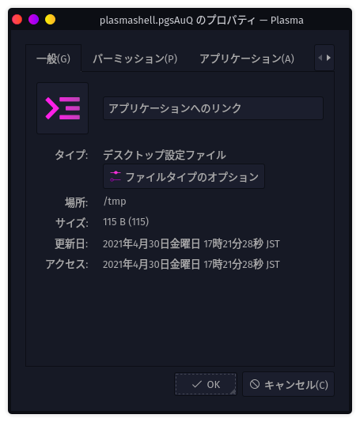

# 10日目　D&Dで動く(fish shell)スクリプトを書く（画像縮小）

前回の記事でデスクトップ画像を載せたが、実は横幅が大きすぎて困った。Windows上なら適当に画像縮小ソフトをインストールしてショートカットをデスクトップ上に出しておいて、適当にD&Dで画像縮小ということができるが、今自分はGaruda Linux上にいる。どうしよう。

ということで、D&Dで画像縮小するfish shellスクリプトを書く。

## 準備

### Image Magickのインストール

肝心の画像縮小部分はImage Magickに任せる。自分はGaruda Linuxインストール時に入れたが、まだだったら以下を打つ。

~~~shell
$ sudo pacman -Syu imagemagick
~~~

ちなみに実行コマンドは`iamgemagick`ではなく`magick`なので注意。

## 手順

### コマンドを新たに作成

以前の記事でコマンド置き場を作ったのでそこに今回のコマンドを作成する。

~~~shell
$ cd ~/command
$ touch resizeimage
$ chmod +x resizeimage
$ micro resizeimage
~~~

以下を打つ。

~~~
#!/usr/bin/fish

magick $argv -resize 756x756 (dirname $argv)/rs-(basename $argv)
~~~

### デスクトップにショートカットを作成

次にデスクトップ上を右クリック→「新規作成」→「アプリケーションへのリンク...」をクリック。いかにもショートカットのプロパティみたいなものが出てくる。

アプリケーションタブの「コマンド」に`/home/takeshi/command/resizeimage %u`と書く。

最後にショートカットを右クリックして適当に名前を変えておく。

## 使い方

デスクトップにあるショートカットに、縮小したい画像をD&Dすると756x756に収まるように画像を縮小してくれる。

勘違いしてはいけないのは、正方形に画像を変形するのではなく、縦か横のどちらか長い方が756になるように拡大・縮小するのが`magick -resize`の意味。

## 今後

* 画像加工をしたかったら`-resize`の部分をちょちょいと変えてやれば良い。
* 面倒くさかったら適当なフォームを持つGUIアプリ作ってD&Dを受け付けて、チェックボックスで切り替えられるようにしたら良い。
* 自分が使うオプションだけじゃなく、`magick`が持つ全部のオプションを切り替えられるようにして、ついでに複数ファイルも受け付けられるようにして、人に使ってもらえるようにしたら配布できるんじゃね？

あっ。

## 参考

[ImageMagick - ArchWiki](https://wiki.archlinux.org/index.php/ImageMagick)
[ubuntu - Create executable bash script that accepts drag & drop - Stack Overflow](https://stackoverflow.com/questions/10393164/create-executable-bash-script-that-accepts-drag-drop)
[Ubuntuでドラッグ＆ドロップで画像を縮小する | マックン・モックンのPCとお得](https://macn-mocn.info/archives/76)
[ImageMagick - Command-line Options](https://imagemagick.org/script/command-line-options.php#resize)
[Resizing or Scaling -- IM v6 Examples](https://legacy.imagemagick.org/Usage/resize/)

