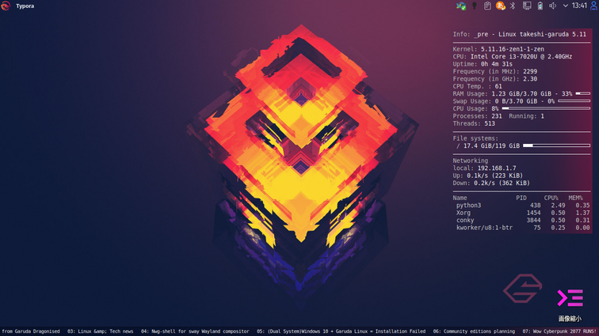
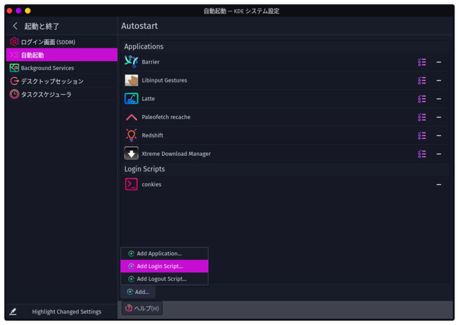

# 11日目　conkyを使ってGaruda Linux Forumの最新スレッドを表示する

これまで使ってて、Garuda Linux Forumの存在はかなり重要だと分かったので、常に最新の情報が得られるようにデスクトップにスレッドタイトルを常に表示するようにする。

15分に1回のペースで取得するようにする。

## コマンド作成

`garuda-forum`という名前のファイルを作成し、実行権限をつけてPATHが通っている場所（自分は`~/command`）に保存。中身は以下の内容。

~~~shell
#!/usr/bin/fish

set IFS "\n"
set mytext (curl -s "https://forum.garudalinux.org/latest" | grep "<a href='https://forum\.garudalinux\.org/t/.*/[0-9]*' class='title raw-link raw-topic-link'>" | sed 's/<\/a>//' | sed 's/ *<a.*>//')

for j in (seq 1 3)
    for i in (seq 1 10)
        if test $i -lt 10
            printf "0"(math $i)": "$mytext[(math $i + 2)]"   "
        else
            printf $i": "$mytext[(math $i + 2)]"   "
        end
    end
end
~~~

## conkyの設定

~~~shell
$ cd ~/.config/conky
$ micro garuda-forum.conf
~~~

以下を記入。

~~~
conky.config = {
    alignment = 'bottom_left',
    background = true,
    border_width = 1,
    border_outer_margin = 0,
    cpu_avg_samples = 2,
    default_color = 'black',
    default_outline_color = 'white',
    default_shade_color = 'white',
    double_buffer = true,
    draw_borders = true,
    draw_graph_borders = true,
    draw_outline = false,
    draw_shades = false,
    extra_newline = false,
    font = 'DejaVu Sans Mono:size=8',
    gap_x = 0,
    gap_y = 0,
    minimum_height = 5,
    minimum_width = 5,
    --maximum_width = 310,
    net_avg_samples = 2,
    no_buffers = true,
    out_to_console = false,
    out_to_ncurses = false,
    out_to_stderr = false,
    out_to_x = true,
    own_window = true,
    own_window_class = 'Conky',
    own_window_type = 'normal',
    own_window_transparent = true,
    own_window_argb_visual = true,
    own_window_argb_value = 255,
    own_window_hints = 'undecorated,below,sticky,skip_taskbar,skip_pager',
    show_graph_range = false,
    show_graph_scale = false,
    stippled_borders = 2,
    update_interval = 2.0,
    uppercase = false,
    use_spacer = 'none',
    use_xft = true,
}

conky.text = [[
${color white}${scroll 226 ${execi 900 garuda-forum}}
]]

~~~

最後の`scroll 226`の数字は画面の横幅に応じて調整。

デスクトップ下部に小さく表示するようにして、邪魔しないけどふとした時に見れるようにした。

## Garuda Linux立ち上げ時の自動起動設定

`conkies`という名前のファイルを作成し、実行権限をつけてPATHが通っている場所（自分は`~/command`）に保存。中身は以下の内容。

~~~shell
#!/usr/bin/fish

conky -c /home/takeshi/.config/conky/conky.conf
conky -c /home/takeshi/.config/conky/garuda_forum.conf
~~~

そして、KDEシステム設定→起動と終了→自動起動に登録。「Add Login Script」でスクリプトを登録すればよい。

## 参考

### コマンド作成

[Hide curl output - Unix & Linux Stack Exchange](https://unix.stackexchange.com/questions/196549/hide-curl-output)
[Using Grep + Regex (Regular Expressions) to Search Text in Linux | DigitalOcean](https://www.digitalocean.com/community/tutorials/using-grep-regular-expressions-to-search-for-text-patterns-in-linux)
[Sed Command in Linux/Unix with examples - GeeksforGeeks](https://www.geeksforgeeks.org/sed-command-in-linux-unix-with-examples/)

[fish2.4日本語ドキュメント:すぐ使える25の便利機能と実例](http://fish.rubikitch.com/document-ja/)
[fish shellチュートリアル](http://fish.rubikitch.com/tutorial/)

### Conkyの設定

[Home · brndnmtthws/conky Wiki · GitHub](https://github.com/brndnmtthws/conky/wiki)