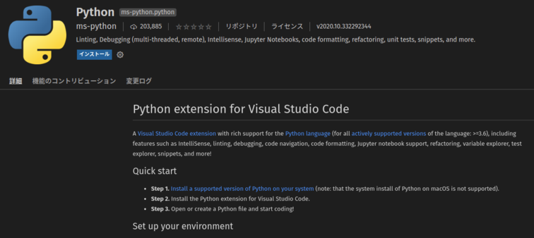
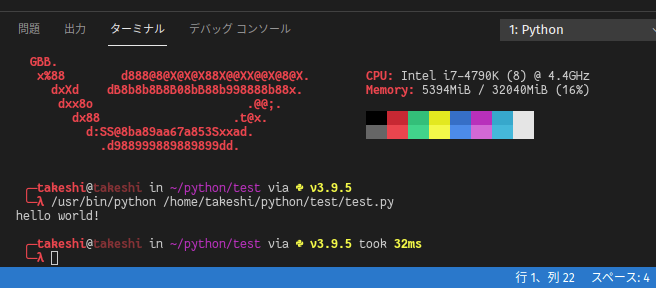

# 14日目　VSCodeをセットアップ

おなじみのVSCodeをGaruda Linuxにセットアップする。

インストールするだけなら簡単なので、ここでは例としてPythonの開発環境構築までもっていく。

## VSCodeのインストール

~~~shell
$ yay -S code
~~~

自分はGaruda Linuxインストール時のUltimateへのアップグレードですでに入れていた。

### 日本語化

[以前の記事](../php/preparation.html)で紹介した拡張機能でのやり方でできる。

* 拡張機能ペインを開き、「japanese」で検索
* 「Japanese Language Pack for Visual Studio Code」があるはずなのでそれをインストール

## Python周り

拡張機能で「python」と打てば、Microsoftが配布する「Python extension for Visual Studio Code」がヒットするはず。

その他Linter、Formatterなどを整える。以下が参考になる。

[VS Code コーディング規約を快適に守る - Qiita](https://qiita.com/firedfly/items/00c34018581c6cec9b84)

## ターミナル

文字の雰囲気が少し違うのでいつも使っているKonsoleのものに合わせる。

設定（ctrl + ,）から`terminal.font`で検索すると「Terminal > Integrated: Font Family」というのが出てくるので、そこに以下を入力。

~~~
FantasqueSansMono Nerd Font Mono
~~~

そうするといつもの雰囲気のフォントになる。（VSCodeの再起動を要求されるかも）

