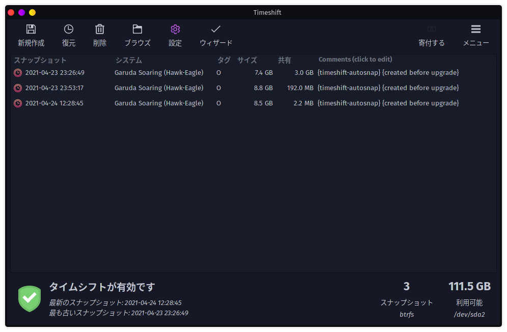

# Garuda Welcome

初期設定を手伝ってくれるWelcome画面。

各種ツール。

Webサイトへのショートカット

## Garuda Assistant (システム→Garuda Assistant)

クリックしたら何やらアップグレードを始めた。800MBとは中々な量。

これは状況によって変わる模様。どうも`pacman -Syu`コマンドと同じ？（ちなみに自分はこのアップグレードの後OSが立ち上がらなくなった。2日経ったら直った）

アップグレードが終わると次の画面が立ち上がる。

### Maintenanceタブ

* System update(pacman -Syu)

  その名の通りシステムアップデートを始める。ただしYes/Noの問い合わせは無かった。避け続けてたchaotic-aur/firedragonも強制的に入ってしまった。

  ※chaotic-aur/firedragonの問題は解決された模様（2021/04/23現在）

  最後の「Press Enter」とかの表示は出ないらしいけど、更新が落ち着いたころにエンターを押すと終了する。

* Refresh mirrorlist(Reflector-Simple)

  Setup-Assistantの時に出てきたmirrorlistの更新がもう一度出てくる。

* Refresh Keyrings

  普段ユーザーにとっては関係ないけど、パスワードなどの認証情報を管理してくれるもの（らしい）。それの更新。

* Reinstall all packages

  そのまんまだと思う。面倒なのでやらない。

* Remove database lock

  不明。

* Remove orphans

  おそらく孤立した依存パッケージ関係を掃除してくれるもの。

* Edit Repositories

  登録されたリポジトリのうちどれを使用するかの設定。でもそれだけじゃない模様。

  

  `pacman -S`ででインストールするときの設定？

  

  

* Clear package cache

  そのままだと思う。

* Clear logs

  そのまま。

### Btrfsタブ

Btrfsとはファイルシステムのこと。FAT32とかNTFSとかのやつの、新しいやつ。

### System Componentsタブ

### Settingsタブ

## Garuda Setting Manager (設定→KDE システム設定)

何故か立ち上がらなかったけど、`pacman -Syu`したらアップグレードされて立ち上がるようになった。

* ハードウェアの設定

  Windowsでの「デバイスマネージャー」のようなもの

* カーネル

  インストールされているLinuxカーネルを表示

* 言語パッケージ

  インストールできる言語パッケージが表示される。Garuda Linuxはデフォルトで日本語に対応しているけど、対応されていないところも表示が崩れるわけではないので特に不要。

* ユーザーアカウント

  ユーザーアカウントの管理ができる。

* 時刻及び日付 

  そのまんま。

* キーボードの設定

  そのまんま。

* ロケールの設定

  OSの表示言語を日本語にするか、英語にするか。通貨とか測定単位とかも合わせてくれるらしい。

## Garuda Gamer

Steam（的なもの）をインストールするかどうか。

試しにSteamにチェックを入れてみたらインストールが始まった。起動してみるとSteamが立ち上がる。Konsoleに`steam`と打ってもいいけど、デスクトップの何もないところをクリックして`steam`と打っても起動できる。

## Garuda Network Assistant

ネットワークの設定ができる。

## Garuda Boot Options

ブートオプションが設定できる。

## Partition Manager

ドライブのパーティションがGUIベースで操作できる。

## Time Shift

起動するとセットアップウィザードが始まった。

* スナップショットタイプの選択　→　BTRFS
* スナップショットの場所を選択　→　そのまま
* スナップショットレベル　→　そのまま（3日分を保持？）
* ユーザーホームディレクトリ、その他　→　そのまま

完了すると画面が立ち上がる。

アップグレード前に自動でスナップショットを取って、システムがおかしくなったらここから復活する、というような使い方かな？

## System Cleaner

キャッシュや履歴など、消しても良さそうな一時ファイルを一括で消してくれるらしい。

## Qwikaccess

便利機能に素早くアクセスできるメニュー。

## Add/Remove Software

GUIベースでアンインストールするときはここで、ということかな。

