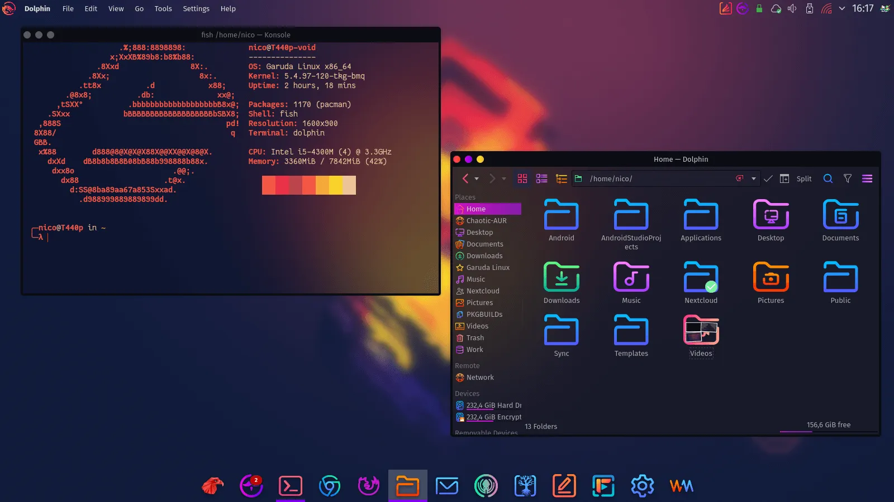

# Garuda Linux編

かっこよさに惹かれてGaruda KDE Dr460nized(Dragonized) Editionをインストールしてみた。そのときに得られた知見を書いておく。

[Garuda Linux \| Home](https://garudalinux.org/)

Garuda Dragonized Editionのイメージ（公式HPより）

## トラブルシューティング

[こちらへ](troubleshooting.html)

## コンテンツ

* 前提知識
  * [OSについて](intro_aboutOS.html)
  * [デスクトップ環境について](intro_aboutDE.html)
* [インストール](install.html)
* 使い始め
  * [パッケージマネージャー](pacman.html)
  * [Xrdpをインストール（※失敗）](xrdp.html)
  * [Windowsとファイル共有](samba.html)
* 初期アプリ
  * [Garuda Welcome](garuda_welcome.html)
  * [Kate - 高度なテキストエディタ](kate.html)
  * [KDE Connect](kdeconnect.html)
* 普段使いを目指して
  * [1日目　`yay`を入れてAUR(Arch User Repository)の使い勝手を良くする。](day01_yay.html)
  * [2日目　Typoraを入れてマークダウンを書く](day02_typora.html)
  * [3日目　SSH接続でRaspberry Piにログイン](day03_ssh.html)
  * [4日目　Raspberry PiからWebサーバーのドキュメントルートをDL&UL](day04_dl_document_root.html)
  * [5日目　サブディスプレイを接続](day05_subscreen.html)
  * [6日目　キーボードとマウスをWindowsと共有＆切り替え](day06_sharing_keyboard_and_mouse.html)
  * [7日目　このサイトのコンテンツをGaruda Linuxで編集＆アップ自動化](day07_edit_on_garuda.html)
  * [8日目　Laptop用設定を適用する](day08_turning_for_laptop.html)
  * 9日目　conkyを設定してみる
* メモ
  * conky

