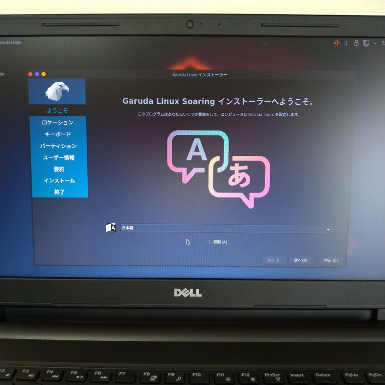
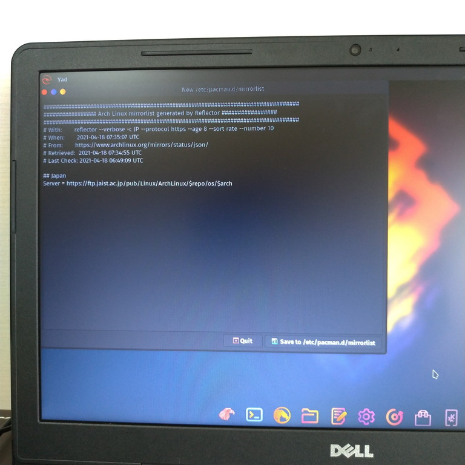

# インストール

実際にPCにGaruda KDE Dragonized Editionをインストールし、日本語入力できるところまで持っていく。

デュアルブートは考えていないので、デュアルにする必要がある人は各自で調べる。この記事の想定としては中身が全部消えてしまってもいいPCを用意している、とする。

## 準備物

* 中身が消えてもいい64bitのPC（最低でも30GBの空きと4GBのメモリ）→インターネットにつながるようにしておく
* USBメモリ（おそらく32GB以上）

## 概要

* 公式HPからisoイメージをDL

* RufusでisoイメージをUSBに（ブータブルメディアとして）書き込み

* PCのBIOS設定画面に入り、どうにかしてUSBからのブートを有効にする

* ライブセッション（お試し起動）に入ってからPCへのインストール開始

* 初回立ち上げ時にOSアップデートと導入ソフト選択

* 日本語入力有効化

  ~~~shell
  $ sudo pacman -S fcitx fcitx-mozc fcitx-qt5 fcitx-configtool
  $ micro ~/.xprofile
  ~~~

  ~~~
  (.xprofileの中身)
  export GTK_IM_MODULE=fcitx
  export QT_IM_MODULE=fcitx
  export XMODIFIERS=@im=fcitx
  ~~~

  

## 手順

### isoイメージをDL

[Garuda Linux \| Download](https://garudalinux.org/downloads.html)に飛び、「Download KDE Dragonized Edition」をクリック。

### isoイメージをUSBに書き込み

[Rufus \- Create bootable USB drives the easy way](https://rufus.ie/en/)からRufusを入手し、先ほどDLしたisoイメージを選択して書き込み。自分がやったところでは詳細なオプションはほぼ変更不可能でそのまま書き込むしかなかった。

### isoを書き込んだUSBをPCに挿し起動

中身が全部消えてしまってもいいPCに、先ほど書き込んだUSBを挿し電源ボタンを押す。元々Windowsが入っていたようなPCだったらWindowsが立ち上がる前にBIOS画面に入らなければならない。BIOS画面の入り方はPCのメーカー・機種によって違うので自分で検索する。

自分の場合はDELLのinspiron15 5100だったのでF12を連打するとBIOS設定入れるとのことだった。

BIOS設定画面に入ったら、USBからのブートを最優先に設定。これもメーカー・機種によって手順が変わる。とにかく頑張る。

### USBからGaruda Linuxのライブセッションを立ち上げる

BIOSの設定を保存するとおそらく再起動してUSBからブートしようと試みるはず。上手くいけば下の画面のようなものが出る。カウントダウンが始まって焦るけど、特に何も変える必要は無いはず。

裏で何かが頑張り始める。

しばらくするとライブセッションがスタートしてWelcomeウィンドウみたいなものが表示される。ネット接続が無線LANならこのタイミングでWifi接続しておく。そしたら画面下部の「Install Garuda Linux」をクリック。

設定が始まる。安心の日本語。

ここから設定するのは以下。

* タイムゾーン　→　「Asia/Tokyo」
* キーボード配列　→　「Japanese」→「Default」
* パーティション　→　「ディスクの消去」（デュアルブートにする人はここで上手く設定する）
* 名前、ログインID、コンピューター名、パスワード

最後に確認画面が出て、「本当にいいですね？」的なことを聞かれるのでOK的なボタンをクリック。

しばらくすると完了するので再起動。

### Garuda Linuxの初回起動

ログイン画面。

Garuda Linuxを選んでくれてありがとう！というメッセージが出てセットアップアシスタントを起動しますかと聞かれる。はい。

最新のmirrorlistを入手しますか？と聞かれる。Raspberry Piなどの`sudo apt update`と同義。しない理由は無い。

どこから持ってくるかが選択できる。最初から日本が選択されているので特に何も変えずにOK。

なんかテキストエディタが立ち上がるので、ウィンドウ下部の`Save to /etc/pacman.d/mirrorlist`をクリック。

特権がいるらしい。パスワードを入力してOK。

システムをアップデートしますかと聞かれる。もちろんこれもYes。

**これは注意が必要。**FireDragonというのはブラウザなんだけど、chaotic-aur/firedragonに置き換えると上手く動かなくなる（2021/04/18現在）。`n`とタイプしてエンター。

破壊されますとか言われてもどうすることもできない。現時点ではThunderbirdは使えないということかな？ちなみにこれはさっきのFireDragonの選択とは無関係に表示される。

Ultimateへアップグレードしますか？と聞かれる。Ultimateと言ってもオススメソフトを入れていくだけで特に課金が発生する訳ではない。Garuda Linuxを普段使い用にするなら色々入れるといいんじゃないだろうか。ここではYesを選択して何が入るのか見ていく。

日本語表示に関して、不足する文字を補うものらしい。とりあえず必要になったら入れよう。No。

プリンター、スキャナー、Samba（Windowsとのファイル共有）はあってもいいんじゃないか。Yes。

追加の壁紙は後で色々変えて遊んでみよう。Yes。

AppImage形式のアプリと`fwupd`（ファームウェア自動アップデート）が必要か。よく分からんけどYes。

追加コンポーネントとアプリが必要か。これもよく分からんけどYes。

別のLinuxカーネルは必要か。いらんのちゃう？

オフィス関連は何か一つあったら十分じゃないか。LibreOfficeがデフォルトでチェックが付いていたのでそのままにする。

追加のブラウザ。せっかくなのでメインはFireDragonを使うつもりだけど、念のためChromiumも入れておく。

メーラー。せっかくなのでKDEのメーラーを使おう。

いわゆるチャットソフト的なもの。普段はあまり使わないけど、まあ必要になってくるんじゃないかな。

続き。FilezillaとPuttyは使いそうな気がするけど、まあ必要なときに入れましょう。

オーディオソフト。音楽もあまり聞かないけど、Audacityは音声ファイル編集ソフトとして神だから入れちゃう。

動画ソフト。そのままで。

画像編集ソフト。ImageMagickは画像の拡大縮小が優れてるから入れちゃう。使うかどうかは不明。

マルチメディアソフト。よく分からんけど、下2つは面白そうなので遊んでみよう。

ゲーム。ソリティアで十分。

ソフト開発系。宗教戦争に発展するのでノーコメントで。

仮想環境。まあその時が来れば入れましょう。

ターミナルが立ち上がる。Sudoの儀式。「大いなる力には大いなる責任が伴うこと。」って言い方好き。

**またFireDragonについて聞かれる。**ここでも`n`をタイプ。

JRE（Java Runtime Environment：Java実行環境）について聞かれる。困ったら対処しよう。とりあえずデフォルトで。

また破壊とか怖いこと言ってくる。どうしようも無いのでそのまま。エンター。

セットアップアシスタントはせっかくなので残しておこう。Noで。

### 日本語入力を有効化

ターミナルを立ち上げる。KDEではKonsoleと表記するらしい。結局コンソールやんけ。

以下を打ち日本語入力システムをインストールする。Arch Linuxでは`apt`や`yum`の代わりに`pacman`というコマンドでアプリをインストールする。`-S`がインストールコマンドらしい。

~~~shell
$ sudo pacman -S fcitx fcitx-mozc fcitx-qt5 fcitx-configtool
~~~

その後`~/.xprofile`というファイルを作成する。Raspberry Piと違いNanoエディタが標準で入っていない。代わりにMicroエディタが入っているらしいのでそれを使う。

~~~shell
$ micro ~/.xprofile
~~~

以下を入力し、保存（`ctrl + S`）、終了（`ctrl + Q`）。

~~~
export GTK_IM_MODULE=fcitx
export QT_IM_MODULE=fcitx
export XMODIFIERS=@im=fcitx
~~~

そして再起動して設定完了。