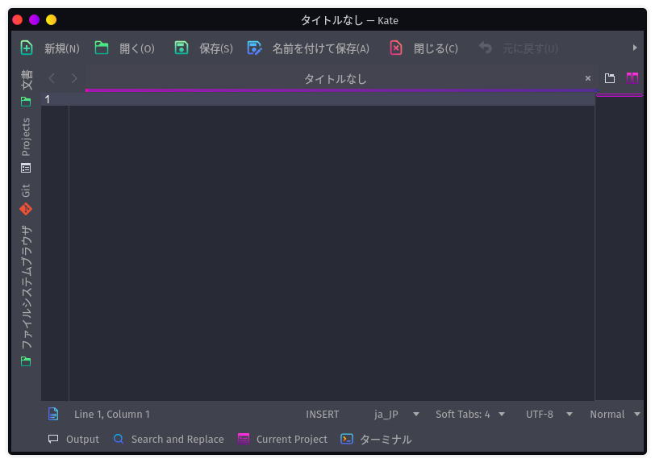

# Kate - 高度なテキストエディタ

インストール直後に画面下部のドックに登録されているものの中でいまいちピンと来なかったものがコイツ。

Kateというテキストエディターだそうで、テキストエディターの話をするのは一部の界隈ではタブーであることは分かりつつも、少なくともインストール直後にデフォルトで表示されているものは理解しておきたい。

ちなみに「高度なテキストエディタ―」とはGaruda Linuxがそう言ってるだけで、別に優れているとか劣っているとかそういう意味じゃないからね。ほら。

## 画面

プログラマーならこれだけで「あー、なるほど」と感じるのではないか。

* 左サイドバー

  * 文書

    開いているファイルの一覧。タブでも移れるけど、こっちにもリストされてるよって感じ。

  * Projects

    Gitのリポジトリがあれば、記録されているファイルを表示。ファイルエクスプローラーのような使い方。

  * Git

    ステージングとかコミットとかができる。

  * ファイルシステムブラウザ

    こっちはファイルシステム全体にアクセスできるエクスプローラー

* 画面下部のバー

  * Output

    標準出力。

  * Search and Replace

    検索＆置換。

  * Current Project

    ターミナル・コードインデックス・コード解析・メモがセットになってる。使い方はイマイチよく分からない。

  * ターミナル

    こちらは普通にターミナルが起動する。起動直後に現在開いているディレクトリに移動してくれるらしい。これはおそらくGitのリポジトリが無くても動くのではないかと。