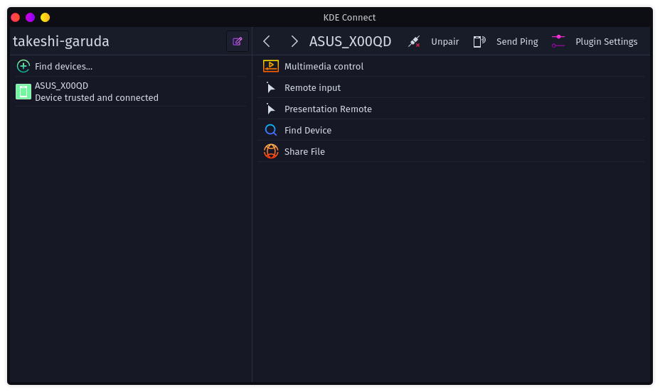
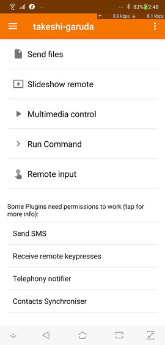

# KDE Connect

インストール直後にデフォルトでドックに表示される最後のやつ。何コレ。

参考

[AndroidとLinuxを無線連携！「KDE Connect」でファイル転送＆着信通知etc\. \| LFI](https://linuxfan.info/kde-connect)
[KDE Connect \- Google Play のアプリ](https://play.google.com/store/apps/details?id=org.kde.kdeconnect_tp&hl=ja&gl=US)
[KDEConnect \- KDE UserBase Wiki](https://userbase.kde.org/KDEConnect#Share_and_Receive)

どうもKDE Connectを入れたスマホ（Android）や他のPC（Linux）と簡単につながるらしい。

## 入れてみた

スマホにも「KDE Connect」というアプリを入れて、同じLAN内に居る状態で接続をする。

Linux側のファイアーウォールさえクリアすればあっさり繋がる。（Garuda Linuxインストール直後だったらデフォルトでガバガバなので特に問題ないはず）

実際この画面はスマホでスクリーンショットを取ってからKDE Connect経由でGaruda Linuxに送り、それをSamba経由でWindowsに転送したもの。面倒な認証とか無しにスッと送られて非常に使い勝手が良い。

適当に使って確認できたもの

* Linuxからファイルの送信
* スマホ内のファイルや画像の受信
* Linux上でスマホの通知を受け取る
* メディアコントロール（音楽鳴らす、止める）
* リモートインプット（スマホがタッチパッドになる）
* スマホを鳴らす
* クリップボードの共有

試してないけど使えるらしい機能

* SMSの送受信
* プレゼンテーション時のリモコン機能
* コンソールコマンドの実行

## 感想

普通に良い。

なぜだろう、こういう機能はMicrosoftもWindows上で提供しているはずだけど、使う気になれない。Microsoftは商売でそういうことをするから信用できないんだろうか。

「なんだかんだで結局制限を付けられて『Edge、OneDrive、Azure使えば最強』みたいな状態に誘導される」とか。