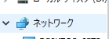
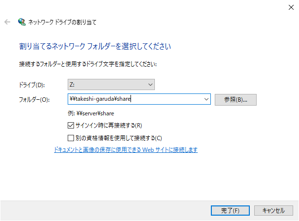
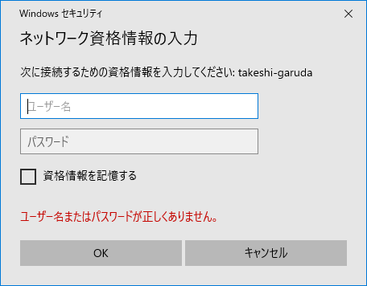

# Windowsとファイル共有

メインPC（Windows）とファイル共有して、Garuda Linux上で撮ったスクリーンショットをWindowsに送って記事を書きやすくしようという目論見。

## 手順

### Sambaをインストール

SambaはLinuxでファイルサーバー作るときに有名なやつ。

Sambaの情報を表示。

~~~shell
$ pacman -Si samba
~~~

特に問題なければインストール。

~~~shell
$ sudo pacman -S samba
~~~

### Sambaの設定ファイルを作成

コマンド一発で設定ファイルをDL。

~~~shell
$ sudo wget "https://git.samba.org/samba.git/?p=samba.git;a=blob_plain;f=examples/smb.conf.default;hb=HEAD" -O /etc/samba/smb.conf
~~~

ファイルの中身は[こちら](https://git.samba.org/samba.git/?p=samba.git;a=blob_plain;f=examples/smb.conf.default;hb=HEAD)。

### Sambaの設定ファイルを編集

~~~shell
$ sudo micro /etc/samba/smb.conf
~~~

以下の部分を探し、それぞれの行を設定する。

~~~
# workgroup = NT-Domain-Name or Workgroup-Name, eg: MIDEARTH
   workgroup = (Windowsのワークグループ) ←この行を設定
~~~

~~~
#========================== Share Definitions ===========================
;[homes]
;   comment = Home Directories
;   browseable = no
;   writable = yes

([homes]セクションをコメントアウト)
~~~

`[homes]`のコメントアウトは正直要らないと言えば要らないけど、自分のホームディレクトリが勝手に丸見えになってしまうので何か気持ち悪い。気にならない人はスキップ。

Windowsのワークグループを確認するには、Windows上で「設定」→「システム」→「バージョン情報」→画面右の「システム情報」の中に載ってる。

さらに`/etc/samba/smb.conf`の最後に以下を記述。

~~~
[share]
   path = /home/takeshi/share
   browseable = yes
   writable = yes
   valid users = takeshi
   create mode = 0777
   directory mode = 0777
~~~

この`[share]`というセクション名は後で必要になる。

### 共有用のディレクトリを作成

~~~shell
$ mkdir ~/share
$ chmod 777 ~/share
~~~

### Samba用ユーザーを追加

~~~shell
$ sudo pdbedit -a -u takeshi
~~~

この後2回パスワードを聞かれる。

### Sambaをスタート

~~~shell
$ sudo systemctl start smb nmb
~~~

### Windowsからアクセス

Explorerの（普通は）左側にあるショートカット一覧的なものの中から「ネットワーク」を探す。

右クリックをして「ネットワークドライブの割り当て」をクリック。

ドライブレターは適当、フォルダーは`\\(ipまたはコンピューター名)\(Sambaの設定ファイルに作ったセクション名)`を入力。

自分の場合は`\\takeshi-garuda\share`

IDとパスワードを聞かれるので`pdbedit`で決めたやつを入力。資格情報を記憶しておけば次回は入力不要なのか。

OKでフォルダが開けば開通。

## 参考

[Samba \- ArchWiki](https://wiki.archlinux.jp/index.php/Samba)
[SambaでLinuxとWindowsとの間でファイル共有 \- Qiita](https://qiita.com/k-Mata/items/8bee9e02e74565b6c147)
[smb\.conf](http://www.samba.gr.jp/project/translation/3.5/htmldocs/manpages-3/smb.conf.5.html)
[samba でホームディレクトリを無効にする \- IT漂着メモ](https://god-support.blogspot.com/2014/07/samba.html)
