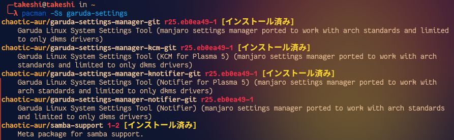

# トラブルシューティング

[TOC]

## ソフトが起動しないとき

~~~shell
$ sudo pacman -Syu (対象のパッケージ名)
~~~

対象のパッケージ名が分からないとき

~~~shell
$ pacman -Ss (それっぽい名前)
~~~

自分の場合、Garuda Settings Managerが立ち上がらなかったのでそれっぽく調べたら以下のように出てきた。

よって、`garuda-settings-manager-git`がどうもパッケージ名らしい。

## 絵文字がおかしい

画面上部のスタートボタン右の`Garuda KDE Dr460nized ?`の`?`は絵文字が入るはずなのにおかしい。

どうも`noto-color-emoji-fontconfig`というものをAUR(Arch User Repository)からインストールしないといけないらしい。

[Upgrade to Ultimate is causing broken emojis \- Issues & Assistance \- Garuda Linux Forum](https://forum.garudalinux.org/t/upgrade-to-ultimate-is-causing-broken-emojis/6796)

~~~shell
$ mkdir ~/aur (←既に作ってあれば不要)
$ cd ~/aur
$ git clone https://aur.archlinux.org/noto-color-emoji-fontconfig.git
$ cd noto-color-emoji-fontconfig
$ micro PKGBUILD (←PKGBUILDの中身を確認するだけ) 
$ makepkg -si
~~~

無事直りました。

## Konsoleを立ち上げたら`starship`が警告を発している

Konsoleを立ち上げて以下が表示されたとき。

~~~
[WARN] - (starship::configs::starship_root): Unknown config key 'docker'
[WARN] - (starship::configs::starship_root): Did you mean 'docker_context'?
[WARN] - (starship::configs::starship_root): Unknown config key 'haskell'
[WARN] - (starship::configs::starship_root): Did you mean 'shell'?
[WARN] - (starship::configs::starship_root): Unknown config key 'docker'
[WARN] - (starship::configs::starship_root): Did you mean 'docker_context'?
[WARN] - (starship::configs::starship_root): Unknown config key 'haskell'
[WARN] - (starship::configs::starship_root): Did you mean 'shell'?
[WARN] - (starship::configs::starship_root): Unknown config key 'docker'
[WARN] - (starship::configs::starship_root): Did you mean 'docker_context'?
[WARN] - (starship::configs::starship_root): Unknown config key 'haskell'
[WARN] - (starship::configs::starship_root): Did you mean 'shell'?
[WARN] - (starship::configs::character): Unknown config key 'use_symbol_for_status
~~~

システムアップデート→`starship`をアップデート→コンフィグファイルの一つをコピー。

~~~shell
$ sudo pacman -Syu starship
$ cp /etc/skel/.config/starship.toml ~/.config/starship.toml
~~~

