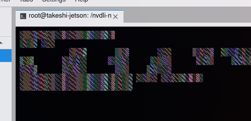

# Headless Device Mode

## 問題点

1. レクチャー動画でやっていたmicroUSB経由でのアクセスができない。

2. 仕方がないので自分で勝手にJetson NanoのIPを固定したらSSH接続できたけど、それが原因でインターネットにつながっていなかった。DHCPに任せたらJetson NanoのIP探すのに手間がかかるけどインターネット接続できた。

3. JupyterLabのターミナルの文字がおかしい。

   

   文字化けってレベルじゃない。

   ちなみにスマホからJupyterLabにアクセスするとちゃんと表示された。ということはLinux依存かブラウザ依存。

4. カメラが逆。

   

## 学習メモ

