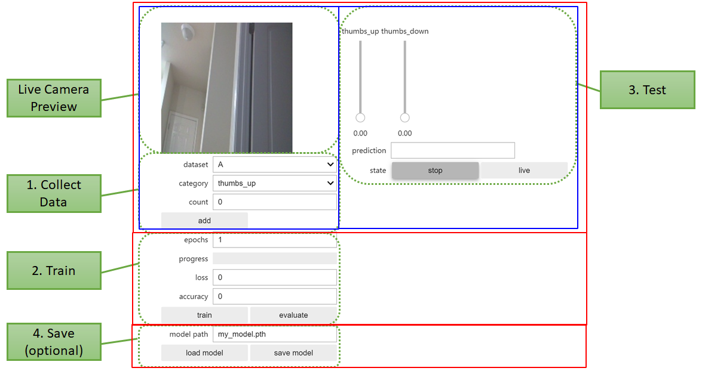
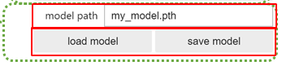
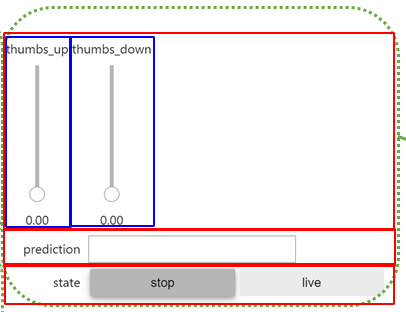
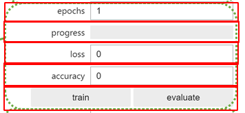

# Image Classification（フォーム部）

コードは大きく分けて

* Interactive Form（iPython widget）
* Deep Leaning（PyTorch）

に分かれる。

ここではまずフォームの構成に注目して解析していく。

## Interactive Form

### 全体像

まず以下をインポート。

~~~python
import ipywidgets
~~~

そして、色々した後にできるものが以下。（緑の注釈は公式によるもの）

~~~python
from IPython.display import display

(略)

# Combine all the widgets into one display
all_widget = ipywidgets.VBox([
    ipywidgets.HBox([data_collection_widget, live_execution_widget]), 
    train_eval_widget,
    model_widget
])

display(all_widget)
~~~

赤枠が`ipywidgets.VBox`の中身で

* `ipywidgets.HBox`（青枠）→`data_collection_widget`、`live_execution_widget`
* `train_eval_widget`
* `model_widget`

の順で並ぶ。

`VBox`、`HBox`はリスト（配列）を受け取る。

それぞれのWidgetはこのコードの前にすでに作っておく。

最後に`display`で`ipywidgets.VBox`を表示すれば良い。

### `data_collection_widget`

全体像。

大きな`VBox`の中にいくつかのWidget（赤枠）が入れられ、一つのWidgetの塊を作っている。

~~~python
(略)

# create image preview
camera_widget = ipywidgets.Image()

(略)

# create widgets
dataset_widget = ipywidgets.Dropdown(options=DATASETS, description='dataset')
category_widget = ipywidgets.Dropdown(options=dataset.categories, description='category')
count_widget = ipywidgets.IntText(description='count')
save_widget = ipywidgets.Button(description='add')

(略)

data_collection_widget = ipywidgets.VBox([
    ipywidgets.HBox([camera_widget]), dataset_widget, category_widget, count_widget, save_widget
])
~~~

#### カメラについて

~~~python
(略)

from jetcam.usb_camera import USBCamera

(略)

# for USB Camera (Logitech C270 webcam), uncomment the following line
camera = USBCamera(width=224, height=224, capture_device=0) # confirm the capture_device number

(略)

camera.running = True

(略)

import traitlets
from jetcam.utils import bgr8_to_jpeg

camera.unobserve_all()

# create image preview
camera_widget = ipywidgets.Image()
traitlets.dlink((camera, 'value'), (camera_widget, 'value'), transform=bgr8_to_jpeg)
~~~

* `jetcam`・・・Jetson Nanoでカメラを使う用に[NVIDIAが作ったライブラリ](https://github.com/NVIDIA-AI-IOT/jetcam)っぽい。

  * `camera = USBCamera(...)`：カメラインスタンスを生成

  * `image = camera.read()`：カメラで写真を撮る

    （実際はOpenCVの`VideoCapture`クラスの`read()`メソッドで取り込んでいるっぽいので、`image`は`numpy.ndarray`）

  * ~~~python
    image_widget = ipywidgets.Image(format='jpeg')
    image_widget.value = bgr8_to_jpeg(image)
    display(image_widget)
    ~~~

    こうしてやることで取り込んだ写真を表示することができる。`bgr8_to_jpeg`は`jetcam`内にある。実際は`cv2.imencode`を使ってJPEGに変換しているらしい。

  * `camera.running = true`

    これはUSBカメラの画像を連続的に（具体的には`while True`ループで）`read()`を実行する

  * `camera.value`：読み込んだ画像が収められる場所。`running = true`だと連続的に値が変化する。

* `traitlets`・・・クラスのメンバ変数のデフォルト値を決めたり、バリデーションしたり、値の変更を監視したりするライブラリ。`jetcam.USBCamera`内でも使われている。

  * `camera.observe(関数, names=メンバ変数名)`：メンバ変数の値が変わったら関数をコールバックするようにセットする。

    ~~~python
    camera.running = true
    camera.observe(関数, names=value)
    ~~~

    とすると、`value`は`running = true`によって常に変化するので関数がループ的に常に実行されることになる。

    * 関数には引数として値の変化に関する辞書（`new`とか`old`とかをキーとする辞書）が渡されて実行されるらしい。ということは逆に関数の定義にはそれ用の引数を用意しておかないといけない。

  * `unobserve_all()`：名前から察するに全ての`observe`を解除する（つまり監視を止める）ということかな。
  * `dlink((クラス1, メンバ変数名), (クラス2, メンバ変数名), transform=関数)`：クラス1の指定メンバ変数が変更されたときに、クラス2のメンバ変数にも同じ値（または`transform`で指定した関数を通した値）をセットする。
    * クラス1→クラス2という方向があり、逆は無い
    * ソースコードによると`dlink`は`directional_link`のことらしい。
    * 双方向で同期させたかったら`link`というメソッドを使う。

#### ドロップダウン（`dataset_widget`、`category_widget`）について

~~~python
(略)

DATASETS = ['A', 'B']
# DATASETS = ['A', 'B', 'C']

(略)

dataset = datasets[DATASETS[0]]

(略)

dataset_widget = ipywidgets.Dropdown(options=DATASETS, description='dataset')
category_widget = ipywidgets.Dropdown(options=dataset.categories, description='category')

(略)

# sets the active dataset
def set_dataset(change):
    global dataset
    dataset = datasets[change['new']]
    count_widget.value = dataset.get_count(category_widget.value)
dataset_widget.observe(set_dataset, names='value')

# update counts when we select a new category
def update_counts(change):
    count_widget.value = dataset.get_count(change['new'])
category_widget.observe(update_counts, names='value')

(略)
~~~

`dataset_widget`、`category_widget`はどちらも基本的には同じなので、`dataset_widget`に注目して解析していく。

生成は`dataset_widget = ipywidgets.Dropdown(options=リスト, description=ラベル)`という書式。

* 引数として何が渡せるのかは`dataset_widget.keys`と書いて実行してみるとわかる。あとは[公式ドキュメント](https://ipywidgets.readthedocs.io/en/stable/examples/Widget%20List.html#Dropdown)を見て頑張る。

  ~~~python
  dataset_widget.keys
  
  ['_dom_classes',
   '_model_module',
   '_model_module_version',
   '_model_name',
   '_options_labels',
   '_view_count',
   '_view_module',
   '_view_module_version',
   '_view_name',
   'description',
   'description_tooltip',
   'disabled',
   'index',
   'layout',
   'style']
  ~~~

* [Widget Events — Jupyter Widgets 7.6.2 documentation](https://ipywidgets.readthedocs.io/en/stable/examples/Widget%20Events.html#Traitlet-events)にも書いてあるとおり、`traitlets`の`observe`が使える。

* `dataset_widget.value`が現在選択している項目。

* `dataset_widget.observe(set_dataset, names='value')`で、`dataset_widget`の`value`が変化したとき、関数`set_dataset`が実行されるとわかる。

  * 関数`set_dataset`はグローバル変数`dataset`（次回解説）の更新が主な目的。それに伴って`count_widget.value`も更新しないといけない、ということ。

[Widget List — Jupyter Widgets 8.0.0a5 documentation](https://ipywidgets.readthedocs.io/en/latest/examples/Widget%20List.html#Dropdown)

#### 整数値専用のテキストボックス（`count_widget`）について

~~~python
count_widget = ipywidgets.IntText(description='count')
~~~

これについては特に変わったところは無い。`IntText`で整数ボックス、`BoundedIntText`で最大、最小などが指定できる整数ボックス、`FloatText`で小数まで入力できるボックス、`BoundedFloatText`で小数＋最大、最小が指定できるボックスが生成できる。

`count_widget.value`で、テキストボックス内の数字の読み書きができるらしい。

[Widget List — Jupyter Widgets 8.0.0a5 documentation](https://ipywidgets.readthedocs.io/en/latest/examples/Widget%20List.html#Numeric-widgets)

#### ボタン（`save_widget`）について

~~~python
(略)

save_widget = ipywidgets.Button(description='add')

(略)

# save image for category and update counts
def save(c):
    dataset.save_entry(camera.value, category_widget.value)
    count_widget.value = dataset.get_count(category_widget.value)
save_widget.on_click(save)
~~~

ボタンについては、クリックしたときの動作は`save_widget.on_click(関数)`で指定するらしい。関数の引数（ここでは`save(c)`の`c`）には、クリックされたボタンのインスタンスが代入される。

[Widget List — Jupyter Widgets 8.0.0a5 documentation](https://ipywidgets.readthedocs.io/en/latest/examples/Widget%20List.html#Button)
[Widget Events — Jupyter Widgets 8.0.0a5 documentation](https://ipywidgets.readthedocs.io/en/latest/examples/Widget%20Events.html#Special-events)

### `model_widget`

全体像

~~~python
(略)

import torch

(略)

model_save_button = ipywidgets.Button(description='save model')
model_load_button = ipywidgets.Button(description='load model')
model_path_widget = ipywidgets.Text(description='model path', value='/nvdli-nano/data/classification/my_model.pth')

def load_model(c):
    model.load_state_dict(torch.load(model_path_widget.value))
model_load_button.on_click(load_model)
    
def save_model(c):
    torch.save(model.state_dict(), model_path_widget.value)
model_save_button.on_click(save_model)

model_widget = ipywidgets.VBox([
    model_path_widget,
    ipywidgets.HBox([model_load_button, model_save_button])
])
~~~

ここでは`model`と`torch`を後で解析するとすれば、新たに出てきているのは`ipywidgets.Text`のみ。

#### 1行テキストボックス（`model_path_widget`）について

生成の書式は`model_path_widget = ipywidgets.Text(description=ラベル, value=中の文字列)`となる。

`model_path_widget.value`でテキストボックス内の文字列にアクセスできる。`observe`を使えば中の文字列が変更されたときの動作を（多分）定義できる。

### `live_execution_widget`

~~~python
import threading
import time
from utils import preprocess
import torch.nn.functional as F

state_widget = ipywidgets.ToggleButtons(options=['stop', 'live'], description='state', value='stop')
prediction_widget = ipywidgets.Text(description='prediction')
score_widgets = []
for category in dataset.categories:
    score_widget = ipywidgets.FloatSlider(min=0.0, max=1.0, description=category, orientation='vertical')
    score_widgets.append(score_widget)

def live(state_widget, model, camera, prediction_widget, score_widget):
    (略)

def start_live(change):
    if change['new'] == 'live':
        execute_thread = threading.Thread(target=live, args=(state_widget, model, camera, prediction_widget, score_widget))
        execute_thread.start()

state_widget.observe(start_live, names='value')

live_execution_widget = ipywidgets.VBox([
    ipywidgets.HBox(score_widgets),
    prediction_widget,
    state_widget
])
~~~

ここでは関数`live`を読み飛ばせば、そこまで複雑なことはしていない。

#### トグルボタン（`state_widget`）について

~~~python
state_widget = ipywidgets.ToggleButtons(options=['stop', 'live'], description='state', value='stop')
~~~

これはボタンが複数並び、どれか一つが選択状態になるというもの。`options`にリストを代入すると、そのリストの要素数だけボタンが生成され、必ずどれが一つが選択状態になるということかな。

何が選択されているのかは`state_widget.value`で取得できる。

以下のように書くと、選択が変更されたときに発火する動作を定義できる。

~~~python
state_widget.observe(start_live, names='value')
~~~

その動作は、`live`という関数（後述）を別スレッドで動かすというものらしい。

~~~python
def start_live(change):
    if change['new'] == 'live':
        execute_thread = threading.Thread(target=live, args=(state_widget, model, camera, prediction_widget, score_widget))
        execute_thread.start()
~~~

#### FloatSlider（`score_widget`）について

~~~python
score_widget = ipywidgets.FloatSlider(min=0.0, max=1.0, description=category, orientation='vertical')
~~~

スライダーなので当然最大最小がある。ラベルは`description`で指定し、`value`は勝手に表示されるらしい。`orientation`で縦か横かを指定できる。

### `train_eval_widget`

~~~python
(略)

epochs_widget = ipywidgets.IntText(description='epochs', value=1)
eval_button = ipywidgets.Button(description='evaluate')
train_button = ipywidgets.Button(description='train')
loss_widget = ipywidgets.FloatText(description='loss')
accuracy_widget = ipywidgets.FloatText(description='accuracy')
progress_widget = ipywidgets.FloatProgress(min=0.0, max=1.0, description='progress')

def train_eval(is_training):
    (略)
    
train_button.on_click(lambda c: train_eval(is_training=True))
eval_button.on_click(lambda c: train_eval(is_training=False))
    
train_eval_widget = ipywidgets.VBox([
    epochs_widget,
    progress_widget,
    loss_widget,
    accuracy_widget,
    ipywidgets.HBox([train_button, eval_button])
])
~~~

`train_eval`の中身は次回に回すとしたら、ここでしていることとしてはウィジェットを作って配置しているだけ。

#### FloatProgress（`progress_widget`）について

~~~python
progress_widget = ipywidgets.FloatProgress(min=0.0, max=1.0, description='progress')
~~~

スライドバーのスライドできないバージョンみたいな扱い。現在値も特にデフォルトでは表示されないらしい。

## 参考

[非エンジニアでも使いやすい高機能なPython環境「IPython」「Jupyter」を使ってみよう | さくらのナレッジ](https://knowledge.sakura.ad.jp/17727/)
[GitHub - NVIDIA-AI-IOT/jetcam: Easy to use Python camera interface for NVIDIA Jetson](https://github.com/NVIDIA-AI-IOT/jetcam)
[Python, OpenCVで動画を読み込み（ファイル・カメラ映像） | note.nkmk.me](https://note.nkmk.me/python-opencv-videocapture-file-camera/)
[jupyterを支える技術：traitlets（の解読を試みようとした話） - Qiita](https://qiita.com/cotton-gluon/items/c343a1f57e46e3238a32)
[traitlets/traitlets.py at main · ipython/traitlets · GitHub](https://github.com/ipython/traitlets/blob/main/traitlets/traitlets.py)
[Widget List — Jupyter Widgets 8.0.0a5 documentation](https://ipywidgets.readthedocs.io/en/latest/examples/Widget%20List.html)
