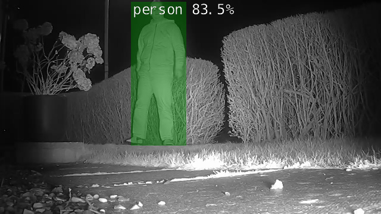

# CUDACAM

防犯カメラ＋DetectNetで動く物体を検知してイベントを発生させる。

[GitHub](https://github.com/JoeTester1965/CudaCam)

## 身も蓋もない概要

* DetectNetと防犯カメラを繋いだら必要なときだけ知らせてくれるAIカメラができるんじゃね

  * Hello AI Worldの[Building the Project from Source](https://github.com/dusty-nv/jetson-inference/blob/master/docs/building-repo-2.md)でベース作り

  * PythonスクリプトでConfigを読み、シェルスクリプトを作ってあげる

  * CudaCam.pyを動かす

    * カメラはRTSP接続

    * SQLiteにイベントデータを溜め込む
    * `jetson.utils`と`detectNet`を多用

* 通知はメールかMQTT

* あとはやりたいことを盛り込んだらコードが長くなっちゃった

## 勝手な感想

* 発想は割とシンプルだけど、いざ形にすると時間かかりそう
* コンフィグは`configparser`を使う
* SQLiteええかも
* RTSPサーバーは別のOSSから引っ張って「依存パッケージ」としてしれっと組み込んでる
* 通知の方法がメールとMQTTの意図が不明
* 確かに、いざ組んだらこれぐらいのコード量にはなりそう

