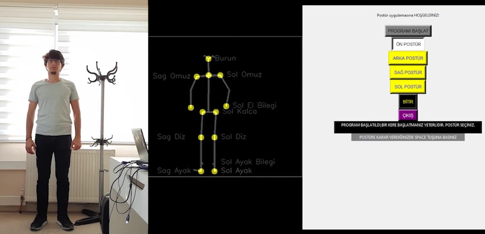

# POSTURE ANALYSIS APPLICATION USING JETSON NANO

カメラ画像から姿勢を分析して画像を保存する。

[GitHub](https://github.com/ysfzkn/posture-anaylsis-app)　[Youtube](https://www.youtube.com/watch?v=bQAjxHcxU6A)

## 概要

* FlaskでWebアプリという形にしてJetson内で動かしている。なのでクライアント（Winなど）からリモートでアクセスして結果を得る
* [OpenPose](https://github.com/CMU-Perceptual-Computing-Lab/openpose)という外部APIを使用して姿勢をキャプチャーしている
  * OpenPoseは少なくとも2.5GBのRAMが必要なので、Jetson Nano (2GB)ではちょっと微妙。
  * とにかく使って得られた座標をとにかくPythonで描画している

## 感想

* OpenPoseをJetsonで動かして、それをWebサーバーに見立ててアクセスすればいいんじゃね的な発想。
* 精度は？
* 「使える！」（どんな風に使えるとは言っていない）
