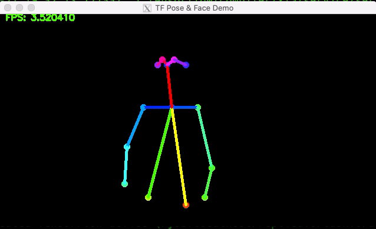

# AI Home Monitoring with Nvidia Jetson Nano

[GitHub](https://github.com/raymondlo84/nvidia-jetson-ai-monitor)　[Blog](https://towardsdatascience.com/using-cv-and-ml-to-monitor-activity-while-working-from-home-f59e5302fe67)

## 概要

* 姿勢検知系なのでOpenPose使用
  * インストールは[こちら](https://github.com/karaage0703/jetson-nano-tools)から。
* [Motion](https://motion-project.github.io/index.html)というカメラサーバーを使用。
* デフォルトの学習モデルはMobilenet-thin。
* [Face Recognition](https://github.com/ageitgey/face_recognition)というライブラリを付け足すことで表情も検知可能にした。

