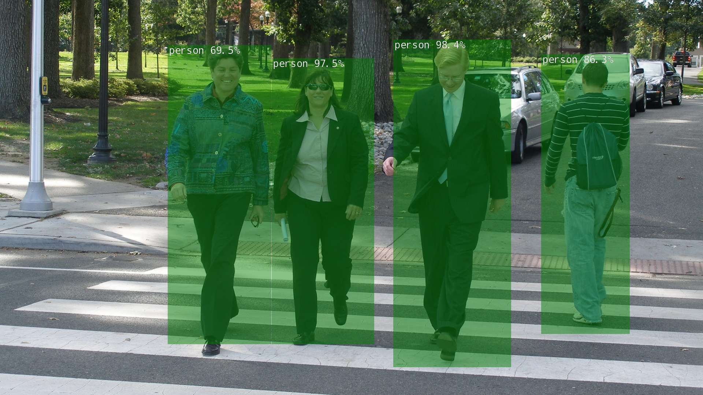

# Locating Objects with DetectNet

物体検知。こういう系。

## 使うだけ

コンテナ上で以下を打つ。

~~~shell
$ detectnet (入力ソース) (出力先)
~~~

ImageNetと同じように、入出力は画像・動画・カメラの指定が可能。特に入力ソースにカメラを指定すれば出力は必須ではない。

オプションは以下。

* `--network=(ネットワーク)`：推論に使うモデルを指定。
* `--overlay=box,labels,conf`：画像の上に示すもの。デフォルトは3つともだけど減らせる。
* `--alpha=120`：alpha blending value。よく分からんけど、透過度？
* `--threshold=0.5`：しきい値

ネットワークとして使えるのは[こちら](https://github.com/dusty-nv/jetson-inference/blob/master/docs/detectnet-console-2.md#pre-trained-detection-models-available)を参照。

## 自分のコードに組み込む

全体像

~~~python
import jetson.inference
import jetson.utils

net = jetson.inference.detectNet("ssd-mobilenet-v2", threshold=0.5)
camera = jetson.utils.videoSource("csi://0")      # '/dev/video0' for V4L2
display = jetson.utils.videoOutput("display://0") # 'my_video.mp4' for file

while display.IsStreaming():
	img = camera.Capture()
	detections = net.Detect(img)
	display.Render(img)
	display.SetStatus("Object Detection | Network {:.0f} FPS".format(net.GetNetworkFPS()))
~~~

ただ実行するだけのコードなのでこれだけでは何の面白みも無い。とりあえず以下の3行がポイントらしい。

~~~python
	img = camera.Capture()
	detections = net.Detect(img)
	display.Render(img)
~~~

### `detectNet`クラスに渡す引数

詳しくは[こちら](https://rawgit.com/dusty-nv/jetson-inference/python/docs/html/python/jetson.inference.html#detectNet)。

~~~python
net = jetson.inference.detectNet(network, sys.argv, threshold)
~~~

* `network`：ネットワークを指定する文字列。
* `sys.argv`：コマンドライン引数が丸々入ったリスト。詳しくは[こちら](https://docs.python.org/ja/3/library/sys.html#sys.argv)。
* `threshold`：しきい値

### `net.Detect()`の戻り値

検知できた物体の情報のリスト。複数検知できた場合は複数の要素が入っている。逆に検知出来なかった場合は配列の要素数は0。

物体の情報とは、具体的には`jetson.inference.detectNet.Detection`というオブジェクトで、メンバ変数として以下を持つ。

~~~
Area
	Area of bounding box
 
Bottom
    Bottom bounding box coordinate
 
Center
    Center (x,y) coordinate of bounding box
 
ClassID
    Class index of the detected object
 
Confidence
    Confidence value of the detected object
 
Height
    Height of bounding box
 
Instance
    Instance index of the detected object
 
Left
    Left bounding box coordinate
 
Right
    Right bounding box coordinate
 
Top
    Top bounding box coordinate
 
Width
     Width of bounding box
~~~

ということで`detections`の中に入っている要素`detection`を取り出してやれば検知した情報を元に色々できるっぽい。

ただ、`detection`には検知物体のクラスIDという識別番号しか格納されないので、文字列で`'person'`とかそういうのを取り出したかったら以下のようにする。

~~~python
detection = detections[0] # 適当にdetectionsの中身を取り出す
objectName = net.GetClassDesc(detection.ClassID)
~~~

ちなみに明示的にOverlayをオフにしない限り、バウンディングボックスは描画されちゃうみたい。オフにするときは以下。

~~~python
detections = net.Detect(img, overlay=False)
~~~

## モデルのカスタマイズ

### ネット上の素材を使用する

[Open Images Dataset V6](https://storage.googleapis.com/openimages/web/visualizer/index.html?set=train&type=detection&c=%2Fm%2F0fp6w)から画像をDLして再学習に使う。

