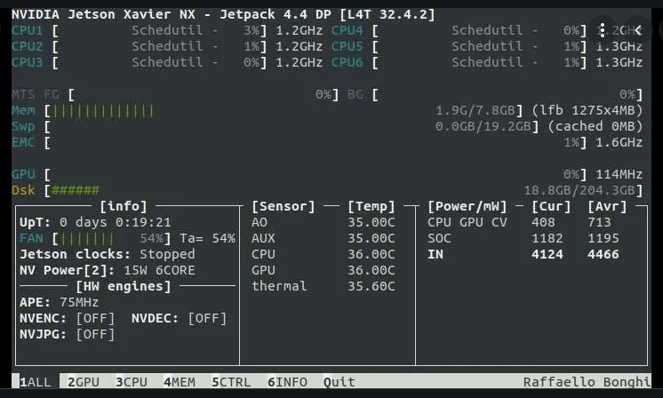

# `jetson-stats`（`jtop`）とその注意点

こんな感じのシステムモニター。

参照元：[Monitor GPU, CPU, and other stats on Jetson Nano / Xavier NX / TX1 / TX2 - Latest open tech from seeed studio](https://www.seeedstudio.com/blog/2020/07/09/monitor-gpu-cpu-and-other-stats-on-jetson-nano-xavier-nx-tx1-tx2/)

## インストール

### `pip`

簡単にインストールするなら以下。

~~~shell
$ sudo apt install python-pip
~~~

[Docker-Composeを使う予定があるなら](../docker/docker_compose.html)以下の方法でやる。

~~~shell
$ sudo apt update && sudo apt upgrade
$ sudo apt install curl
$ curl -sSL https://bootstrap.pypa.io/get-pip.py | sudo python3
~~~

Python3上で使う`pip`は普通`pip3`となるけど、このコマンドで入れると単に`pip`になるらしいので注意。

### `jetson-stats`

参考：[Jetson Nanoでjtopを使ってみる - Qiita](https://qiita.com/zrock/items/ab9a4b3042b0d6d9c41e)

~~~shell
$ sudo -H pip install -U jetson-stats
$ sudo reboot
~~~

## 注意点

`jetson-stats`を入れた後に、SSH経由でGUIアプリを起動しようと`ssh -X`または`ssh -Y`で接続すると以下のようなエラーが出る。（以下は`-Y`で接続したときで、`-X`のときは違う）

~~~
X Error of failed request:  BadLength (poly request too large or internal Xlib length error)
    Major opcode of failed request:  155 (NV-GLX)
    Minor opcode of failed request:  1 ()
    Serial number of failed request:  19
    Current serial number in output stream:  19
~~~

これについては以下を参考。

参考：https://forums.developer.nvidia.com/t/running-graphical-cuda-sample-over-ssh-from-within-l4t-docker-container/113027/3

雑に要約すると「なんかNanoに入っているライブラリ見るとCUDA使うらしいやんけ。でもお前んとこのPC、CUDAのドライバ入ってへんぞ！」ということらしい。Jetson Nanoには入っているけど、Xフォワーディングした先（つまりローカルPC）でCUDAが無ければ出るエラー。これは`jetson-stats`を入れたことが原因らしい。`jetson-stats`を削除するとこのエラーは消える。

参考：https://forums.developer.nvidia.com/t/ssh-x-problems/158038/9
