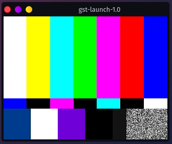

# 調査4　GStreamer

マルチメディアフレームワーク。今回のケースで言えばVideo4Linux(V4L)のAPIをソースとし、モニターやOpenCVに出力する役割を担う。

※OpenCVはGStreamerを介さなくても映像をキャプチャーできるが、GStreamerを介すことで細かいことができるようになる。

参考：[GStreamer アプリケーション開発マニュアル 日本語訳 (0.10.25.1)](http://oss.infoscience.co.jp/gstreamer/index.html)

参考：[gst-launch-1.0](https://gstreamer.freedesktop.org/documentation/tools/gst-launch.html?gi-language=c)

## インストール

今回使うコンテナでの環境は以下。

~~~shell
$ sudo apt install \
	gstreamer1.0-alsa \
    gstreamer1.0-libav \
    gstreamer1.0-plugins-bad \
    gstreamer1.0-plugins-base \
    gstreamer1.0-plugins-good \
    gstreamer1.0-plugins-ugly \
    gstreamer1.0-tools \
	libgstreamer1.0-dev \
	libgstreamer-plugins-base1.0-dev
~~~

他にも色々あるらしい。

~~~shell
$ sudo apt install \
	gstreamer1.0-doc \
	gstreamer1.0-tools \
	gstreamer1.0-x \
	gstreamer1.0-gl \
	gstreamer1.0-gtk3 \
	gstreamer1.0-qt5 \
	gstreamer1.0-pulseaudios
~~~

## テスト

真っ当な環境（？）なら普通に以下でテスト画像が表示される。右下のノイズが動いているはずなので、動画であることが分かる。

~~~shell
$ gst-launch-1.0 videotestsrc ! autovideosink
~~~

自分のように

~~~
ローカルPC > Jetson Nano > コンテナ
~~~

という接続で、コンテナ内で起動させてローカルPCに表示させたい場合は`autovideosink`ではなく`ximagesink`を指定する。ただし、

* [コンテナ内で起動したXアプリがローカルPCで起動する設定をしておく](../docker/l4t_base1.html)
* `gstreamer1.0-x`をインストールしておく

~~~shell
$ gst-launch-1.0 videotestsrc ! ximagesink
~~~

## V4Lをソースにする

~~~shell
$ gst-launch-1.0 v4l2src device=/dev/video0 ! ximagesink
~~~

~~~
Setting pipeline to PAUSED ...
Pipeline is live and does not need PREROLL ...
Setting pipeline to PLAYING ...
ERROR: from element /GstPipeline:pipeline0/GstV4l2Src:v4l2src0: Internal data stream error.
Additional debug info:
gstbasesrc.c(3055): gst_base_src_loop (): /GstPipeline:pipeline0/GstV4l2Src:v4l2src0:
streaming stopped, reason not-negotiated (-4)
Execution ended after 0:00:00.000345216
Setting pipeline to PAUSED ...
Setting pipeline to READY ...
Setting pipeline to NULL ...
Freeing pipeline ...
~~~

`not-negotiated (-4)`が出ると「上手くパイプラインが繋がっていない」という意味っぽい。

`videoconvert`を挟むとカメラ映像を取得することができる。

~~~shell
$ gst-launch-1.0 v4l2src device=/dev/video0 ! videoconvert ! ximagesink
~~~

ただ、最大解像度で取り込んでるので解像度を調整する。

~~~shell
$ gst-launch-1.0 v4l2src device=/dev/video0 ! video/x-raw,width=160,height=120 ! videoconvert ! ximagesink
~~~

設定できる解像度は`v4l2-ctl -d 0 --list-formats-ext`で確認できるものだけらしい。

ちなみに`videoconvert`が入ると、`v4l2-ctl -V`で見れる情報も書き換わる。

~~~shell
$ v4l2-ctl -V
~~~

~~~
Format Video Capture:
Width/Height      : 1920/1080
Pixel Format      : 'YUYV'
Field             : None
Bytes per Line    : 3840
Size Image        : 4147200
Colorspace        : sRGB
Transfer Function : Default (maps to sRGB)
YCbCr/HSV Encoding: Default (maps to ITU-R 601)
Quantization      : Default (maps to Limited Range)
Flags             :
~~~

どうも`video/x-raw`を指定すると`Pixel Format : 'YUYV'`になるらしい。

## MJPG（Motion-JPEG）を指定する

~~~shell
$ gst-launch-1.0 v4l2src device=/dev/video0 ! jpegdec ! videoconvert ! ximagesink
~~~

これも最大解像度になってしまうので、以下のようにして調整する。

~~~shell
$ gst-launch-1.0 v4l2src device=/dev/video0 ! image/jpeg,width=800,height=600 ! jpegdec ! videoconvert ! ximagesink
~~~

同じ解像度でも、`video/x-raw`で指定し`jpegdec`無しで繋いだときとはFPSが違う。これはそもそもカメラの性能がそうなっている。

~~~shell
$ v4l2-ctl -d 0 --list-formats-ext
~~~

~~~
ioctl: VIDIOC_ENUM_FMT
    Index       : 0
    Type        : Video Capture
    Pixel Format: 'MJPG' (compressed)
    Name        : Motion-JPEG
    
		(略)
		
        Size: Discrete 800x600
        Interval: Discrete 0.033s (30.000 fps)
        
		(略)

    Index       : 1
    Type        : Video Capture
    Pixel Format: 'YUYV'
    Name        : YUYV 4:2:2

		(略)

        Size: Discrete 800x600
        Interval: Discrete 0.100s (10.000 fps)

		(略)
~~~

