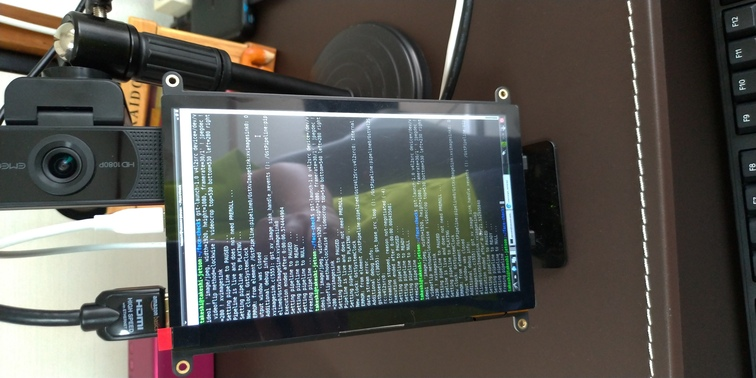

# ディスプレイを縦にする

## ディスプレイのみ

~~~shell
$ xrandr -o left
~~~

## タッチデバイス

自分の場合はタッチスクリーンなので、タッチデバイス部分に関しても回転させないといけない。そのためにはまずデバイスIDを調べる必要がある。

~~~shell
$ xinput
~~~

~~~
⎡ Virtual core pointer                    	id=2	[master pointer  (3)]
⎜   ↳ Virtual core XTEST pointer              	id=4	[slave  pointer  (2)]
⎜   ↳  USB OPTICAL MOUSE                      	id=6	[slave  pointer  (2)]
⎜   ↳ SIGMACHIP USB Keyboard                  	id=8	[slave  pointer  (2)]
⎜   ↳ TSTP MTouch                             	id=9	[slave  pointer  (2)]
⎣ Virtual core keyboard                   	id=3	[master keyboard (2)]
    ↳ Virtual core XTEST keyboard             	id=5	[slave  keyboard (3)]
    ↳ SIGMACHIP USB Keyboard                  	id=7	[slave  keyboard (3)]
    ↳ HD Webcam eMeet C960                    	id=10	[slave  keyboard (3)]
    ↳ gpio-keys                               	id=11	[slave  keyboard (3)]
    ↳ SIGMACHIP USB Keyboard                  	id=12	[slave  keyboard (3)]                 id=10   [slave  keyboard (3)]
~~~

自分の場合、`TSTP MTouch`がタッチスクリーンのデバイスになっているので、IDは`9`。

以下を打つ。

~~~shell
$ xinput set-prop '9' 'Coordinate Transformation Matrix' 0 -1 1 1 0 0 0 0 1
~~~

参考：[Linuxで画面&タッチスクリーンを90度回転 (Debian10 KDE): 個人的健忘録 from 2013](http://bluearth.cocolog-nifty.com/blog/2019/12/post-e5f4f1.html)

## 自動起動

上記のコマンドをシェルスクリプトにして保存し、それをログイン時に起動してやれば良い。

以下の内容を`~/command/rotate-display.sh`として保存。

~~~sh
#!/bin/bash

xrandr -o left
xinput set-prop '9' 'Coordinate Transformation Matrix' 0 -1 1 1 0 0 0 0 1
~~~

実行権限を与える。

~~~shell
$ chmod 755 ~/command/rotate-display.sh
~~~

後は自動実行の登録をGUI上ですれば良い。

スタートメニュー→「Preferences」→「Default applications for LXSession」→「Autostart」に「Add」というボタンがあるから、隣のテキストボックスにシェルスクリプトへのフルパスを記入してクリックすれば良い。

## 元に戻す

同じくシェルスクリプトにしておけば実行するだけでよくなる。

以下の内容を`~/command/normal-display.sh`として保存。

~~~
#!/bin/bash

xrandr -o normal
xinput set-prop '9' 'Coordinate Transformation Matrix' 1 0 0 0 1 0 0 0 1
~~~

実行権限を忘れずに。

~~~shell
$ chmod 755 ~/command/normal-display.sh
~~~

実行は以下。一応。

~~~shell
$ ~/command/normal-display.sh
~~~

