# 環境構築

Raspberry Pi上でJupyter Notebookをサーバーとして動かし、メインPCからアクセスする。これでJupyter Notebook上でのコード（つまりPythonのコード）は全てRaspberry Piが動かすことになる。

## 環境

- ローカル
  - Windows 10
- リモート
  - Raspberry Pi 3B+
  - Raspberry Pi OS 10.4
  - Python 3.7.3

## Pythonのバージョンについて

+ Pythonはバージョンを上げればいいというものではない。
+ `pyenv`は非推奨（Deprecated）らしい。
+ エラーが出たら勉強だと思うようにする。

以上の理由によりPythonは特にバージョンアップさせずにこのままいく。

## Jupyter Notebook

### 仮想環境の用意

ホームディレクトリに`jupyter`ディレクトリを作成し中に入る。

~~~shell
$ mkdir jupyter
$ cd jupyter
~~~

仮想環境を作成し実行。

~~~shell
$ python3 -m venv .venv
$ . .venv/bin/activate
~~~

### インストール

~~~shell
(.venv) $ python3 -m pip install jupyter
~~~

すごいいっぱいパッケージが入る。

### 設定

設定ファイルを作成し開く。

~~~shell
(.venv) $ jupyter notebook -generate-config
(.venv) $ nano ~/.jupyter/jupyter_notebook_config.py
~~~

以下を検索して変更。Nanoエディタでの検索は`ctrl + W`。気になる人は`c.NotebookApp.port

~~~python
c.NotebookApp.ip = '*'
c.NotebookApp.notebook_dir = '/home/takeshi/jupyter'
c.NotebookApp.open_browser = False
~~~

パスワードを設定する。入力と確認はタイプしても表示されない。

~~~shell
(.venv) $ jupyter notebook password
Enter password:
Verify password:
~~~

### Jupyter Notebookサーバー起動

~~~shell
(.venv) $ jupyter notebook
~~~

### メインPCからブラウザ経由でアクセス

ブラウザに`http://192.168.1.201:8888`と打ち込みアクセス。

パスワードを要求されるので入力してログイン。

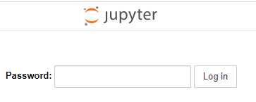

はいきたー。

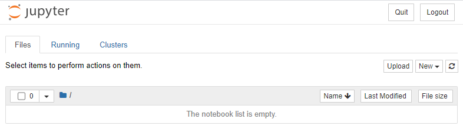

### 動作確認

新しいNotebookを作成する。右上の「New」をクリックして「Python 3」をクリックする。

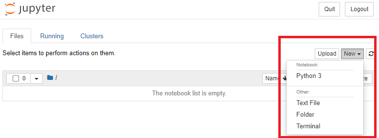

新規Notebookが作成された。

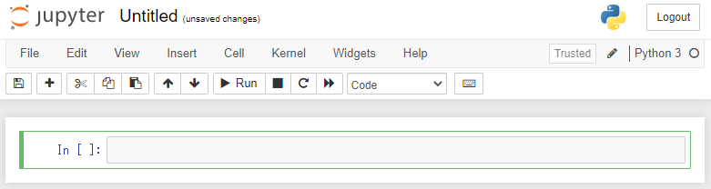

以下を打ち込んで`Shift + Enter`

~~~python
print("Hello Python!")
~~~

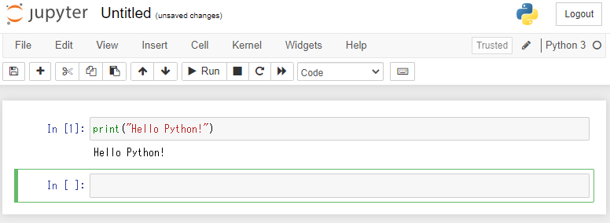

Jupyter Notebookの使い方は各自チェック。

Notebookに名前を付ける。画面上部の「Untitled」をクリック。

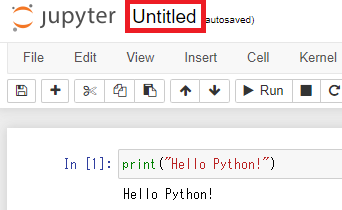

適当に名前を付ける。

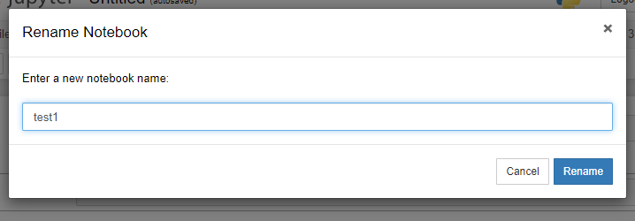

保存ボタンを押してNotebookを保存する。

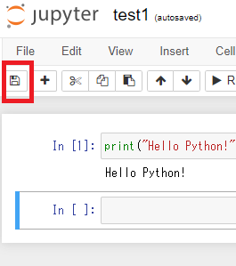

Notebookを終了。

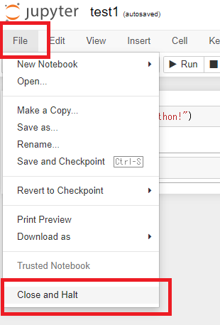

Jupyter Notebook自体を終了する。

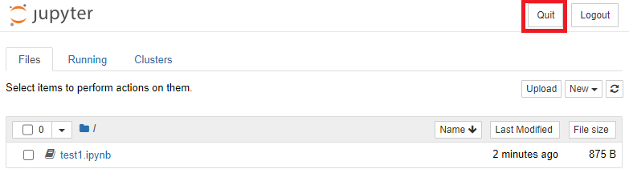

以下のメッセージが表示されたらブラウザを閉じても良い。

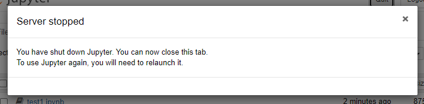

Raspberry Pi上でどうなったのか確認すると、ちゃんとさっき作った`test1.ipynb`が保存されている。

~~~shell
(.venv) $ ls
test1.ipynb
~~~

ちょっと気になるので中身を開いてみる。

~~~
{
 "cells": [
  {
   "cell_type": "code",
   "execution_count": 1,
   "id": "acoustic-brazilian",
   "metadata": {},
   "outputs": [
    {
     "name": "stdout",
     "output_type": "stream",
     "text": [
      "Hello Python!\n"
     ]
    }
   ],
   "source": [
    "print(\"Hello Python!\")"
   ]
  },
  {
   "cell_type": "code",
   "execution_count": null,
   "id": "moved-mauritius",
   "metadata": {},
   "outputs": [],
   "source": []
  }
 ],
 "metadata": {
  "kernelspec": {
   "display_name": "Python 3",
   "language": "python",
   "name": "python3"
  },
  "language_info": {
   "codemirror_mode": {
    "name": "ipython",
    "version": 3
   },
   "file_extension": ".py",
   "mimetype": "text/x-python",
   "name": "python",
   "nbconvert_exporter": "python",
   "pygments_lexer": "ipython3",
   "version": "3.7.3"
  }
 },
 "nbformat": 4,
 "nbformat_minor": 5
}
~~~

なんだかよく分からないけどまあこれでいいんじゃないか。

最後に仮想環境の終了。

~~~shell
(.venv) $ deactivate
~~~

次に起動する場合はまた仮想環境を実行してから`jupyter notebook`を打つ。