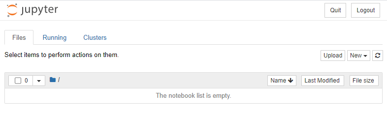
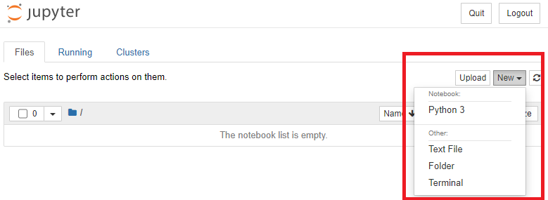
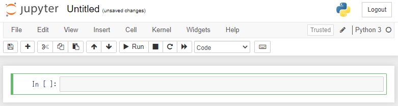
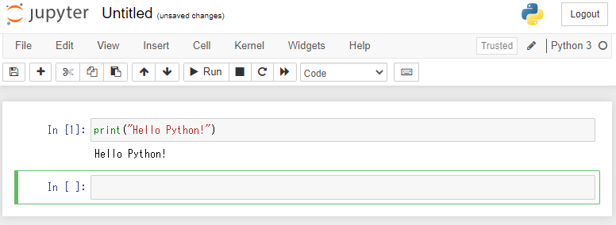
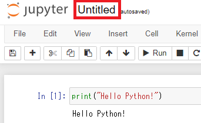
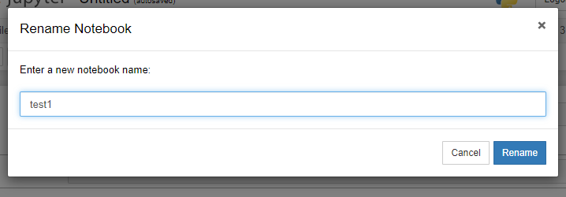
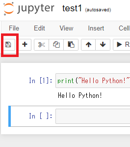
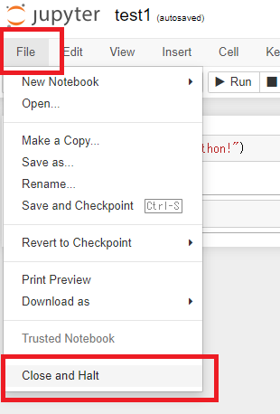
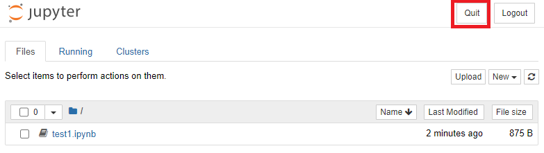
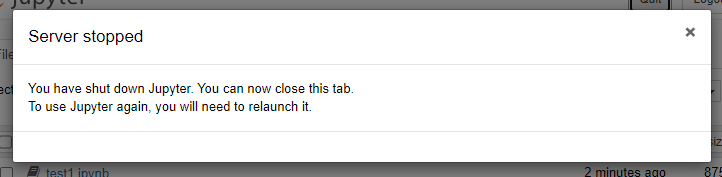

# 環境構築（Jupyter Notebook）

## 環境

RHEL 8（IPは`192.168.1.204`）

Python 3.9.5

## 手順

### ポート開放

以下の手順では`8888/tcp`を使用するのでそれを開けないといけない。

RHEL 8の場合

~~~shell
$ sudo firewall-cmd --addport=8888/tcp --permanent
$ sudo firewall-cmd --reload
~~~

他のOSは各自チェック。

### 仮想環境の用意

ホームディレクトリに`jupyter`ディレクトリを作成し中に入る。

~~~shell
$ mkdir jupyter
$ cd jupyter
~~~

仮想環境を作成し実行。

~~~shell
$ python3 -m venv .venv
$ . .venv/bin/activate
~~~

### Jupyter Notebookのインストール

~~~shell
(.venv) $ python3 -m pip install jupyter
~~~

すごいいっぱいパッケージが入る。

### 設定

設定ファイルを作成し開く。

~~~shell
(.venv) $ jupyter notebook --generate-config
(.venv) $ nano ~/.jupyter/jupyter_notebook_config.py
~~~

以下を検索して変更。Nanoエディタでの検索は`ctrl + W`。

~~~python
c.NotebookApp.ip = '*'
c.NotebookApp.notebook_dir = '/home/takeshi/jupyter'
c.NotebookApp.open_browser = False
~~~

パスワードを設定する。入力と確認はタイプしても表示されない。

~~~shell
(.venv) $ jupyter notebook password
Enter password:
Verify password:
~~~

### Jupyter Notebookサーバー起動

~~~shell
(.venv) $ jupyter notebook
~~~

### メインPCからブラウザ経由でアクセス

ブラウザに`http://192.168.1.204:8888`と打ち込みアクセス。

パスワードを要求されるので入力してログイン。

はいきたー。

### 動作確認

新しいNotebookを作成する。右上の「New」をクリックして「Python 3」をクリックする。

新規Notebookが作成された。

以下を打ち込んで`Shift + Enter`

~~~python
print("Hello Python!")
~~~

Jupyter Notebookの使い方は各自チェック。

Notebookに名前を付ける。画面上部の「Untitled」をクリック。

適当に名前を付ける。

保存ボタンを押してNotebookを保存する。

Notebookを終了。

Jupyter Notebook自体を終了する。

以下のメッセージが表示されたらブラウザを閉じても良い。

サーバー上でどうなったのか確認すると、ちゃんとさっき作った`test1.ipynb`が保存されている。

~~~shell
(.venv) $ ls
test1.ipynb
~~~

ちょっと気になるので中身を開いてみる。

~~~
{
 "cells": [
  {
   "cell_type": "code",
   "execution_count": 1,
   "id": "acoustic-brazilian",
   "metadata": {},
   "outputs": [
    {
     "name": "stdout",
     "output_type": "stream",
     "text": [
      "Hello Python!\n"
     ]
    }
   ],
   "source": [
    "print(\"Hello Python!\")"
   ]
  },
  {
   "cell_type": "code",
   "execution_count": null,
   "id": "moved-mauritius",
   "metadata": {},
   "outputs": [],
   "source": []
  }
 ],
 "metadata": {
  "kernelspec": {
   "display_name": "Python 3",
   "language": "python",
   "name": "python3"
  },
  "language_info": {
   "codemirror_mode": {
    "name": "ipython",
    "version": 3
   },
   "file_extension": ".py",
   "mimetype": "text/x-python",
   "name": "python",
   "nbconvert_exporter": "python",
   "pygments_lexer": "ipython3",
   "version": "3.7.3"
  }
 },
 "nbformat": 4,
 "nbformat_minor": 5
}
~~~

なんだかよく分からないけどまあこれでいいんじゃないか。

最後に仮想環境の終了。

~~~shell
(.venv) $ deactivate
~~~

## 次回起動時

~~~shell
$ cd ~/jupyter
$ . .venv/bin/activate
$ jupyter notebook
~~~

そののちに、メインPCのブラウザから

~~~
http://192.168.1.204:8888/
~~~

