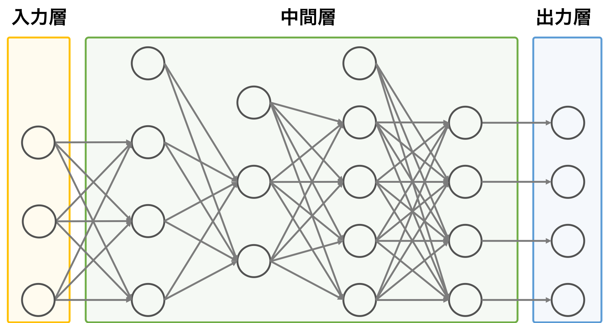

# 予測について

自分用のまとめ。

引用元：https://axa.biopapyrus.jp/deep-learning/nn.html

## 基本

第0層：入力層

* 1レコード：`n`次元の行ベクトル
* `m`個のレコードを一度に処理
  * つまり入力は`x`：`(m, n)`行列となる。

第1層：中間層（または隠れ層）

* ニューロン数を`n1`個とする
  * `W1`：重み（`(n, n1)`の行列）
    * 1つのニューロンへの入力ルートは`n`個あるので、入力に対する重みは`n`次元の列ベクトルで表される。それが`n1`個のニューロンが集まっているので、重みは`(n, n1)`の行列となる。
  * `b1`：バイアス（`n1`次元の行ベクトル）
    * ニューロン1つに対し、バイアスが一つある。`n1`個のニューロンがあるのでバイアスの要素数は`n1`個となる。
    * Pythonではブロードキャスト機能により`b1`のコピーが`m`個集まった`(m, n1)`行列に拡張される。

* 活性化関数を`h1`とする

* 第1層を通過した後を`z1`（=`(m, n1)`行列）と表す。

  * 1レコードの内容が1つのニューロンへ（重み付きで）入力されて1つの値に変換される。`n1`個のニューロンがあるのでそれぞれの結果を行ベクトルにまとめると次元は`n1`次元となる。つまり1つのレコードの中身が`n`次元から`n1`次元へと変化した、と言える。
  * `m`個のレコードがあるので`z1`は`(m, n1)`行列となる

* 実装は以下。

  ~~~python
  a1 = np.dot(x, W1) + b1
  z1 = h1(a1)
  ~~~

第2層：中間層（または隠れ層）

* ニューロン数を`n2`とする。

* 重みは`W2`：`(n1, n2)`行列

* バイアスは`b2`：`n2`次元の行ベクトル→Pythonのブロードキャストにより`(n1, n2)`行列へ拡張

* 活性化関数は`h2`

* 通過後を`z2`：`(m, n2)`行列とする

* 実装は以下。

  ~~~python
  a2 = np.dot(z1, W2) + b2
  z2 = h2(a2)
  ~~~

第3層：出力層

* ニューロン数（出力パターン数）を`p`とする。

* 重みは`W3`：`(n2, p)`行列

* バイアスは`b3`：`p`次元の行ベクトル→Pythonのブロードキャストにより`(n2, p)`行列へと拡張

* 活性化関数は`h3`

* 通過後を`y`：`(m, p)`行列とする。

* 実装は以下。

  ~~~python
  a3 = np.dot(z2, W3) + b3
  z3 = h3(a3)
  ~~~

# まとめ

* 予測とは1レコード（`n`次元の行ベクトル）を別の形（`p`次元の行ベクトル）へ変化させること。
* 予測は`m`レコードまとめて処理することができる。

