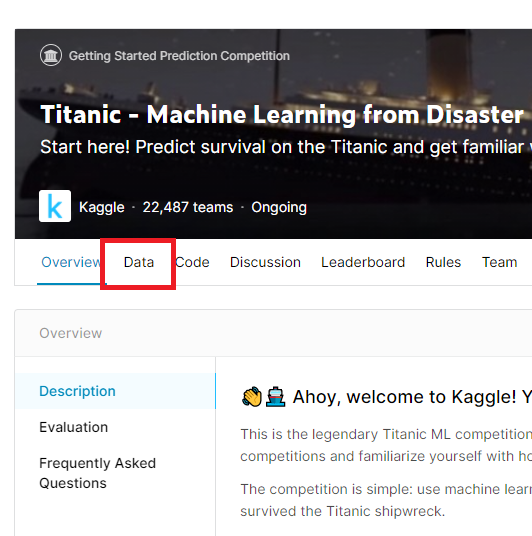
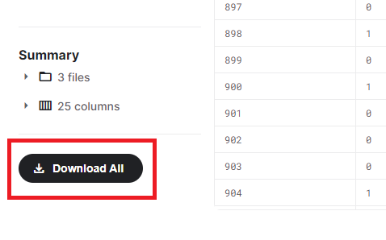
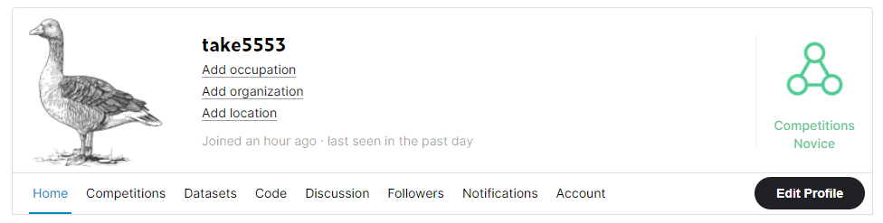
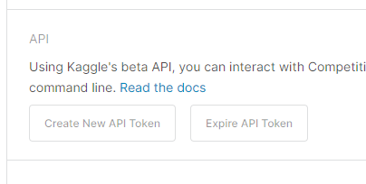

# Kaggleに登録しコンペに参加する

参加から回答提出まで。

サーバーPCとしてRaspberry Piを使うことを想定。

## Kaggleに登録

1. [Kaggle](https://www.kaggle.com/)にアクセス。
2. 「Register」をクリック。
3. メアド、パスワード、ユーザー名（適当で可）を入力。
4. メールが飛んできてベリファイすればアカウント作成完了。

## コンペに参加する（メインPCから）

ここではチュートリアルとして有名なタイタニック号生存者予測コンペに参加してみる。Windows等、ブラウザベースでデータを取得・提出する手順を紹介する。Raspberry Piなどのサーバー機から直接データをDL・提出する方法は後述。

1. Kaggleの検索欄に「titanic」と打ち、「Titanic - Machine Learning from Disaster」というページにアクセス。

2. 「始めるならここやで」的な説明と、「ペラペラペラペラKaggleへようこそペラペラペラペラ」と喋る動画を見て、分かったようなフリをして「Join Competition」をクリック。

3. 「ルールちゃんと読んだ！？」と出るので「I Understand and Accept」をクリック。

4. 「Data」タブをクリック

   

5. 下の方までスクロールすると「Download All」があるのでそれをクリックすると

   * `gender_submission.csv`（提出ファイルの見本）
   * `train.csv`（学習データ）

   * `test.csv`（テストデータ）

   がダウンロードできる。

   

6. これらを使って機械学習モデルを作成し、見本ファイルのような形式で提出ファイルを作る。（詳しくは次回以降）

7. Titanicコンペのページ上部にある「Submit Predictions」をクリックし、アップする提出ファイルをD&Dで登録し、適当に説明を書いて「Make Submission」をクリックするとアップされてスコアが表示される（らしい）。

## コンペに参加する（サーバー機から）

上記の方法だとDLしたデータ等をRaspberry Pi等に送受信したりする必要がある。サーバー上で学習して放置するならサーバー機から直接コンペとやり取りできた方が楽。

### Kaggle API Tokenの入手

1. Kaggle内の自分のアカウントページにどうにかしてアクセスする。

   

2. 「Account」をクリック。

3. 「API」欄の「Create New API Token」をクリック。

   

4. `kaggle.json`ファイルのDLが始まるので適当なところにDL。

5. そのファイルをどうにかしてサーバー機の中の`~/.kaggle`ディレクトリ内に入れる。

   自分の場合はメインPCで`kaggle.json`を開き中身（たった1行だけ）をコピー。サーバー上で`kaggle.json`を新規作成しNanoエディタで開きペーストして直接入力した。

   ~~~shell
   $ mkdir ~/.kaggle
   $ nano ~/.kaggle/kaggle.json
   ~~~

6. 権限を編集する必要があるらしい。

   ~~~shell
   $ chmod 600 ~/.kaggle/kaggle.json
   ~~~

### サーバー機にKaggle APIをインストール

1. 必要であれば仮想環境に入っておく。

   ここでは[前回](devenv.html)の環境に入ることを想定する。

   ~~~shell
   $ cd ~/jupyter
   $ . .venv/bin/activate
   ~~~

2. Kaggle APIインストール&確認。

   ~~~shell
   $ python3 -m pip install kaggle
   $ kaggle --version
   Kaggle API 1.5.10
   ~~~

### Kaggle API経由でTitanicコンペに参加する

1. 一旦メインPCからブラウザ経由で「Join Competition」→「I Understand and Accept」をクリックする。

   （これはKaggle API経由ではできないらしい）

2. Raspberry Pi上で以下を打つと`titanic`ディレクトリが作られ、そこに`titanic.zip`がDLされる。

   ~~~shell
   $ kaggle c download -c titanic -p titanic
   ~~~

3. `titanic`ディレクトリに入り、`titanic.zip`を解凍。ついでに提出ファイル置き場も作る。

   ~~~shell
   $ cd titanic
   $ unzip titanic.zip -d data
   $ mkdir submit
   ~~~

4. `data`ディレクトリに入り、csvファイルの中身を軽く確認。

   ~~~shell
   $ cd data
   $ head gender_submission.csv
   $ head test.csv
   $ head train.csv
   ~~~

5. 頑張って予測する（次回以降）。

6. 以下を打てば提出できる（らしい）。

   ~~~shell
   $ kaggle c submit -c titanic -f (提出ファイルのパス) -m (メッセージ)
   ~~~

   